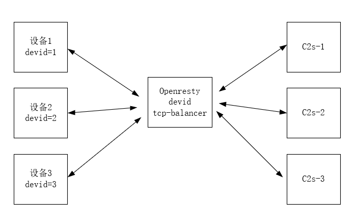

# 基于openresty 自定义tcp 请求流量转发到不同消息处理服务器

>  有个消息推荐项目，netty 框架技术架构，客户端采用netty client 封装的私有tcp 协议 请求消息服务器。需要一套tcp 分流处理网关来分发请求流量到不同的tcp 消息处理器，现采用openresty 基本可以满足，主要是是用到openresy  balancer
>
> []: https://github.com/openresty/lua-resty-balancer#name
>
> 模块技术实现，具体请参考官方文档说明
>
> 主要思路是 利用 lua 语言 lpack 模块 对私有协议头 协议主体进行解析，解析得到设备id 取模得到一台上游消息处理服务器upstream server 节点， 然后通过balancer 模块更新上游处理服务器转发流量。
>
> 也可以利用openresty 自带balancer 模块来完成实现，应用核心代码如下


 ```lua
 stream {
   lua_code_cache off; #关闭代码缓存，利于调用，生产环境不建议
   init_by_lua_block {  #当nginx 启动时，初始化时，从redis加载配置，或者从etcd 加载配置,该数据可以做一个后台管理，运维人员直接后台操作
     require('ngx.balancer')
     _G.BACKENDS = {
       {'172.17.0.1', 1000}, #消息netty服务器c2s-1
       {'172.17.0.2', 1000}, #消息netty服务器c2s-2
       {'172.17.0.3', 1000}, #消息netty服务器c2s-3
     }
   }
   
   #配置lua请求拦截器 upstream
   upstream lua_dispatcher {
     server 0.0.0.1:1234;
     balancer_by_lua_block {
       local balancer = require('ngx.balancer')
       local backend_index
       local hash = ngx.crc32_long(ngx.ctx.devid);
       backend_index = (hash % 2) + 1
       local backend_table = _G.BACKENDS[backend_index]
       #通过激活id算出一个hash值 取个模后，得到服务器下标index 然后更新balancer 即可流量负载过去
       local ok, err = balancer.set_current_peer(table.unpack(backend_table))
       if not ok then
           ngx.log(ngx.ERR, err)
           ngx.exit(ngx.ERROR)
       end
     }
   }
   
    # 配置代码 proxy
   server {
     listen 9000;
     proxy_pass lua_dispatcher;
     preread_by_lua_block {
         require("pack")
         local mypack    = string.pack
         local myunpack    = string.unpack
         local sock = ngx.req.socket(true)
         if sock then
             ngx.say("got the request socket")
         else
             ngx.say("failed to get the request socket: ", err)
             return
         end
         while true do
             #先尝试读取固定头 6个字节
             local data, err = sock:receive(6)
             #如果遇到timeout,或者close的情况，则break 本次循环读取，继续下一条读取
             if err=='timeout' or err =='close' then
                 break
             end
             #按消息推送私有协议读取返回的参数，type1为消息类型，ver2为消息推送私有协议版本号，time待命时间，len4为消息体的长度，不包含头的长度
             local succ,succLen,type1,Ver2,Time3,Len4 = pcall(myunpack,data,">ccHH")
             #读取剩余的消息体长度内容
             local body, err = sock:receive(Len4)
             #如果读取body为空，则退出
             if body == nil then
                 break
             end
             #打印body消息内容 解析body是一个json串，需要对json进行解码，再赋值给ngx.ctx 全局上下文中共享变量
             ngx.ctx.device_id = body[devid]
             ngx.log(ngx.ERR, "------bdy ", body)
         end
   
     }
   }
   
     
   
 }
 ```

如下图，左边是设备，中间是tcp 流量转发器，  右 边是消息处理服务器，  设备需要和消息处理服务器 建立tcp长链接，并维持不间断时间心跳，总之采用openresty 来完现流量分发具有强性能，只需要在原来的netty消息层外层加个流量处理网关即可。

但我们在实际环境不推荐这样做，除非小项目，大项目还是推荐apisix 网关来处理很方便

