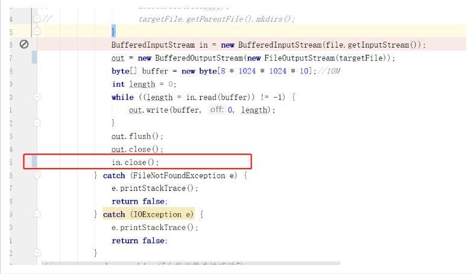
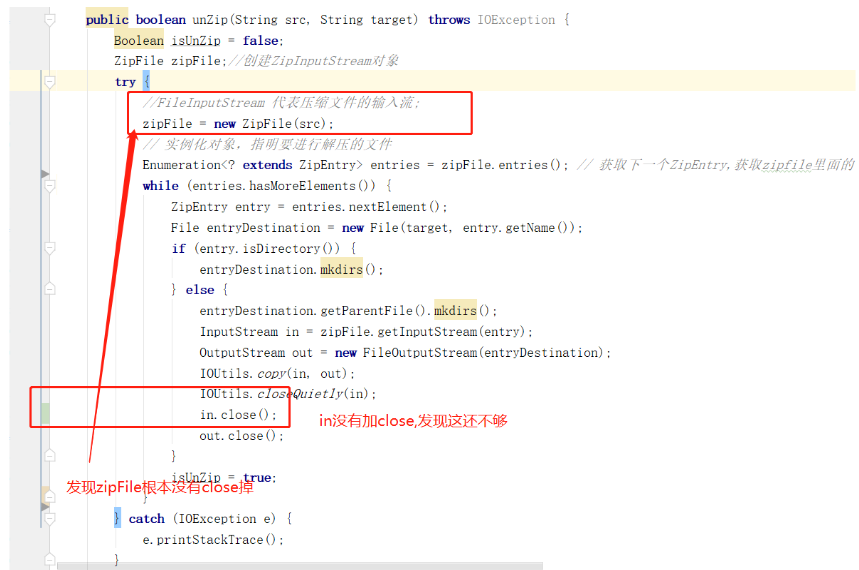

# 在windows系统中检验一个上传文件程序是否有bug另一种姿势

> 某一天在公司对一个文件上传项目进行bug修改，不料查到另一个bug 也顺带解决，在此记录一下解决过程
>
> 在windows系统调试一个文件上传程序，手贱想重新删除原文件，重新上传，结果这一删除发现windows 弹窗，报窗 
>
> *文件正常使用*    错误提示。

这个程序需求就是把一个zip包上传到ftp当中，流程是先上传到服务器本地，然后同步到ftp当中

在windows 调试过程重新删除了己上传的文件，但发现不能删除的，这个问题也找了很久。

于是就重新梳理一下上传的流程。

发现以下问题

来调试代码

下面这段代码，上传zip后先保存到本地

接下来是解压zip

最后增加zipFile.close() 解决，增加in.close() 解决

问题总结：

​    论代码review 重要性，前期需要多多测试。