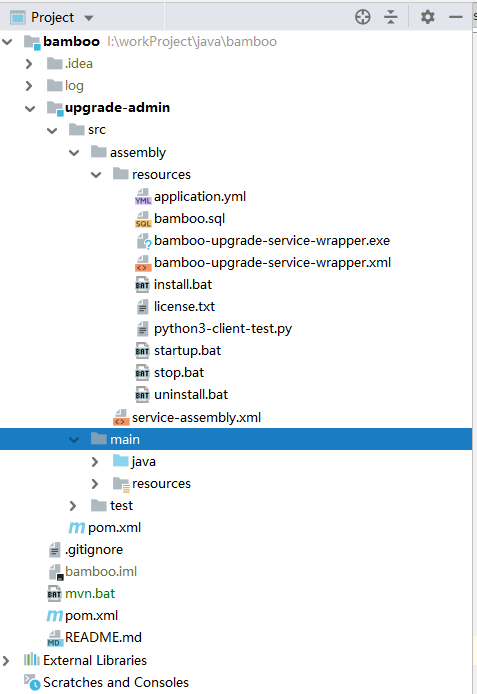
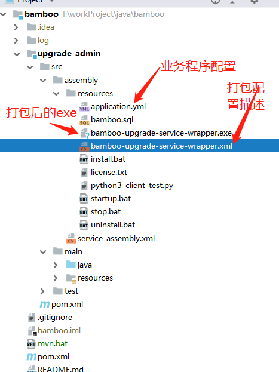
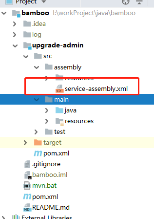
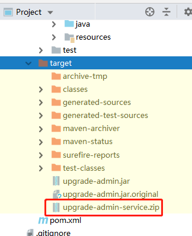
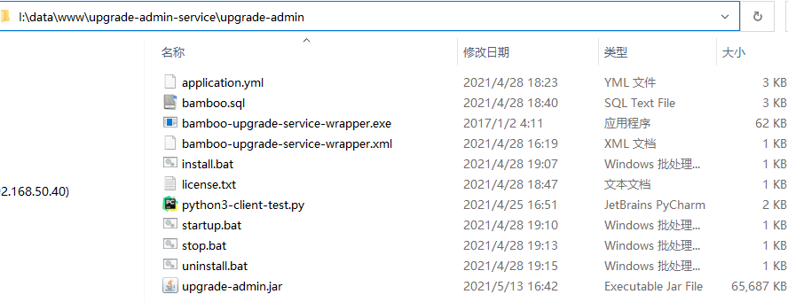
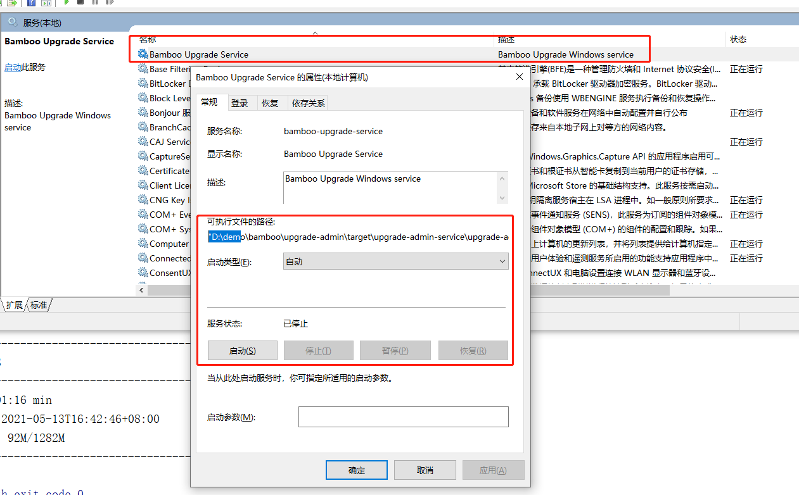

# spring boot程序如何正确运行在Windows服务器上面

> 一次项目开发中，要求服务器是windows环境，一般我们都是用java sprint boot 开发的程序运行在linux 环境中，通过supervisor程序来守护，设置开机启动之类的操作命令， 很少有人用windows server, 这次机会遇到这个问题需要解决，好在记的我在几年前用过java service wapper（简称jsw）这个程序 ，对jsw 有一些了解,于是找一相当资料看一下
>
> 官网资料介绍在这里：https://wrapper.tanukisoftware.com/doc/english/launch-win.html

我在这里简单介绍一下jsw，通过官网介绍，我了解到。

他可以替代supervisor 做程序守护，开机启动等相关设置，如果是需要把jar包跑在windows 服务器当中。我需要通过sc 命令来注册服务指令

目前我暂时用到服务守护，和服务注册，等特点，其他特性还没有研究。以下是记录一下我在spring boot 项目中如何使用它来打包成 jsw 服务。

​    首先看一下我的项目结构图



1.  需要在pom.xml 加入maven 打外插件，
     插件名为：maven-assembly-plugin

   ```xml
      <build>
           <finalName>upgrade-admin</finalName> 
           <plugins>
               <plugin>
                   <groupId>org.springframework.boot</groupId>
                   <artifactId>spring-boot-maven-plugin</artifactId>
                   <configuration>
                       <executable>true</executable>
                   </configuration>
               </plugin>
   
               <!--主要是以下插件配置-->
               <plugin>
                   <groupId>org.apache.maven.plugins</groupId>
                   <artifactId>maven-assembly-plugin</artifactId>
                   <version>3.0.0</version>
                   <configuration>
                       <descriptors>
                           <!--通过service-assembly.xml 描述该项目打包的配置信息-->
                           <descriptor>${project.basedir}/src/assembly/service-assembly.xml</descriptor>
                       </descriptors>
                   </configuration>
                   <executions>
                       <execution>
                           <id>service-assembly</id>
                           <phase>package</phase>
                           <goals>
                               <goal>single</goal>
                           </goals>
                       </execution>
                   </executions>
               </plugin>
   
           </plugins>
       </build>
   ```

   

2.  配置服务jsw 打包描述信息 

    以下是打包配置文件信息： 

   ```xml
   <service>
       <id>bamboo-upgrade-service</id>
       <name>Bamboo Upgrade Service</name>
       <description>Bamboo Upgrade Windows service</description>
       <executable>java</executable>
       <arguments>-jar upgrade-admin.jar</arguments>
   </service>
   ```

    id: windows 服务id,要是唯一的，在windows 服务注册表里是唯一的

    name: 服务名称

    description：  服务描述

    executable ： 执行bin 名称
    arguments： 执行参数

   

   


​      service-assembly.xml 文件  这是打包核心配置核心文件

​     主是用于告诉maven 需要打包的文件在哪 里，如何打包，打成什么格式的包 

```xml
<assembly xmlns="http://maven.apache.org/ASSEMBLY/2.0.0" xmlns:xsi="http://www.w3.org/2001/XMLSchema-instance"
          xsi:schemaLocation="http://maven.apache.org/ASSEMBLY/2.0.0 http://maven.apache.org/xsd/assembly-2.0.0.xsd">
    <id>service</id>
    <formats>
        <format>zip</format>
    </formats>
    <fileSets>
        <!-- Copy in the application JAR -->
        <fileSet>
            <directory>${project.build.directory}</directory>
            <outputDirectory>/</outputDirectory>
            <includes>
                <include>${project.build.finalName}.jar</include>
            </includes>
        </fileSet>
        <!-- Copy in the resources including the wrapper exe and config -->
        <fileSet>
            <directory>${project.basedir}/src/assembly/resources</directory>
            <outputDirectory>/</outputDirectory>
        </fileSet>
    </fileSets>
</assembly>
```

 该文件的目录位置如下



3.   执行打包 mvn package 命令
   

4.  部署程序，降upgrade-admin-service.zip包 复制到一个正式的目录下解压后下图就是解压后zip后的效果
    

   1. 先安装windows 服务指令，上图install.bat是我之前写好的，该文件就是用来install Windows 服务脚本
      install.bat

      ```powershell
      @echo off
      bamboo-upgrade-service-wrapper install
      echo 安装bamboo服务完成
      pause
      ```

      

   2. 编写启动服务，新建startup.bat文件

      ```powershell
      @echo off
      for /f "skip=3 tokens=4" %%i in ('sc query bamboo-upgrade-service') do set "zt=%%i" &goto :next
      :next
      if /i "%zt%"=="RUNNING" (
      echo 已经发现该服务在运行
      ) else (
         net start bamboo-upgrade-service
         echo 该服务现己启动，请等20秒中....
      )
      pause
      ```

   3.  停止服务 ，新建stop.bat文件

      ```powershell
      @echo off
      for /f "skip=3 tokens=4" %%i in ('sc query bamboo-upgrade-service') do set "zt=%%i" &goto :next
      :next
      if /i "%zt%"=="RUNNING" (
         net stop bamboo-upgrade-service
         echo 该服务现己关闭，请等20秒中....
      ) else (
      
      )
      pause
      ```

      

   4. 卸载服务, 新建uninstall.bat 文件

      ```powershell
      @echo off
      bamboo-upgrade-service-wrapper uninstall
      echo 卸载bamboo服务完成
      pause
      ```

   5. 查看windows运行效果

      按win+R 快捷键，输入*services.msc*  命令，回车，

      设置开机启动该服务都可以在windows 这边设置

      

     

