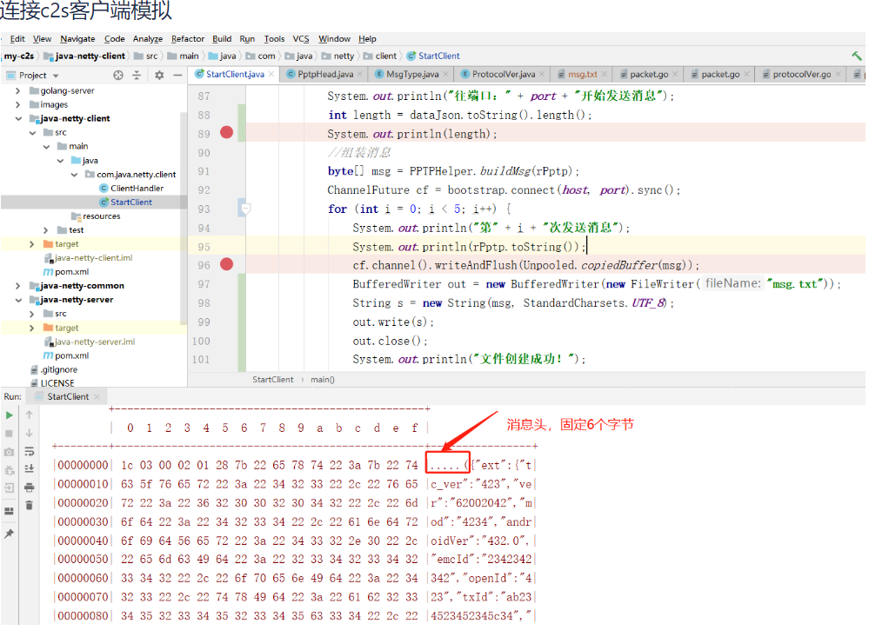

# 使用lua语言解析tcp私有协议包示例


> 为什么需要lua来解析tcp 私有协议包？
>
>  因为lua语言生态内，有强大的openresty 技术可使用，而openresty可以提供强劲的web 并发性能，能提供tcp 长链接通道 技术


## 首先需要lapck包对其解析


```
git clone  https://github.com/Kong/lua-pack 
或
git clone https://github.com/lilien1010/lpack
```

## 安装lapck包需要编译 


# <!--编译时找不到lua.h头文件，需要增加以下参数，其目的是让编译是找到luajit lua.h头文件-->  

在编译时遇到 lua.h No such file or directory #include " lua.h" ？ 问题时，需要遇增加如下参数

```
-DLUA_INCLUDE_DIR=/usr/local/openresty/luajit/include/luajit-2.1/ 
```

最终编译命令如下：

```
#DLUA_INCLUDE_DIR 表示lua.h 存放的位置 LUA_LIBRARY指定luajit库，so文件，
cmake ./  -DLUA_INCLUDE_DIR=/usr/local/openresty/luajit/include/luajit-2.1/  -DLUA_LIBRARY=/usr/local/lib/libluajit-5.1.so
make  #编译成so文件，得到pack.so
```

## 详细解析tcp私有代码如下

```
require("pack")
local mypack    = string.pack
local myunpack    = string.unpack
local sock = ngx.req.socket(true)
if sock then
    ngx.say("got the request socket")
else
    ngx.say("failed to get the request socket: ", err)
    return
end
while true do
    --先尝试读取固定头 6个字节
    local data, err = sock:receive(6)
    --如果遇到timeout,或者close的情况，则break 本次循环读取，继续下一条读取
    if err=='timeout' or err =='close' then
        break
    end
    --按pmtp协议读取返回的参数，type1为消息类型，ver2为pmtp协议版本号，time待命时间，len4为消息体的长度，不包含头的长度
    --默认字节顺序为 大端，>ccHH
    local succ,succLen,type1,Ver2,Time3,Len4 = pcall(myunpack,data,">ccHH")
    --读取剩余的消息体长度内容
    local body, err = sock:receive(Len4)
    --如果读取body为空，则退出
    if body == nil then
        break
    end
    --打印body消息内容
    ngx.log(ngx.ERR, "------bdy ", body)
end
```


通过客户端链接后发送tcp私有协议包的一模拟效果


