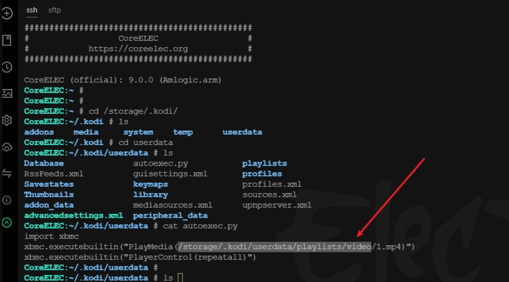
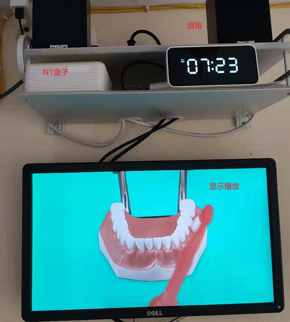

# **我是如何在coreelec系统设置开机自动播放视频列表的** 

> 手里空闲N1盒子一台，刷了coreelec 系统，本质为kodi播放器，起初想配合小米智能插座 + n1盒子+显示器+音箱
>
> 打造一台家用融媒体diy宣传广告机,设置定时开关机，定时播放指定内容，比如每天早上播放《三子经》《刷牙》，每天中午播放《交通安全》，晚上播放《护眼宣导片》
>
> 等三个.mp4文件。于是翻了一下kodi技术开发论坛，就有了以下成果


原论坛：https://forum.kodi.tv/showthread.php?tid=157120

解决方法：

​     用electerm ssh管理软件登录到kodi 系统，在/storage/.kodi/userdata/ 目录下 创建 autoexec.py 文件 ，输入代码如下

​     

```python
import xbmc
xbmc.executebuiltin("PlayMedia(/storage/.kodi/userdata/playlists/video/1.mp4)")
xbmc.executebuiltin("PlayerControl(repeatall)") #PlayerControl(repeatall)  这一句是循环播放1.mp4文件
```

1.mp4 我这里只是测试视频，你可以用nas nfs 接入就可以，做一个软链接即可读取




设备实际播放效果图：

