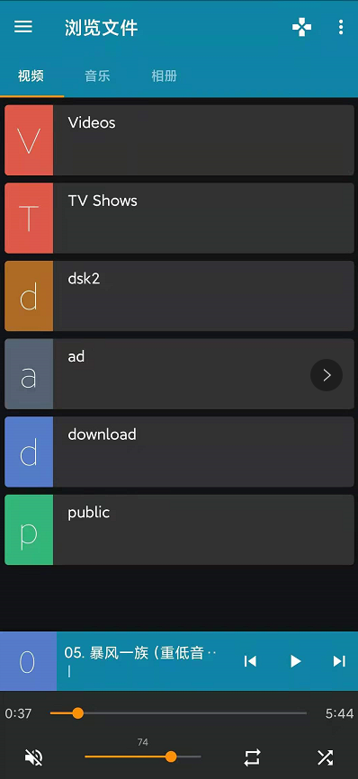

# **我是如何在coreelec系统设置开机自动播放视频列表的** 

> 手里空闲N1盒子一台，刷了coreelec 系统，本质为kodi播放器，起初想配合小米智能插座 + n1盒子+显示器+音箱
>
> 打造一台家用融媒体diy宣传广告机,设置定时开关机，定时播放指定内容，比如每天早上播放《三字经》《刷牙》，每天中午播放《交通安全》，晚上播放《护眼宣导片》
>
> 等三个.mp4文件。于是翻了一下kodi技术开发论坛，就有了以下成果


原论坛：https://forum.kodi.tv/showthread.php?tid=157120

解决方法：

​     用electerm ssh管理软件登录到kodi 系统，在/storage/.kodi/userdata/ 目录下 创建 autoexec.py 文件 ，输入代码如下


```python
import xbmc 
xbmc.executebuiltin("PlayMedia(/storage/ad/test.m3u)")
xbmc.executebuiltin( "XBMC.SetVolume(%d)" % (56)) # 设置音量，这个很有用，比如早上闹钟模式可以设置大一点，晚上睡觉前可以小一点声音，这里的脚本是在nas 群晖系统自动生成，采用定时任务生成的，然后在kodi设备做了开机启动挂载nfs共享实现的

```

test.m3u我这里只是测试音视频列表，你可以用nas nfs 接入就可以，做一个软链接即可读取

test.m3u为播放列表，该文件是生成的，生成工具在这里，也可以制混合m3u播放列表，包含本地播放，在线链接播放

[Isayso/PlaylistEditorTV: IPTV m3u list Editor/Player for Windows with Kodi support (github.com)](https://github.com/Isayso/PlaylistEditorTV)


设备实际播放效果图：


### 最后推荐一款 `快控` APP 非常好用，配合ddnsto远程控制相当完美


| |       |
| ------------------------------------------------------------ | ---- |


# 注意事项总结

本场景需求是：让n1 kodi 设备 音视频播放器，开机自动播放，并根据早，中，晚，周末，节假日特证来设置不同播放内容，内容可以是

网络采集的在线视频，在线新闻，音乐，Youtube频道自动播放等等，诸如此类，

需要注意以下几点：

1，通过小米智能插座，控制开关机时段，比如早上时间段为6：00 ~ 8：00， 中午时间段11：00 ~ 14：00 ， 晚上时间段：17：30 ~ 21：00

2，内容通过群晖计划任务，定时生成播放计划脚本，以及播放内容

3，播放列表根据自己喜好，分类制作不同的分类播放列表

​      如国学单独一个播放列表，流行music一个播放列表，背景音乐，睡前音乐等等 

播放列表是自己生成的播放列表.m3u格式如下文件

```m3u
#EXTCPlayListM3U::M3U
#EXTINF:0,高枫 - 大中国
/storage/recordings/mp3/高枫 - 大中国.mp3
#EXTINF:0,下山
/storage/recordings/01.下山.flac
```

 其播放计划脚本为autoexec.py 脚本 需要根据不同日期判断音量，不同时间段判断播放内容

 m3u 文件格式制作请参考文档：[M3U - Wikipedia](https://en.wikipedia.org/wiki/M3U)

