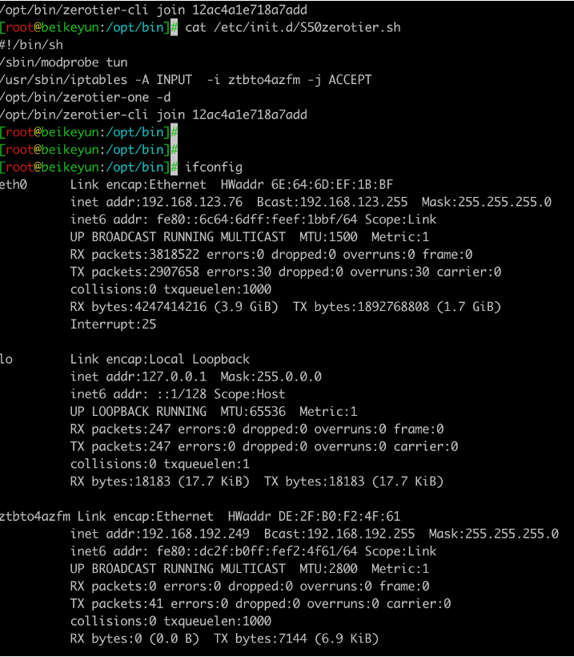

# 解决[贝壳云]小刚炮系统（Nano Disk Manager） zerotier 开机启动问题


> 在网上找了很多的教程，有很相关做开机启动 zerotier 客户端，我都没有成功，好几次由于停电导致的 盒子启动后并没有启动zerotier 客户端。出门在外没有远程服务真的很不方便。经过折腾好一阵子找到一个解决方法如下
> ##### 找到原来开机启动脚本,没有的话添加即可 /etc/init.d/S50zerotier.sh
> 
> ##### 把如下代码，新建startup_zerotier.sh文件，写入如下代码内容，保存在/root目录下
```
 
#!/bin/sh
program=zerotier
sn=`ps -ef | grep program | grep -v grep |awk '{print $2}'`
if [ "${sn}" = "" ]
then
  sh /etc/init.d/S50zerotier.sh
  echo start ok !
else
  echo running
fi
```

> ##### 在小刚炮系统后台，打开任务执行菜单栏，添加 计划任务为每隔2分钟启动该脚本即可

