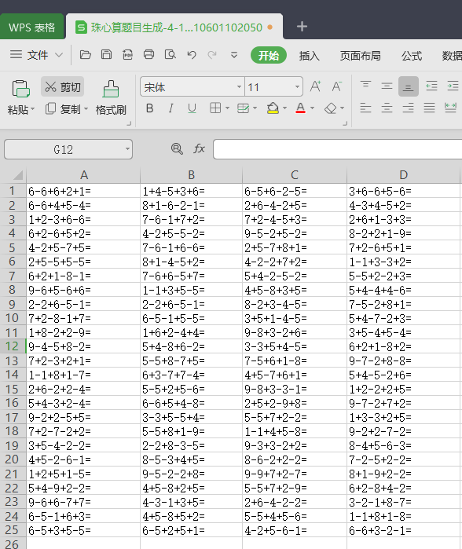

# 珠心算二笔、三笔、五笔、十笔一位加减混合计算题自动生成 

> 珠算是以算盘为工具，数学理论为基础，运用手指拨珠，进行运算的一门计算技术，它是我国古代劳动人民重要的发明创造之一，千百年来这一技术不断扩散，传播到世界各国，推进着人类文明的发展历程。
>
> 珠心算只有三个符号即1、5和0;数学有10个符号，即0、1、2、3、4、5、6、7、8、9。可见珠心算运算的简捷性。珠心算的直观模型作用能培养小孩子的数学概念能力，珠心算的分析模型作用能帮助小孩子理解应用题的结构关系和数量关系，提高解题能力。


>  这几天看到娃娘，在用办公软件excel 给5岁娃出题，一页一页的打印出来, 很费劲
>
>  我说这个可以写个程序自动生成出来，更快。不用这么幸苦
>
>  开始我不太了解珠心算的规则，后面翻了资料，还真不是随便10以内的加减组合。有一定的规则，如上文章开头所描述
>
>  ### 出题要求规则如下:
>
>  加法  
>  `1`可以加`1`，`2`，`3`，`5`，`6`，`7`，`8`  
>  `2`可以加`2`，`5`，`6`，`7`  
>  `3`可以加`1`，`5`，`6`  
>  `4`可以加`5`  
>  `5`可以加`4`  
>  `6`可以加`1`，`2`，`3`  
>  `7`可以加`1`，`2`  
>  `8`可以加`1`  
>  减法  
>  `9`可以减`1`，`2`，`3`，`4`，`5`，`6`，`7`，`8`，`9`  
>  `8`可以减`1`，`2`，`3`，`5`，`6`，`7`，`8`  
>  `7`可以减`1`，`2`，`5`，`6`，`7`  
>  `6`可以减`1`，`5`，`6`  
>  `5`可以减`5`  
>  `4`可以减`1`，`2`，`3`，`4`  
>  `3`可以减`1`，`2`，`3`  
>  `2`可以减`1`，`2`  
>  `1`可以减`1`  
>  `1-9`都可以加减`0`  
>
>  出`五笔`到`十笔`的题  
>
>  要求计算结果不能是负数，结果不能大于10

### 于是就有以下代码

```py
# -*- coding=utf-8 -*-
import sys
import random
import datetime
from openpyxl import Workbook
wb = Workbook()
ws = wb.active
reload(sys)
sys.setdefaultencoding('utf8')
var = {}
var["add1"] = [1,2,3,4,5,6,7,8]
var["add2"] = [2,5,6,7]
var["add3"] = [1,5,6]
var["add4"] = [5]
var["add5"] = [4]
var["add6"] = [1,2,3]
var["add7"] = [1,2]
var["add8"] = [1]
var["add9"] = [0]
var["add0"] = [1,2,3,4,5,6,7,8]
var["sub9"] = [1,2,3,4,5,6,7,8,9]
var["sub8"] = [1,2,3,4,5,6,7,8]
var["sub7"] = [1,2,5,6,7]
var["sub6"] = [1,5,6]
var["sub5"] = [5]
var["sub4"] = [1,2,3,4]
var["sub3"] = [1,2,3]
var["sub2"] = [1,2]
var["sub1"] = [1]
var["sub0"] = [0]
sa = {
    "1":"-",
    "2":"+"
}
def getNum():
    return random.randrange(1, 10)
def getU(f):
    u = random.randrange(1, 3)
    if f>9:
        f = random.randrange(0, 10)
    if (u == 2):
        return "+",var["add%s" % f]
    else:
        return "-", var["sub%s" % f]
def getV(a):
    al = len(a)
    qz = 0
    if (al != 1):
        qz = random.randrange(1, al)
    return qz
def getRes(a,b,u):
    if(u=="+"):
        return a +b
    else:
        return a-b
def recursive_formula(num,count,arr):
    if len(arr)==0:
      arr.append(str(num))
    u1, a = getU(num)
    count = count - 1
    if count>0:
        v = a[getV(a)]
        arr.append(str(u1))
        arr.append(str(v))
        r = getRes(num,v,u1)
        return recursive_formula(r, count, arr)
    else:
        return arr 
data = []
cell = 4  #生成excel 4列表格
total = 100 #生成100题
while True:
    a = recursive_formula(getNum(), 5, [])
    if len(data)>=total:
        break
    if "0" not in a:
        data.append("".join(a) + "=")

print "共%d题" % len(data)
rows = []
for item in data:
    rows.append(item)
    if len(rows)==cell:
        ws.append(rows)
        del rows[:]
version = datetime.datetime.now().strftime('%Y%m%d%H%M%S')
wb.save("珠心算题目生成-%d-%d-%s.xlsx" % (cell,len(data),version))
wb.close()
```

最终生成效果如下，请自行调整打印格式

