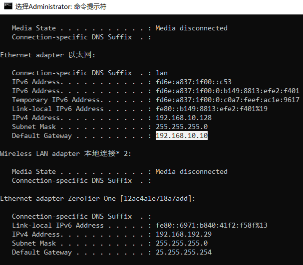
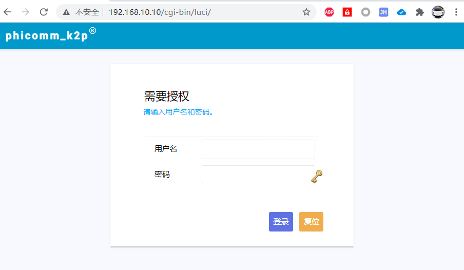
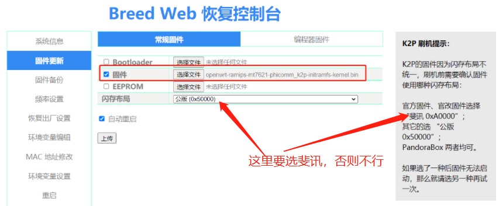

---

title: "Phicomm Router Upgrade System to Openwrt"
date: 2021-07-02T14:40:17+08:00
draft: false
tags: ["k2p","openwrt","lede","padavan"]
---

# OpenWrt Lede 系统 刷入 k2p 路由器

> 记录一下，过去经常用的k2p 刷入老毛子系统【padavan】 不用选闪存布局，分分钟成功刷入。但这次刷入OpenWrt 时发现死活进去路由器登录界面。经过在恩山发贴求助终于解决，感谢恩山大神们，真的很厉害！
> 我刷入步骤是都先复位的，长按复位键 8到10秒，松开，
> 然后上传`openwrt-ramips-mt7621-phicomm_k2p-initramfs-kernel.binn `文件，
> 然后点击更新，重启，就是不能进入`openwrt` 系统路由系统，关键是`openwrt wifi ssid `搜索不到，没看到， 说明刷入不成功，我用网线链接电脑 ，电脑网线插上都不能有正常的`ip` 获取到

 

> 登录界面如下图, 打开 http://192.168.10.10 就可以进入，如果找不到ip是多少，可以用ipconfig查看，必须是电脑 网线有线连接到 k2p lan口

> 默认用户名 `root`   密码 `password` 

> 刷入失败导致路由器不能工作，重新解决步骤   记录一下

