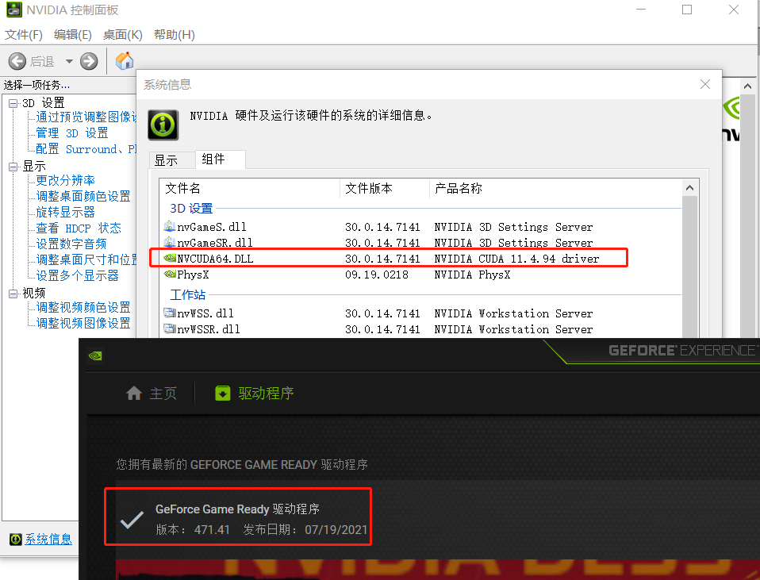
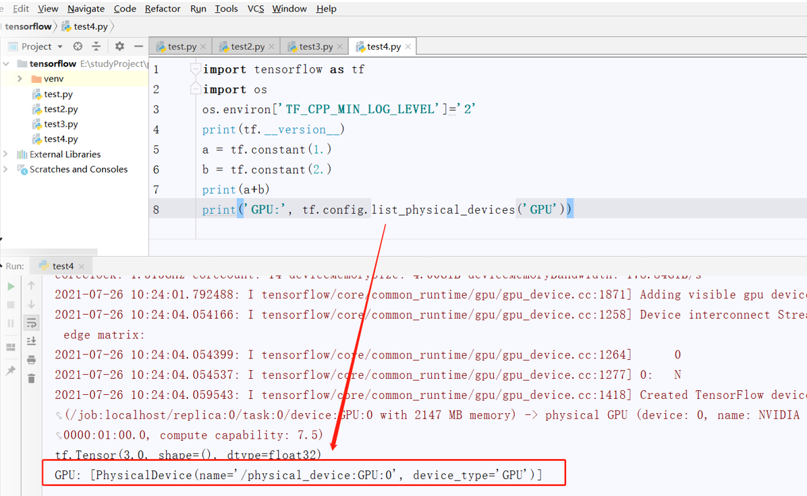

# TensorFlow DLL Solutions for missing files：cudnn64_8.dll not found&cusolver64_10.dll not found

> 解决tensorflow在安装最新版本（2.5.0） 时，运行时报错找不到各种dll文件方法。网上有很多的原因，说有因版本太高了，不兼容
>
> 还给了什么版本对应安装包，反正是折腾了很久，作为tensorflow使用新手，主要是想用用最新版本如何。正好换了台新的笔记本联想工作本本
>
> legion系统 r7000, 内存32G, CPU amd 4000 series ryzen，显卡nvidia  geforce gtx 1060。最初我按照网上的教程安装很多个版本都试了不行，一气之下，安装最新新版 pip install tensorflow 最新版本如何，什么需要设置pip镜像， 反正都是科学网络了，下载速度也快。
>
> 当前配置的最新的显卡驱动，最新的tensorflow框架版本2.5.0



 第一步，更新nvidia 驱动程序 ，去nvidia官网更新，能更新则更新最新版本显卡驱动程序，不能更新则卸载，然后重新安装显卡驱动程序

​                 去nvidia官网下载一个GeForce_Experience 的软件，用来专门更新显卡驱动程

 第二步下载最新版本的cuda开发工具sdk, 最新版，去官网下载，不要点我这个链接下载， 

​      我最下载最新的是这个链接地址 https://developer.download.nvidia.com/compute/cuda/11.4.0/local_installers/cuda_11.4.0_471.11_win10.exe  

​       再次提醒，你去官网下载，不要下载我上面连接。免的版本不兼容

第三步， 安装最新版本的anaconda3 最版本的

​      去掉官网下载 [https://repo.anaconda.com](https://repo.anaconda.com/archive/Anaconda3-2020.11-Windows-x86_64.exe)   

第四步，安装tensorflow最新版本
```
​       pip install tensorflow

​       pip install tensorflow-gpu
```
第五步，则试是否正常，运行如下脚本

```python
import tensorflow as tf
import os
os.environ['TF_CPP_MIN_LOG_LEVEL']='2'
a = tf.constant(1.)
b = tf.constant(2.)
print(a+b)
print(tf.__version__)
print('GPU:', tf.config.list_physical_devices('GPU'))
```

发现运行后报错，找不到各种dll 文件，像如下：

```
D:\anaconda3\python.exe E:/studyProject/python/tensorflow/test4.py
2021-07-26 09:52:07.878136: I tensorflow/stream_executor/platform/default/dso_loader.cc:53] Successfully opened dynamic library cudart64_110.dll
2.5.0
2021-07-26 09:52:20.978421: I tensorflow/stream_executor/platform/default/dso_loader.cc:53] Successfully opened dynamic library nvcuda.dll
2021-07-26 09:52:21.087958: I tensorflow/core/common_runtime/gpu/gpu_device.cc:1733] Found device 0 with properties: 
pciBusID: 0000:01:00.0 name: NVIDIA GeForce GTX 1650 computeCapability: 7.5
coreClock: 1.515GHz coreCount: 14 deviceMemorySize: 4.00GiB deviceMemoryBandwidth: 178.84GiB/s
2021-07-26 09:52:21.088759: I tensorflow/stream_executor/platform/default/dso_loader.cc:53] Successfully opened dynamic library cudart64_110.dll
2021-07-26 09:52:22.594321: I tensorflow/stream_executor/platform/default/dso_loader.cc:53] Successfully opened dynamic library cublas64_11.dll
2021-07-26 09:52:22.594571: I tensorflow/stream_executor/platform/default/dso_loader.cc:53] Successfully opened dynamic library cublasLt64_11.dll
2021-07-26 09:52:23.993389: I tensorflow/stream_executor/platform/default/dso_loader.cc:53] Successfully opened dynamic library cufft64_10.dll
2021-07-26 09:52:24.075060: I tensorflow/stream_executor/platform/default/dso_loader.cc:53] Successfully opened dynamic library curand64_10.dll
2021-07-26 09:52:24.866344: I tensorflow/stream_executor/platform/default/dso_loader.cc:53] Successfully opened dynamic library cusolver64_11.dll
2021-07-26 09:52:25.583784: I tensorflow/stream_executor/platform/default/dso_loader.cc:53] Successfully opened dynamic library cusparse64_11.dll
2021-07-26 09:52:25.586297: W tensorflow/stream_executor/platform/default/dso_loader.cc:64] Could not load dynamic library 'cudnn64_8.dll'; dlerror: cudnn64_8.dll not found
2021-07-26 09:52:25.586582: W tensorflow/core/common_runtime/gpu/gpu_device.cc:1766] Cannot dlopen some GPU libraries. Please make sure the missing libraries mentioned above are installed properly if you would like to use GPU. Follow the guide at https://www.tensorflow.org/install/gpu for how to download and setup the required libraries for your platform.
Skipping registering GPU devices...
2021-07-26 09:52:25.590408: I tensorflow/core/platform/cpu_feature_guard.cc:142] This TensorFlow binary is optimized with oneAPI Deep Neural Network Library (oneDNN) to use the following CPU instructions in performance-critical operations:  AVX AVX2
To enable them in other operations, rebuild TensorFlow with the appropriate compiler flags.
2021-07-26 09:52:25.594368: I tensorflow/core/common_runtime/gpu/gpu_device.cc:1258] Device interconnect StreamExecutor with strength 1 edge matrix:
2021-07-26 09:52:25.594692: I tensorflow/core/common_runtime/gpu/gpu_device.cc:1264]      
tf.Tensor(3.0, shape=(), dtype=float32)
GPU: []

Process finished with exit code 0

```

以上问题有两个问题

1，找 不到'cudnn64_8.dll'; dlerror: cudnn64_8.dll not found 

2，GPU: []  gpu不支持，跑tensorflow怎么能没有gpu工作呢，怎么不支持gpu呢

首先把第一个版本解决

直接在网站https://www.dll-files.com/search/下载，我上面报错只丢了一个dll 文件，有些人丢一堆，我在这建议安装最新版本cuda,和显卡驱动程序 再测试一下

下载dll文件后，把它放在cuda 安装目录 bin文件下，具体目录，我的目录如下：

C:\Program Files\NVIDIA GPU Computing Toolkit\CUDA\v11.4\bin

注意NVIDIA GPU Computing Toolkit  这个目录是你下载cuda后，双击解压安装后才会有的这个目录，必须安装，而不是下载下来解压就有的

安装完后，重启电脑

再跑一次上面脚本得到如下信息

```
D:\anaconda3\python.exe E:/studyProject/python/tensorflow/test4.py
2021-07-26 10:26:42.976336: I tensorflow/stream_executor/platform/default/dso_loader.cc:53] Successfully opened dynamic library cudart64_110.dll
2021-07-26 10:26:48.285803: I tensorflow/stream_executor/platform/default/dso_loader.cc:53] Successfully opened dynamic library nvcuda.dll
2021-07-26 10:26:48.337562: I tensorflow/core/common_runtime/gpu/gpu_device.cc:1733] Found device 0 with properties: 
pciBusID: 0000:01:00.0 name: NVIDIA GeForce GTX 1650 computeCapability: 7.5
coreClock: 1.515GHz coreCount: 14 deviceMemorySize: 4.00GiB deviceMemoryBandwidth: 178.84GiB/s
2021-07-26 10:26:48.338010: I tensorflow/stream_executor/platform/default/dso_loader.cc:53] Successfully opened dynamic library cudart64_110.dll
2021-07-26 10:26:48.357652: I tensorflow/stream_executor/platform/default/dso_loader.cc:53] Successfully opened dynamic library cublas64_11.dll
2021-07-26 10:26:48.357930: I tensorflow/stream_executor/platform/default/dso_loader.cc:53] Successfully opened dynamic library cublasLt64_11.dll
2021-07-26 10:26:48.373414: I tensorflow/stream_executor/platform/default/dso_loader.cc:53] Successfully opened dynamic library cufft64_10.dll
2021-07-26 10:26:48.376599: I tensorflow/stream_executor/platform/default/dso_loader.cc:53] Successfully opened dynamic library curand64_10.dll
2021-07-26 10:26:48.383979: I tensorflow/stream_executor/platform/default/dso_loader.cc:53] Successfully opened dynamic library cusolver64_11.dll
2021-07-26 10:26:48.392844: I tensorflow/stream_executor/platform/default/dso_loader.cc:53] Successfully opened dynamic library cusparse64_11.dll
2021-07-26 10:26:48.394278: I tensorflow/stream_executor/platform/default/dso_loader.cc:53] Successfully opened dynamic library cudnn64_8.dll
2021-07-26 10:26:48.394723: I tensorflow/core/common_runtime/gpu/gpu_device.cc:1871] Adding visible gpu devices: 0
2021-07-26 10:26:48.395510: I tensorflow/core/platform/cpu_feature_guard.cc:142] This TensorFlow binary is optimized with oneAPI Deep Neural Network Library (oneDNN) to use the following CPU instructions in performance-critical operations:  AVX AVX2
To enable them in other operations, rebuild TensorFlow with the appropriate compiler flags.
2021-07-26 10:26:48.398205: I tensorflow/core/common_runtime/gpu/gpu_device.cc:1733] Found device 0 with properties: 
pciBusID: 0000:01:00.0 name: NVIDIA GeForce GTX 1650 computeCapability: 7.5
coreClock: 1.515GHz coreCount: 14 deviceMemorySize: 4.00GiB deviceMemoryBandwidth: 178.84GiB/s
2021-07-26 10:26:48.398921: I tensorflow/core/common_runtime/gpu/gpu_device.cc:1871] Adding visible gpu devices: 0
2021-07-26 10:26:49.488227: I tensorflow/core/common_runtime/gpu/gpu_device.cc:1258] Device interconnect StreamExecutor with strength 1 edge matrix:
2021-07-26 10:26:49.488470: I tensorflow/core/common_runtime/gpu/gpu_device.cc:1264]      0 
2021-07-26 10:26:49.488610: I tensorflow/core/common_runtime/gpu/gpu_device.cc:1277] 0:   N 
2021-07-26 10:26:49.489126: I tensorflow/core/common_runtime/gpu/gpu_device.cc:1418] Created TensorFlow device (/job:localhost/replica:0/task:0/device:GPU:0 with 2147 MB memory) -> physical GPU (device: 0, name: NVIDIA GeForce GTX 1650, pci bus id: 0000:01:00.0, compute capability: 7.5)
tf.Tensor(3.0, shape=(), dtype=float32)
2.5.0
GPU: [PhysicalDevice(name='/physical_device:GPU:0', device_type='GPU')]
```

如下三行是打印的真实结果，上面是tensorflow打印的日志信息

 >｀tf.Tensor(3.0, shape=(), dtype=float32)｀   
｀2.5.0｀   
｀GPU: [PhysicalDevice(name='/physical_device:GPU:0', device_type='GPU')]｀   

终于看到GPU 中括号里有 信息了，说明gpu生效，安装tensorflow-gpu成功，

如果你用Anaconda Jupyter Notebook 默认是不会打印 上面日志的，也就是说看不到什么dll 文件丢失

我用的pycharm ide 



我用pycharm ide 配置的环境 如下，我电脑 安装了很多的python 环境，有代码需要在pycharm 切换python 版本，才能正常跑起来，比如我的tensorflow2.5.0 是要用Python 3.8.8才能跑的。 就是如下设置

下面就是我安装的tensorflow 相关依赖包

