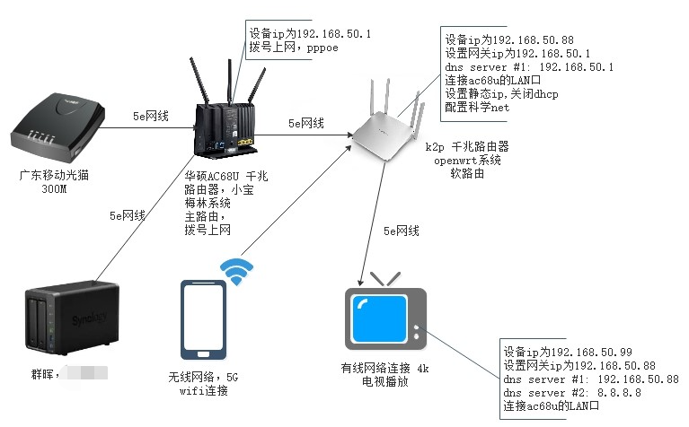
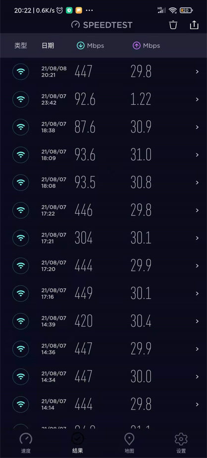

# 软路由配置使用方法

> 为什么需要使用软路由，是为了不影响原来主路由上网配置，网络环境，增加一个软路由来专门来解析404网站，及特殊的网络连接
>
> 满足上网需求，下图就是今天要介绍软路由其中一种设置方法，不影响原来的网络环境下，给增加一台软路由方法，ip设置方法

当电视或者手机需要打开404网站，则需要单独配置 dns 和网关ip,即可正常扶梯

上图为作者家用宽带  移动运营商300M 速度，上行30M, 下行300M,实际用speedtest测速apk，测试速度上行为4m, 下行为50M/s 

主要设置注意点：

1,k2p 做为软路由，需要连使用lan口 接入主路由，k2p 自身需要接入lan口 而不是wan 口，接入wan口的话，则会产生的ip和主路由ip不在同一个网段，这样以来你的局域网访问就麻烦，这样默认情况下如果链接的软路由wifi的的手访问不了 群晖，最终你家里如果有多个路由器且都不在同一个网段的话，结果设备访问会多一层nat转发

2，关于测速，很多朋友对自己家里网速并不关心，不知道自己家里的路由器最大能不能跑满运营商给的网络环境。我经常会碰到运营商打电话给我推销网络提速套餐，然而自己家里路由是个十几年前的百兆路由器tplink的，如果提速成功了，往往网速还停留在原来的样子

这样是不是很坑，花的网络费用价值缺没有最大化，这里给大家推荐 手机 安装一款speedtest apk ,以后你可以时不时的点击一下测试你自己家里网速情况。当我加装了软路由器后，我再用speedtest 测速，并没有达到理想的值，于是在找原因，也打过几次电话给运营商投诉，后面发现是路由器本身发热温度太高了，导致的网速变慢，于是需要买风扇了，降温效果很明显，再次测试网速，可以正常了

