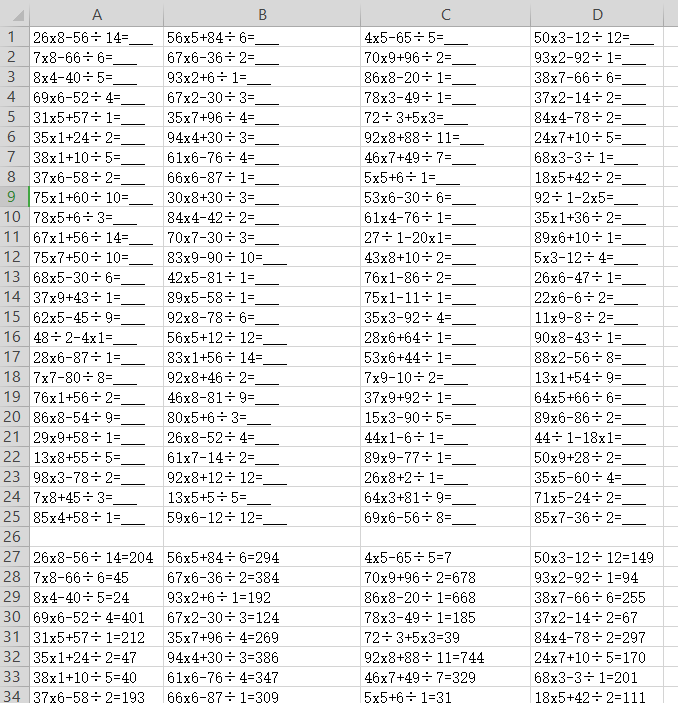
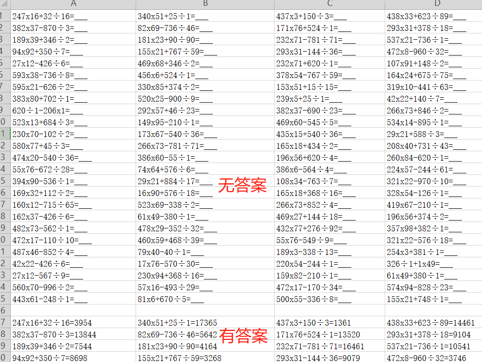

# 生成小学三年级四笔算式题及答案代码

> 由于小学三年级，数学书本未有负数，小数点，难度还是相对初级，要求3位数*2位数，除式算题不能有小数点, 减法不能用负数
>
> 下面就简单写了一下，思路比较简单，还没有包括括号，没有复杂的计算顺序的问题，基本上是 `a*b + d/c`  这种  `a*b - d/c`
>
> 生成有答案和无答案两种，方便后续家长或老师改题需要计算器，哈哈，打算后面有时间再搞智能点


```python
# -*- coding=utf-8 -*-

import random
from random import choice
from openpyxl import Workbook
wb = Workbook()
ws = wb.active
import datetime


def getNum(min,max):
    return random.randrange(min, max)

# 判断是否是小数点，90.0,56.0 这类不算
def is_float(s):
    s = str(s)
    if s.count('.') == 1:  # 判断小数点个数
        sl = s.split('.')  # 按照小数点进行分割
        left = sl[0]  # 小数点前面的
        right = sl[1]  # 小数点后面的
        if right == '0':
            return False
        if left.startswith('-') and left.count('-') == 1 and right.isdigit():
            lleft = left.split('-')[1]  # 按照-分割，然后取负号后面的数字
            if lleft.isdigit():
                return True
        elif left.isdigit() and right.isdigit():
            # 判断是否为正小数
            return True
    return False


chengfa = []
#乘法
while True:
    n1 = getNum(1,99)
    n2 = getNum(1,10)
    total = n1 * n2
    c = []
    c.append(n1);c.append("x");c.append(n2);c.append(total)
    chengfa.append(c)
    if len(chengfa)>200:
        break;


chufa = []
#除法
while True:
    n1 = getNum(1,99)
    n2 = getNum(1,15)
    total = n1 / n2
    if not is_float(total):
        c = []
        c.append(n1);c.append("÷");c.append(n2);c.append(int(total))
        chufa.append(c)
        if len(chufa)>200:
            break;


#乘除合并，加减
hasres = []
nores = []
#计算符随机
c=["+","-"]
#打印多少题
t = 100
cell = 4  #生成excel 4列表格

while True:
    chuf = choice(chufa)
    chenf = choice(chengfa)
    f = choice(c)
    if chuf[3] > chenf[3]:
        if f == "+":
            tt = chuf[3] + chenf[3]
        else:
            tt = chuf[3] - chenf[3]
        #有答案的
        hasres.append("%d%s%d%s%d%s%d=%s" % (chuf[0],chuf[1],chuf[2],f,chenf[0],chenf[1],chenf[2],tt))
        #无答案的
        nores.append("%d%s%d%s%d%s%d=___" % (chuf[0],chuf[1],chuf[2],f,chenf[0],chenf[1],chenf[2]))
    else:
        if f == "+":
            tt = chuf[3] + chenf[3]
        else:
            tt = chenf[3] - chuf[3]
        # 有答案的
        hasres.append("%d%s%d%s%d%s%d=%s" % (chenf[0], chenf[1], chenf[2],f, chuf[0], chuf[1], chuf[2],tt))
        # 无答案的
        nores.append("%d%s%d%s%d%s%d=___" % (chenf[0], chenf[1], chenf[2],f, chuf[0], chuf[1], chuf[2]))
    if len(hasres)>t:
        break


rows = []
for item in nores:
    rows.append(item)
    if len(rows)==cell:
        ws.append(rows)
        del rows[:]

ws.append([])

rows = []
for item in hasres:
    rows.append(item)
    if len(rows)==cell:
        ws.append(rows)
        del rows[:]

version = datetime.datetime.now().strftime('%Y%m%d%H%M%S')
wb.save("小学三年级下册数学算式生成-%d-%d-%s.xlsx" % (cell,len(hasres),version))
wb.close()

```

生成效果如下






