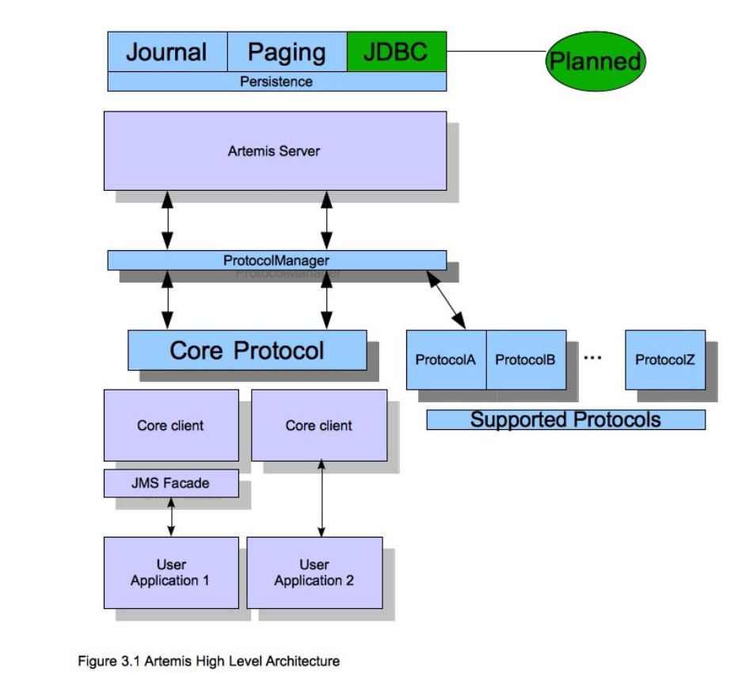

# Activemq Artemis learning 1

> activemq 有两个版本，过去很多人使用的activemq 经典版。 对该版本性能上面评价不是很满意，但今天官方又提供基于netty版的
>
> activemq artemis 这个消息中件间，将提供异步消息处理。在使用activemq好处是在于，对大多数据中小企业来说没有经历去造轮子，那么完全可以采用开源方案来完成需求，采用activemq artemis 这个消息中间件，他不仅继承原来的多协议，还大大提升了性能，着实很香的，activemq 本来就和rabbitmq, kafka,rocketmq 等三大mq不一样，还是有区别，适用不同场景。比如过去们常常使用mq kafka, rabbitmq大多数是在云服务器内网通信使用的，做服务消息解耦使用，但它只是普通的tcp 传输协议，不支持webscket 直连，http, udp 直连等特点，而activemq artemis 相反，他可以支的寺ws直连，tcp,udp直连，加上公司团队java技术栈的优势，采用先使用，熟悉如何使用activemq artemis 然后对其二次开发，也不是不错技术选型路线

下面就是官网提供activemq artemis 核心技术架构图

如果中小企业需要对activemq artemis 商用的话，就不的不考虑安全问题

比如android端 是如何链接actviemq artemis 逻辑的，在建立安全链接之前需要做一些鉴权处理

需要在activemq前 增加一nginx网关作为代理