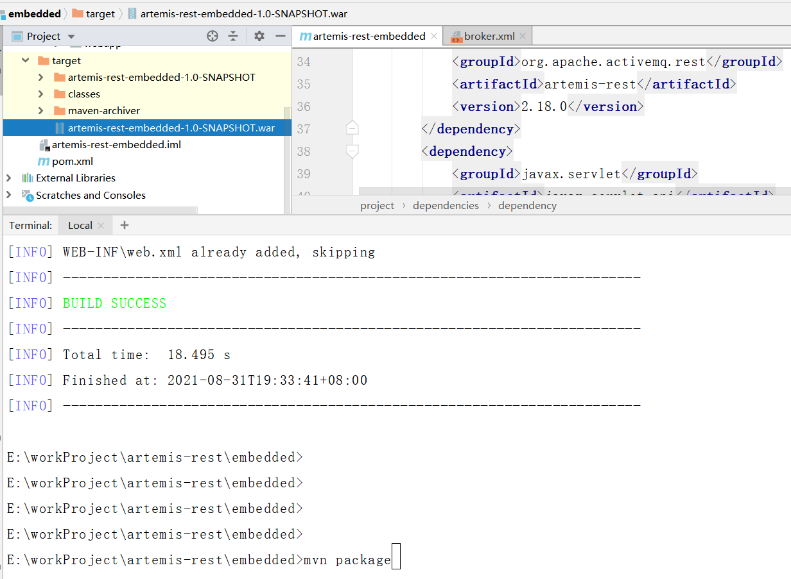
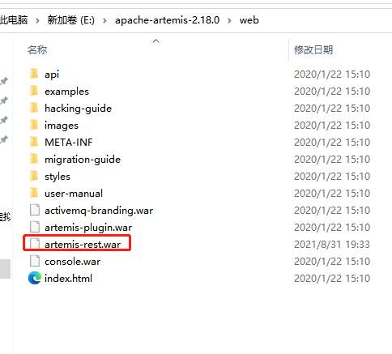

# 如何启用activemq artemis rest api 特性

> 在一次项目中需要使用activemq artemis mqtt 协议通信特性，需要借助rest api 功能按clientId 查询是否在线，也就是如何通过client id 查询 设备是否在线需要借助rest api 特性，默认情况artemis 不提供rest api 特性，在网搜索了一了，再借助官网的文档，需要build 一个war包 放 到web目录下即可，然后 重启程序
>
> 但 在build 过程不是顺利，记录一下报错处理方法 


github 提供的源代码，需要`build` ,即 `mvn package`  

[jirkadanek/artemis-rest: Give your ActiveMQ Artemis Message Broker a REST interface (github.com)](https://github.com/jirkadanek/artemis-rest)

官网提供的文档，如何开启rest api 特性

[REST Interface · ActiveMQ Artemis Documentation (apache.org)](https://activemq.apache.org/components/artemis/documentation/latest/rest.html)

stackoverflow  提供的类似的问答 参考  配置参考

[java - Artemis rest interface - Stack Overflow](https://stackoverflow.com/questions/59319707/artemis-rest-interface)

[maven - REST interface on ActiveMQ Artemis - Stack Overflow](https://stackoverflow.com/questions/63668418/rest-interface-on-activemq-artemis)

> 在集群模式下，如何开集，`master/salver`

[java - How to enable REST in an ActiveMQ Artemis cluster - Stack Overflow](https://stackoverflow.com/questions/59847221/how-to-enable-rest-in-an-activemq-artemis-cluster)

> build 报错如下


```java
[ERROR] Failed to execute goal on project artemis-rest-embedded: Could not resolve dependencies for project com.github.jdanekrh:artemis-rest-embedded:war:1.0-SNAPSHOT: Failure to find o
rg.apache.activemq.rest:artemis-rest:jar:2.18.0 in http://maven.aliyun.com/nexus/content/repositories/central/ was cached in the local repository, resolution will not be reattempted unt
il the update interval of alimaven has elapsed or updates are forced -> [Help 1]
[ERROR]
```

> 解决方法，根据上述报错，原因为找不到`artemis-rest:jar:2.18.0`  其 版本为 2.18.0 但是pom.xml 里面写的RELEASE, why?  
>
> 这里我就把改成对应版本，版本从maven 中央仓库得到最新版本

> 再执行以下命令

```bash
mvn install clean -U
```

> 然后再执行以下命令，就是打包了

```bash
mvn package
```




>  将得到的war包放到web目录下,记得一定要重命名 `activemq-rest.war`



> 重启activemq artemis 

