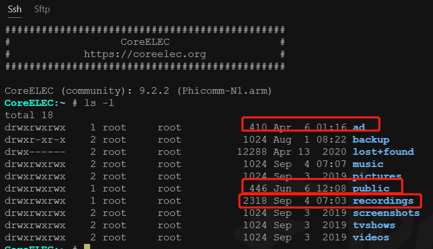
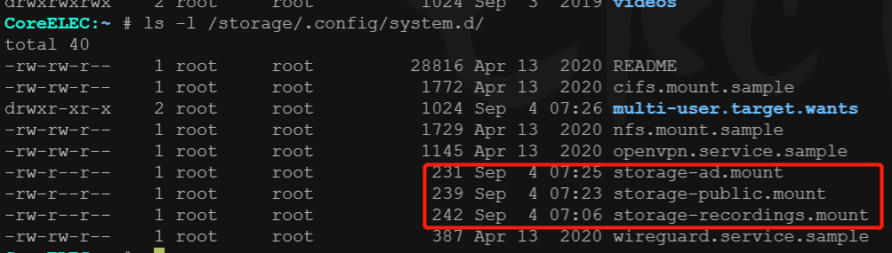

# 如何在coreelec 系统挂在nas共享目录，支持自动开机播放，播放内容安排


> 背景需求是打造家庭定时定点播放内容，内容包含音视频，现有环境闲置的n1盒子一台，音响一套，小米智能插座一个，nas ds218群晖一台，设定每天定时，定点播放不同内容，内容来自群晖硬盘，或者网络离线内容。需要解决以下关键问题如下
>
> 1，如何在coreelec mount 群晖共享目录
>
> 2，如何让coreelec 开机或者重启就自动播放内容

### 如何在coreelecd  mount 共享目录

> 以下是官网介绍

Kodi can natively mount SMB, NFS, SFTP, WebDAV (and more) remote filesystems (shares) to read media for playback, but many applications that write content, e.g. TVHeadend storing TV recordings, must write to "local" storage. Remote SMB and NFS shares can be "mounted" to the local filesystem using kernel mounts configured through systemd .mount files.

The following NAS configuration is used in the examples below:

NAS IP: `192.168.50.22`   群晖的ip

Username: `nasuser1`   群晖系统的账号

Password: `123nas` 群晖的系统密码

Share name: `recordings`    群晖的共享目录名称，我的自己的是volume1

Full address to share: `\\192.168.50.22\volume1`


## SMB Shares  smb 协议共享挂载 

### 1. Create the folder where the share should be mounted

Connect to your LibreELEC HTPC with SSH.

```
mkdir /storage/recordings
```

### 2. Create the systemd .mount file

**IMPORTANT:** The filename uses hyphens to separate elements of the fileystem path to the share mount-point, e.g. `/storage/recordings` will be `storage-recordings.mount` and sub folders, e.g. `/storage/recordings/tv` would be `storage-recordings-tv.mount`

Create the .mount file:

```
nano /storage/.config/system.d/storage-recordings.mount
```

Below is an example of the mount definition file for a Samba share:


```
[Unit]
Description=cifs mount script
Requires=network-online.service
After=network-online.service
Before=kodi.service

[Mount]
What=//192.168.50.22/recordings
Where=/storage/recordings
Options=username=nasuser1,password=123nas,rw,vers=2.1
Type=cifs

[Install]
WantedBy=multi-user.target
```

### 3. Things to edit

Address of your share. Remember to always use / slashes:

```
What=//192.168.1.222/recordings
```

Path where the Share should be mounted:

```
Where=/storage/recordings
```

Options:

```
Options=username=nasuser1,password=123nas,rw,vers=2.1
```

`username=` Username of your network share `password` Password of your network share `rw` Read/write access `vers=2.1` Version of the Samba protocol, `2.1` is supported since Windows 7 several [other versions](https://wiki.samba.org/index.php/Samba3/SMB2#Introduction) are supported too

### 4. Enable the mount

Finally we need to enable the mountpoint.

```
systemctl enable storage-recordings.mount
```

### 5. Reboot

Reboot your system to check if the mount works.

### 6. Helpful command for troubleshooting

Get status and error messages from the mount point.

```
systemctl status storage-recordings.mount
```

Remove mount point and disabling it.

```
systemctl disable storage-recordings.mount
```

# NFS Shares  我使用的nfs协议，推荐使用nfs,效率比smb快

### 1. Create the folder where the share should be mounted

Connect to your LibreELEC HTPC [with SSH](https:///accessing_libreelec).     ssh登录系统，首先创建recordings目录,

```
mkdir /storage/recordings
```

### 2. Create the systemd definition file   定义mount文件

**Important:** you need to use the filename for the definition file according to the folder where you want to mount your share . In our case `storage-recordings.mount` represent path -> `/storage/recordings`. If you like an subfolder `storage-recordings-tv.mount` represent path -> `/storage/recordings/tv`.

 定义mount文件需要一定的格式，如storage-recordings.mount 则 创建的目录是/storage/recordings 

注意storage-music.mount 是不能定义的，定义会有报错，报bad set 错误

```
nano /storage/.config/system.d/storage-recordings.mount
```

Content of the definition file for a NFS share. 

```
[Unit]
Description=nfs mount script
Requires=network-online.service
After=network-online.service
Before=kodi.service

[Mount]
What=192.168.50.22:/volume1/music
Where=/storage/recordings
Options=
Type=nfs

[Install]
WantedBy=multi-user.target
```

### 3. Things to edit

Address of your share;

```
What=192.168.1.222:/usr/data2/video
```

Path where the share should be mounted:

```
Where=/storage/recordings
```

Options: At this section you are able to define specific NFS options, such as NFS version for example. In our example here, we don't need it and we are assuming you are using a NFSv3 share.

Type: `Type=nfs`   type为指定类型

### 4. Start it for a test:   

写好mount文件后，准备开启 ，输入如下命令

```
systemctl start storage-recordings.mount
```

Note: That's only a test and the mount won't be available after a reboot. To make it available after boot you have to "enable" the service first.

### 5. Enable the mount

以下命令的作用可以，让coreelec 开机会就启动挂载共享目录

If the previous test worked, then please enable the service via:

```
systemctl enable storage-recordings.mount
```

### 6. Reboot

Reboot your system to see if the mount is available after boot.

### 7. Helpful command for troubleshooting

Get status and error messages from the mount point.

查看挂载的目录状态

```
systemctl status storage-recordings.mount
```

Remove mount point and disabling it.

如果需要禁用，则用disable 禁用挂载即可

```
systemctl disable storage-recordings.mount
```

# **Apple TimeCapsule**

TimeCapsule devices share files using an Apple dialect of SMB that is not compatible with the Samba `smbclient` Kodi uses to connect to SMB shares. To access media on a TimeCapsule you can follow the steps described above for connecting to Samba shares with a systemd storage mount, but with one difference: the `Options` configuration must force SMB v1.0 and legacy NTLM authentication or the mount will fail. See below:

如果是你是用smb协议共享的 话，如果有用户名和密码，则用以下格式填写在options处

```
Options=username=MyUser,password=MyPass,sec=ntlm,vers=1.0
```

SMB v1.0 is widely considered to be insecure, but TimeCapsules no longer receive software updates and there is no alternative; SMB v2/v3 are not supported.


最后效果，以下三个目录是我挂载进来的，如果你挂music, videos目录不建议，会报错的，估计是系统不留吧




在 /storage/.config/system.d/目录下，默认系统提供了用例sample,模板，你可以直接更改为mount就可以用

mount文件内容格式一定要按上面格式填写才能生效，否则报错bad set 




开机自启脚本如下：

在/storage/.kodi/userdata/ 目录下 创建 autoexec.py 文件 ，输入代码如下

python 脚本，这里借助xbmc 库，可以充分发挥你的想像力

```python
 import xbmc

 xbmc.executebuiltin("PlayMedia(/storage/.kodi/userdata/playlists/video/1.mp4)") 
```

其实还有一个以命令形式来控制播放就是cli 模式

kodi-send 命令

```shell
CoreELEC:~ # kodi-send
Usage
        kodi-send [OPTION] --action=ACTION
        kodi-send [OPTION] --button=BUTTON
Example
        kodi-send --host=192.168.0.1 --port=9777 --action="Quit"
Options
        -?, --help                      Will bring up this message
        --host=HOST                     Choose what HOST to connect to (default=localhost)
        --port=PORT                     Choose what PORT to connect to (default=9777)
        --keymap=KEYMAP                 Choose which KEYMAP to use for key presses (default=KB)
        --button=BUTTON                 Sends a key press event to Kodi, this option can be added multiple times to create a macro
        -a ACTION, --action=ACTION      Sends an action to XBMC, this option can be added multiple times to create a macro
        -d T, --delay=T                 Waits for T ms, this option can be added multiple times to create a macro
```

