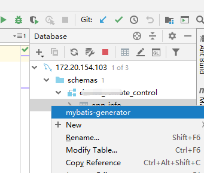
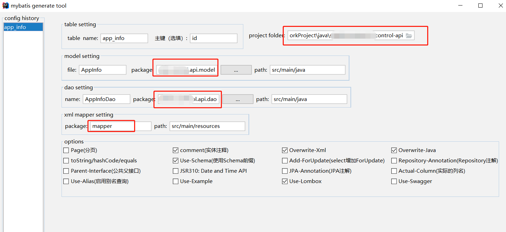
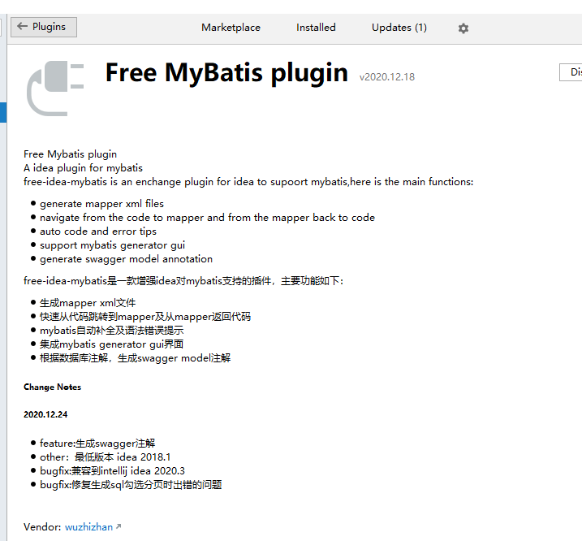

#  在intellij idea 中用mybatis generate tool 插件快速生成mybatis dao,model,mapper等文件

> 用idea 打开一个多模块的项目, 配置database mysql 设置并连接上
>
> 打开schemas 选择一个表，右建选择mybatis-generator

在弹出窗口，注意选择,以下红框中请设置好。很重要，否则生成路径不对。免得移动文件，干脆一次到位生成到对应的目录下面

> 插件名字如下

