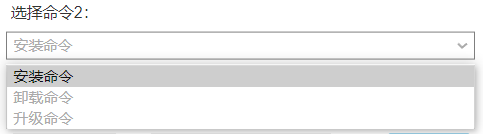
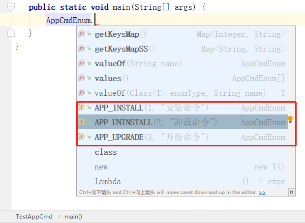

# 枚举类在java中使用方法之一

> 在后数据中台中，有些数据不需要放在数据库当中，只需要一个枚举类即可，比如web ui select 选择器下拉数据，`男`，`女` 这种，还比如`省市` 下拉数据，而这些数据可以不需要数据库来保存，也不需要用配置文件来保存，只需要一个枚举类即可，使用方法如下

```JAVA

public enum AppCmdEnum {

   APP_INSTALL(1, "安装命令"),
   APP_UNINSTALL(2, "卸载命令"),
   APP_UPGRADE(3, "升级命令");

   Integer code;
   String name;

   private static Map<Integer, String> KEYS_MAP = new HashMap<>();
   private static Map<String, String> KEYS_MAP_SS = new HashMap<>();

   //初始化枚举类资源类型数据返回，
   static {
      for (AppCmdEnum item : AppCmdEnum.values()) {
         KEYS_MAP.put(item.code, item.name);
         KEYS_MAP_SS.put(item.code.toString(), item.name);
      }
   }

   public static Map<Integer, String> getKeysMap() {
      return KEYS_MAP;
   }

   public static Map<String, String> getKeysMapSS() {
      return KEYS_MAP_SS;
   }

   //增加一个构造函数，丰富描述该枚举类的作用，和功能，字段含义
   //根据业务需求可以，可以增加很多的属性字段，扩展非常灵活
   AppCmdEnum(Integer code, String name) {
      this.code = code;
      this.name = name;
   }

   public Integer getCode() {
      return this.code;
   }

   public String getName() {
      return this.name;
   }
}

```


在spring boot项目调用方法

```
@GetMapping("/api_conf")
public Object apiConf() {
   Map<Integer, String> keysMap = AppCmdEnum.getKeysMap();
   return keysMap;
}
```

该接口返回内容如下：

```
{
	"1": "安装命令",
	"2": "卸载命令",
	"3": "升级命令"
}
```

用到web前端效果



在业务代码使用枚举类时，还有中文提示，这个比常量好使很多呢

