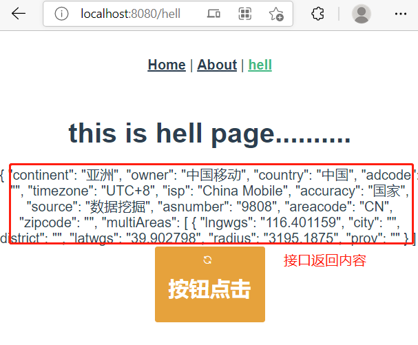

# 前端学习【vue-typescript-1】

> 基于模板代码学习编写最前沿技术框架`vue-typescript-admin-template` , 这里直接省略环境搭建npm node vue 请自行安装, vue 以最新版本为准 vue3.x
> 首先确定一个本次学习目标需求，通过web前端页面把后台的一个接口内容显示输出在页面上即可，实现点击按钮弹窗的效果
>
> 我的后台接口地址是http://www.hell.com/iplocation/ipuu/getInfo?ip=111.44.1.3  
>
> 我浏览器访问地址是`[hello-world](http://localhost:8080/hell)`

### 构建初始化项目

```
vue create hello-world
```

### 构建路由创建一个新的页面

##### 1. 在 App.vue 文件加入 一个 超链接标签 `router-link`  可实现html a标签 href跳转功能   


```
 <router-link to="/hell">hell</router-link>
```

##### 2. 在router目录下index.ts文件里增加如下代码，处理/hell 路由的指向文件    

```typescript
const routes: Array<RouteConfig> = [
    //原有的路由保持不动，增加以下/hell路由指向处理
 { 
  path: '/hell', 
  name: 'hell', 
  component:()=> import('../views/hell.vue') 
 } 
]
```

##### 3. 在utils目录下新增`request.ts`文件


```typescript
import axios from 'axios'
import { config } from 'chai'

const service = axios.create({
  baseURL: "/api", 
  timeout: 5000
})

service.interceptors.request.use(
  (config) => {
    return config
  },
  (error) => {
    Promise.reject(error)
  }
)
 
service.interceptors.response.use(
  (response) => {
    const res = response.data
    return res
  },
  (error) => {
     console.log(11111111)
  }
)

export default service

```


##### 4. 在src目录下创建api目录，用于专门api函数，与后台交互的api接口处理


```typescript
import request from '@/utils/request'

export const getIpInfo = () => 
request({
  url:"iplocation/ipuu/getInfo?ip=111.44.1.3",
  method:'get'
})
```


##### 5. 在main.ts文件加入核心依赖库，需要用到el 标签，icon库，el样式都需要导入，以下main.ts原文件加入注释的都新增代码


```typescript
import Vue from 'vue'  //新加入的
import App from './App.vue'
import ElementUI from 'element-ui' //新加入的
import SvgIcon from 'vue-svgicon' //新加入的

import 'element-ui/lib/theme-chalk/index.css'   //新加入的

import './registerServiceWorker'
import router from './router'
import store from './store'


Vue.use(ElementUI, {}) //新加入的，需要注册到vue,否则控制台报错，不存在该标签


Vue.config.productionTip = false

new Vue({
  router,
  store,
  render: h => h(App)
}).$mount('#app')

```


##### 6. 在views 目录下创建hell.vue 文件

```html
 <template>
  <div> 
    <h1> this is hell page..........</h1>
    <!--这个aa来自类属性变量-->
    <div>{{aa}}</div>
      <div> 
          <el-button
              class="cancel-btn"
              size="small"
              icon="el-icon-refresh"
              type="warning"
              name="aabbba"
              @click="clickfunc(111)"
            >
                  <h1>按钮点击</h1>
            </el-button>
      </div>
  </div>
</template>
<script lang='ts'>
//导入依赖vue
import { Component, Vue } from 'vue-property-decorator' 
//导入ip接口文件库
import { getIpInfo } from '@/api/ip'

//必须增加@commponet注解，否则无效created无效
@Component
export default class extends Vue { 
  private aa = "" 
  //继承了vue特性 created 
  created(){
      this.getIpInfo()
  }
  //当点击时会调用这个函数
  private clickfunc(row: any) {
       alert(this.aa)
  }
  //异步调用getipinfo接口
   async getIpInfo(){
       const { data } = await getIpInfo()
       this.aa = data
   }
}
</script>

```

##### 7. 设置项目接口访问，解决访问接口在开发环境跨域的问题，在vue.config.js


```
module.exports = {
  devServer: {
    headers: {
      'Access-Control-Allow-Origin': '*'
    },
    proxy: {
      '/api': {
        ws: true,  //是否启用websockets
        changeOrigin: true,  //开启代理： 在本地会创建一个虚拟服务端，然后发送请求数据，并且同时接收请求数据，这样客户端和服务端进行数据的交互就不会有跨域问题
        target: 'http://www.hell.com',  // 要访问的跨域的域名
        pathRewrite: {
          ['^/api']: ''
        }
      }
    }
  },
}
```

##### 8. 安装依赖，依次执行

```
npm install element-ui --save  
npm install axios --save
npm install element-ui --save
```


##### 9. 运行


```
# npm run serve

You may use special comments to disable some warnings.    
Use // eslint-disable-next-line to ignore the next line.  
Use /* eslint-disable */ to ignore all warnings in a file.
No type errors found
Version: typescript 4.1.6
Time: 2614ms

  App running at:
  - Local:   http://localhost:8080/
  - Network: http://172.20.148.107:8080/
```


最终效果:

