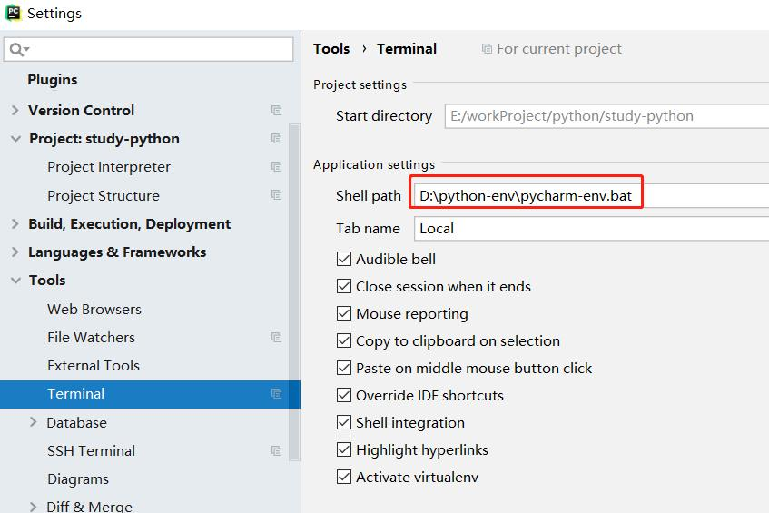

#  windows 环境pycharm python 多环境开发设置
> 在python项目开发中，很多情况每个项目采用不同的python 环境，一般常见的系统默认python 版本为
> python 2.7但如果又不想破坏系统原来的python 环境，则可以安装virualenv 依赖解决多版本的问题
> virtualen 采用pip install 安装，不管是采用python3版本的pip,还是 python2版本的pip都可以安
> 装这个依赖，pycharm 具体设置如下：

The preferences in Settings (Preferences) | Tools | Terminal are global.
If you use a venv for each project, remember to use current path variable and a default venv name: 
> 创建activate.bat文件复制如下代码,并修改自己创建的虚拟环境目录，这里我创建的虚拟环境目录为 
```sh
"cmd.exe" /k " D:\python-env\python3\envname\Scripts\activate" 
```
> /k 的含义是自动执行后面的命令,并且执行完毕后保留窗口   
For Windows users: when using PyCharm with a virtual environment, you can use the /K parameter to cmd.exe to set the virtual environment automatically.

PyCharm 3 or 4: Settings, Terminal, Default shell and add /K <path-to-your-activate.bat>.

PyCharm 5: Settings, Tools, Terminal, and add /K <path-to-your-activate.bat> to Shell path. 
> 打开pychrm，依次点击file菜单，settings-->tools--->terminal-->shell path   
PyCharm 2016.1,2018.x...: Settings, Tools, Terminal, and add ""/K <path-to-your-activate.bat>"" to Shell path and add (mind the quotes). Also add quotes around cmd.exe, resulting in:



> 遇到pip install 模块 下载不了的情况，请设置国产镜像
```$xslt
https://pypi.douban.com/simple
https://mirrors.aliyun.com/pypi/simple
https://pypi.mirrors.ustc.edu.cn/simple
https://pypi.tuna.tsinghua.edu.cn/simple
```
