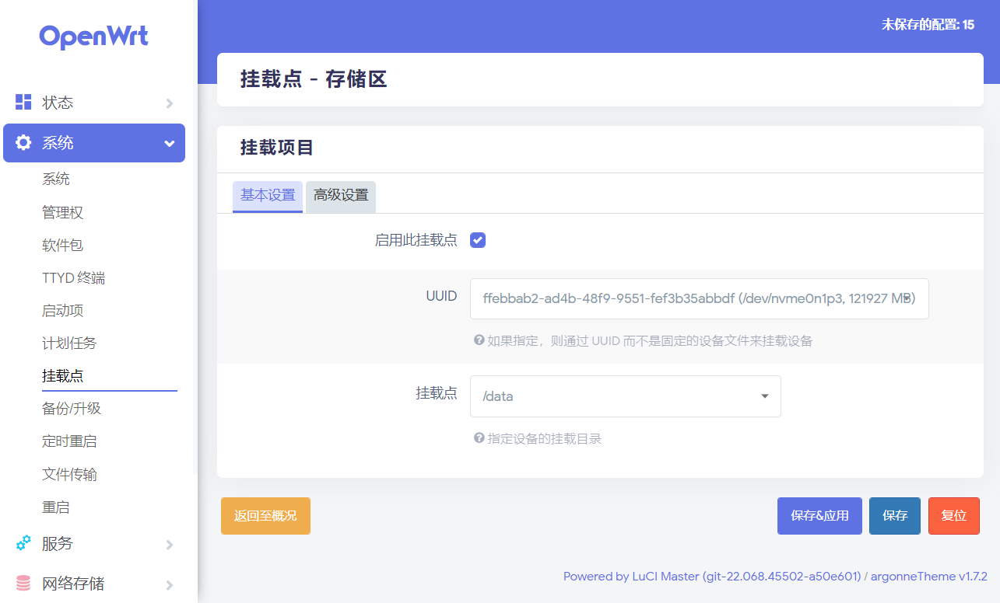
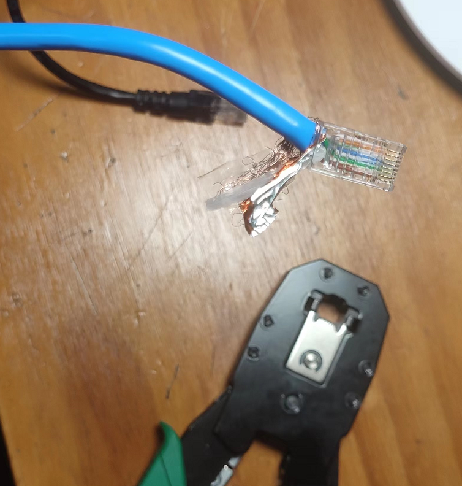
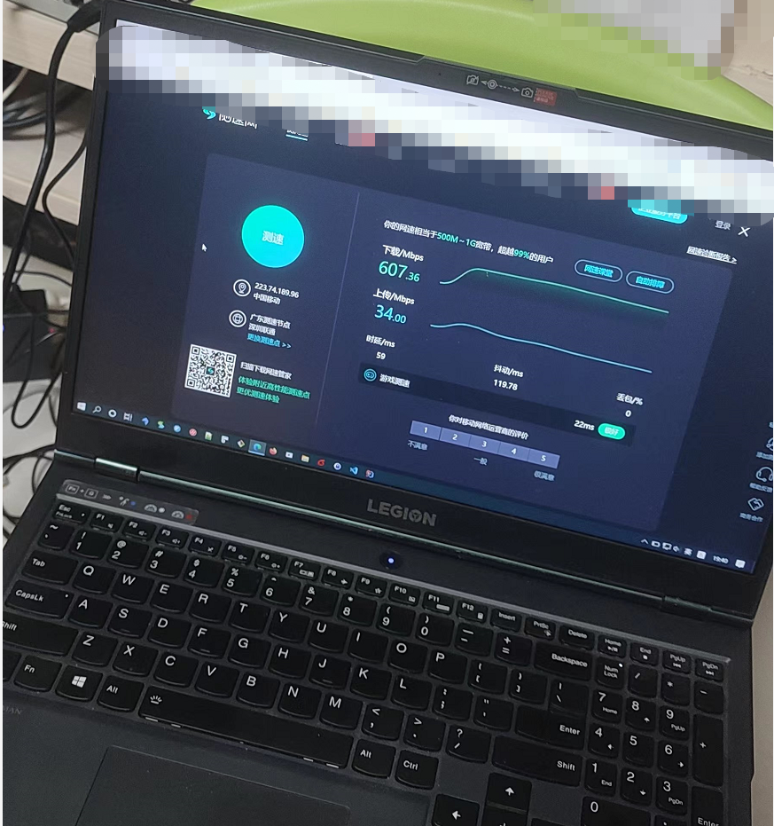

# How to Disk Partition Formatted in Openwrt System and Improve network performance
> 如何在openwrt系统下给磁盘分区，并且是给固态硬盘分区`nvme标识`
> 最近在在淘宝买回一台小主机2.5g 4个网口的 cpu N5105 intel 赛扬,主要帮提升一下网络性能
> 升级wifi6，升级家庭网络结构，提升局域网络复制文件速度，同时解决了4k视频播放本地播放传输慢卡顿问题
> 店主省事帮我安装一openwrt x86系统，（不是arm，不是/dev/sda磁盘标识），没有把128G固态磁盘剩余的空间分区并格式化
> 导致我收到主机后，登录openwrt系统查看不到剩余空间，开始怀疑是否发错错了，不是128G的，还是64G的？？？
> 询问店主后得知没有分区剩下的磁盘空间，所以需要买家自己行解决，如果不是it出生的用户怎么办，想想也是，不是it人员不用这部分空间也
> 也无所谓

## 解决分区问题，分三步
> 1， 检查相关命令，是否有分区命令，没有需要安装，
```bash
    opkg install fdisk
```
>  如果安装好后，使用fdisk -l 命令查看硬盘使用情况，分区情况，以及分区编号

> 2, 格式化未使用的空间,nvme0n1p1,nvme0n1p2己使用了，创建新分区nvme0n1p3
```bash
   mkfs.ext3 /dev/nvme0n1p3
```
> 3, 挂载分区，使用命令临时挂载，一次性的，需要开机则挂机，则需要添加init.d命令，这里推荐用图形界面挂载比
> 比较简单,选择UUID,挂载点后点击保存即可


> 以下是用命令操作分区格式化的过程

```bash
root@OpenWrt:~# mount /dev/nvme0n1p3 /data/
mount: mounting /dev/nvme0n1p3 on /data/ failed: Invalid argument
root@OpenWrt:~# mount /dev/nvme0n1p3 /data
mount: mounting /dev/nvme0n1p3 on /data failed: Invalid argument
root@OpenWrt:~# mkf
mkfifo     mkfs.ext2  mkfs.ext3  mkfs.ext4  mkfs.f2fs
root@OpenWrt:~# mkf
mkfifo     mkfs.ext2  mkfs.ext3  mkfs.ext4  mkfs.f2fs
root@OpenWrt:~# mkfs.ext
-ash: mkfs.ext: not found
root@OpenWrt:~# mkfs.ext3
Usage: mkfs.ext3 [-c|-l filename] [-b block-size] [-C cluster-size]
        [-i bytes-per-inode] [-I inode-size] [-J journal-options]
        [-G flex-group-size] [-N number-of-inodes] [-d root-directory]
        [-m reserved-blocks-percentage] [-o creator-os]
        [-g blocks-per-group] [-L volume-label] [-M last-mounted-directory]
        [-O feature[,...]] [-r fs-revision] [-E extended-option[,...]]
        [-t fs-type] [-T usage-type ] [-U UUID] [-e errors_behavior][-z undo_file]
        [-jnqvDFSV] device [blocks-count]
root@OpenWrt:~# mkfs.ext3 /dev/n
net/         nvme0        nvme0n1p1    nvme0n1p2    nvram
null         nvme0n1      nvme0n1p128  nvme0n1p3
root@OpenWrt:~# mkfs.ext3 /dev/n
net/         nvme0        nvme0n1p1    nvme0n1p2    nvram
null         nvme0n1      nvme0n1p128  nvme0n1p3
root@OpenWrt:~# mkfs.ext3 /dev/nvme0103
mke2fs 1.45.6 (20-Mar-2020)
The file /dev/nvme0103 does not exist and no size was specified.
root@OpenWrt:~# mkfs.ext3 /dev/nvme01p3
mke2fs 1.45.6 (20-Mar-2020)
The file /dev/nvme01p3 does not exist and no size was specified.
root@OpenWrt:~# fdisk  -l
Disk /dev/loop0: 83.56 MiB, 87621632 bytes, 171136 sectors
Units: sectors of 1 * 512 = 512 bytes
Sector size (logical/physical): 512 bytes / 512 bytes
I/O size (minimum/optimal): 512 bytes / 512 bytes


Disk /dev/nvme0n1: 119.24 GiB, 128035676160 bytes, 250069680 sectors
Disk model: SK 128GB
Units: sectors of 1 * 512 = 512 bytes
Sector size (logical/physical): 512 bytes / 512 bytes
I/O size (minimum/optimal): 512 bytes / 512 bytes
Disklabel type: gpt
Disk identifier: 45D81ACA-A5B5-7CD0-2928-787DCE37BA00

Device            Start       End   Sectors   Size Type
/dev/nvme0n1p1      512     33279     32768    16M Linux filesystem
/dev/nvme0n1p2    33280    360959    327680   160M Linux filesystem
/dev/nvme0n1p3   362496 250069646 249707151 119.1G Linux filesystem
/dev/nvme0n1p128     34       511       478   239K BIOS boot

Partition table entries are not in disk order.
root@OpenWrt:~# mount -l
mount: unrecognized option: l
BusyBox v1.33.2 (2022-01-04 15:52:49 UTC) multi-call binary.

Usage: mount [OPTIONS] [-o OPT] DEVICE NODE

Mount a filesystem. Filesystem autodetection requires /proc.

        -a              Mount all filesystems in fstab
        -i              Don't run mount helper
        -r              Read-only mount
        -t FSTYPE[,...] Filesystem type(s)
        -O OPT          Mount only filesystems with option OPT (-a only)
-o OPT:
        loop            Ignored (loop devices are autodetected)
        [a]sync         Writes are [a]synchronous
        [no]atime       Disable/enable updates to inode access times
        [no]diratime    Disable/enable atime updates to directories
        [no]relatime    Disable/enable atime updates relative to modification time
        [no]dev         (Dis)allow use of special device files
        [no]exec        (Dis)allow use of executable files
        [no]suid        (Dis)allow set-user-id-root programs
        [r]shared       Convert [recursively] to a shared subtree
        [r]slave        Convert [recursively] to a slave subtree
        [r]private      Convert [recursively] to a private subtree
        [un]bindable    Make mount point [un]able to be bind mounted
        [r]bind         Bind a file or directory [recursively] to another location
        move            Relocate an existing mount point
        remount         Remount a mounted filesystem, changing flags
        ro              Same as -r

There are filesystem-specific -o flags.
root@OpenWrt:~# mount
/dev/root on /rom type squashfs (ro,relatime)
proc on /proc type proc (rw,nosuid,nodev,noexec,noatime)
sysfs on /sys type sysfs (rw,nosuid,nodev,noexec,noatime)
cgroup2 on /sys/fs/cgroup type cgroup2 (rw,nosuid,nodev,noexec,relatime,nsdelegate)
tmpfs on /tmp type tmpfs (rw,nosuid,nodev,noatime)
/dev/loop0 on /overlay type ext4 (rw,noatime)
overlayfs:/overlay on / type overlay (rw,noatime,lowerdir=/,upperdir=/overlay/upper,workdir=/overlay/work)
/dev/nvme0n1p1 on /boot type vfat (rw,noatime,fmask=0022,dmask=0022,codepage=437,iocharset=iso8859-1,shortname=mixed,errors=remount-ro)
/dev/nvme0n1p1 on /boot type vfat (rw,noatime,fmask=0022,dmask=0022,codepage=437,iocharset=iso8859-1,shortname=mixed,errors=remount-ro)
tmpfs on /dev type tmpfs (rw,nosuid,relatime,size=512k,mode=755)
devpts on /dev/pts type devpts (rw,nosuid,noexec,relatime,mode=600,ptmxmode=000)
debugfs on /sys/kernel/debug type debugfs (rw,noatime)
none on /sys/fs/bpf type bpf (rw,nosuid,nodev,noexec,noatime,mode=700)
root@OpenWrt:~# df -h
Filesystem                Size      Used Available Use% Mounted on
/dev/root                77.0M     77.0M         0 100% /rom
tmpfs                     3.8G      6.8M      3.8G   0% /tmp
/dev/loop0               76.9M      3.1M     68.0M   4% /overlay
overlayfs:/overlay       76.9M      3.1M     68.0M   4% /
/dev/nvme0n1p1           16.0M      5.7M     10.2M  36% /boot
/dev/nvme0n1p1           16.0M      5.7M     10.2M  36% /boot
tmpfs                   512.0K         0    512.0K   0% /dev
root@OpenWrt:~# mkfs.ext3 /dev/nvme0n1p3
mke2fs 1.45.6 (20-Mar-2020)
Discarding device blocks: done
Creating filesystem with 31213393 4k blocks and 7806976 inodes
Filesystem UUID: ffebbab2-ad4b-48f9-9551-fef3b35abbdf
Superblock backups stored on blocks:
        32768, 98304, 163840, 229376, 294912, 819200, 884736, 1605632, 2654208,
        4096000, 7962624, 11239424, 20480000, 23887872

Allocating group tables: done
Writing inode tables: done
Creating journal (131072 blocks):
done
Writing superblocks and filesystem accounting information: done

root@OpenWrt:~#
root@OpenWrt:~# mount /dev/nvme0n1p3 /data
root@OpenWrt:~# df -h
Filesystem                Size      Used Available Use% Mounted on
/dev/root                77.0M     77.0M         0 100% /rom
tmpfs                     3.8G      7.0M      3.8G   0% /tmp
/dev/loop0               76.9M      3.1M     68.0M   4% /overlay
overlayfs:/overlay       76.9M      3.1M     68.0M   4% /
/dev/nvme0n1p1           16.0M      5.7M     10.2M  36% /boot
/dev/nvme0n1p1           16.0M      5.7M     10.2M  36% /boot
tmpfs                   512.0K         0    512.0K   0% /dev
/dev/nvme0n1p3          116.7G     60.1M    110.7G   0% /data

#====================================================================

# root @ FusionWrt in ~ [21:29:18]
$

# root @ FusionWrt in ~ [21:29:18]
$ fdisk -l
Disk /dev/loop0: 749.88 MiB, 786300928 bytes, 1535744 sectors
Units: sectors of 1 * 512 = 512 bytes
Sector size (logical/physical): 512 bytes / 512 bytes
I/O size (minimum/optimal): 512 bytes / 512 bytes
GPT PMBR size mismatch (2236959 != 180355071) will be corrected by write.
The backup GPT table is corrupt, but the primary appears OK, so that will be used.
The backup GPT table is not on the end of the device.


Disk /dev/sda: 86 GiB, 92341796864 bytes, 180355072 sectors
Disk model: Virtual Disk
Units: sectors of 1 * 512 = 512 bytes
Sector size (logical/physical): 512 bytes / 512 bytes
I/O size (minimum/optimal): 512 bytes / 512 bytes
Disklabel type: gpt
Disk identifier: 9EF097BB-CC70-D6F6-8AC0-303F2DC1E300

Device       Start     End Sectors  Size Type
/dev/sda1      512  131583  131072   64M Linux filesystem
/dev/sda2   131584 2236927 2105344    1G Linux filesystem
/dev/sda128     34     511     478  239K BIOS boot

Partition table entries are not in disk order.

# root @ FusionWrt in ~ [21:29:24]
$ df -h
Filesystem                Size      Used Available Use% Mounted on
/dev/root               279.0M    279.0M         0 100% /rom
tmpfs                     1.9G     13.7M      1.9G   1% /tmp
/dev/loop0              747.9M    135.6M    612.3M  18% /overlay
overlayfs:/overlay      747.9M    135.6M    612.3M  18% /
/dev/sda1                63.9M      5.7M     58.2M   9% /boot
/dev/sda1                63.9M      5.7M     58.2M   9% /boot
tmpfs                   512.0K         0    512.0K   0% /dev
cgroup                    1.9G         0      1.9G   0% /sys/fs/cgroup
overlayfs:/overlay      747.9M    135.6M    612.3M  18% /opt/docker

# root @ FusionWrt in ~ [21:29:59]
$ fd
zsh: command not found: fd

# root @ FusionWrt in ~ [21:30:49] C:127
  1 EFI System                     C12A7328-F81F-11D2-BA4B-00A0C93EC93B
  2 MBR partition scheme           024DEE41-33E7-11D3-9D69-0008C781F39F
  3 Intel Fast Flash               D3BFE2DE-3DAF-11DF-BA40-E3A556D89593
  4 BIOS boot                      21686148-6449-6E6F-744E-656564454649
  5 Sony boot partition            F4019732-066E-4E12-8273-346C5641494F
  6 Lenovo boot partition          BFBFAFE7-A34F-448A-9A5B-6213EB736C22
  7 PowerPC PReP boot              9E1A2D38-C612-4316-AA26-8B49521E5A8B
  8 ONIE boot                      7412F7D5-A156-4B13-81DC-867174929325
  9 ONIE config                    D4E6E2CD-4469-46F3-B5CB-1BFF57AFC149
 10 Microsoft reserved             E3C9E316-0B5C-4DB8-817D-F92DF00215AE
 11 Microsoft basic data           EBD0A0A2-B9E5-4433-87C0-68B6B72699C7
 12 Microsoft LDM metadata         5808C8AA-7E8F-42E0-85D2-E1E90434CFB3
 13 Microsoft LDM data             AF9B60A0-1431-4F62-BC68-3311714A69AD
 14 Windows recovery environment   DE94BBA4-06D1-4D40-A16A-BFD50179D6AC
 15 IBM General Parallel Fs        37AFFC90-EF7D-4E96-91C3-2D7AE055B174
 16 Microsoft Storage Spaces       E75CAF8F-F680-4CEE-AFA3-B001E56EFC2D
 17 HP-UX data                     75894C1E-3AEB-11D3-B7C1-7B03A0000000
 18 HP-UX service                  E2A1E728-32E3-11D6-A682-7B03A0000000
 19 Linux swap                     0657FD6D-A4AB-43C4-84E5-0933C84B4F4F
 20 Linux filesystem               0FC63DAF-8483-4772-8E79-3D69D8477DE4
 21 Linux server data              3B8F8425-20E0-4F3B-907F-1A25A76F98E8
 22 Linux root (x86)               44479540-F297-41B2-9AF7-D131D5F0458A
 23 Linux root (x86-64)            4F68BCE3-E8CD-4DB1-96E7-FBCAF984B709
 24 Linux root (ARM)               69DAD710-2CE4-4E3C-B16C-21A1D49ABED3
 25 Linux root (ARM-64)            B921B045-1DF0-41C3-AF44-4C6F280D3FAE
 26 Linux root (IA-64)             993D8D3D-F80E-4225-855A-9DAF8ED7EA97
 27 Linux reserved                 8DA63339-0007-60C0-C436-083AC8230908

Command (m for help): m

Help:

  GPT
   M   enter protective/hybrid MBR

  Generic
   d   delete a partition
   F   list free unpartitioned space
   l   list known partition types
   n   add a new partition
   p   print the partition table
   t   change a partition type
   v   verify the partition table
   i   print information about a partition

  Misc
   m   print this menu
   x   extra functionality (experts only)

  Script
   I   load disk layout from sfdisk script file
   O   dump disk layout to sfdisk script file

  Save & Exit
   w   write table to disk and exit
   q   quit without saving changes

  Create a new label
   g   create a new empty GPT partition table
   G   create a new empty SGI (IRIX) partition table
   o   create a new empty DOS partition table
   s   create a new empty Sun partition table


Command (m for help): c
c: unknown command

Command (m for help): g

Created a new GPT disklabel (GUID: A5806F78-F456-C34C-B92D-AE3357E8FC1B).

Command (m for help):


Command (m for help): q


# root @ FusionWrt in ~ [21:34:57]
$ fdisk /dev/sda

Welcome to fdisk (util-linux 2.37.3).
Changes will remain in memory only, until you decide to write them.
Be careful before using the write command.

GPT PMBR size mismatch (2236959 != 180355071) will be corrected by write.
The backup GPT table is corrupt, but the primary appears OK, so that will be used.
The backup GPT table is not on the end of the device. This problem will be corrected by write.
This disk is currently in use - repartitioning is probably a bad idea.
It's recommended to umount all file systems, and swapoff all swap
partitions on this disk.


Command (m for help): c
c: unknown command

Command (m for help): m

Help:

  GPT
   M   enter protective/hybrid MBR

  Generic
   d   delete a partition
   F   list free unpartitioned space
   l   list known partition types
   n   add a new partition
   p   print the partition table
   t   change a partition type
   v   verify the partition table
   i   print information about a partition

  Misc
   m   print this menu
   x   extra functionality (experts only)

  Script
   I   load disk layout from sfdisk script file
   O   dump disk layout to sfdisk script file

  Save & Exit
   w   write table to disk and exit
   q   quit without saving changes

  Create a new label
   g   create a new empty GPT partition table
   G   create a new empty SGI (IRIX) partition table
   o   create a new empty DOS partition table
   s   create a new empty Sun partition table


Command (m for help): p

Disk /dev/sda: 86 GiB, 92341796864 bytes, 180355072 sectors
Disk model: Virtual Disk
Units: sectors of 1 * 512 = 512 bytes
Sector size (logical/physical): 512 bytes / 512 bytes
I/O size (minimum/optimal): 512 bytes / 512 bytes
Disklabel type: gpt
Disk identifier: 9EF097BB-CC70-D6F6-8AC0-303F2DC1E300

Device       Start     End Sectors  Size Type
/dev/sda1      512  131583  131072   64M Linux filesystem
/dev/sda2   131584 2236927 2105344    1G Linux filesystem
/dev/sda128     34     511     478  239K BIOS boot

Partition table entries are not in disk order.

Command (m for help): m

Help:

  GPT
   M   enter protective/hybrid MBR

  Generic
   d   delete a partition
   F   list free unpartitioned space
   l   list known partition types
   n   add a new partition
   p   print the partition table
   t   change a partition type
   v   verify the partition table
   i   print information about a partition

  Misc
   m   print this menu
   x   extra functionality (experts only)

  Script
   I   load disk layout from sfdisk script file
   O   dump disk layout to sfdisk script file

  Save & Exit
   w   write table to disk and exit
   q   quit without saving changes

  Create a new label
   g   create a new empty GPT partition table
   G   create a new empty SGI (IRIX) partition table
   o   create a new empty DOS partition table
   s   create a new empty Sun partition table


Command (m for help): f
f: unknown command

Command (m for help): F

Unpartitioned space /dev/sda: 84.93 GiB, 91195686400 bytes, 178116575 sectors
Units: sectors of 1 * 512 = 512 bytes
Sector size (logical/physical): 512 bytes / 512 bytes

  Start       End   Sectors  Size
2238464 180355038 178116575 84.9G

Command (m for help): n
Partition number (3-127, default 3):
First sector (2236928-180355038, default 2238464):
Last sector, +/-sectors or +/-size{K,M,G,T,P} (2238464-180355038, default 180355038):

Created a new partition 3 of type 'Linux filesystem' and of size 84.9 GiB.

Command (m for help): w
The partition table has been altered.
Syncing disks.


# root @ FusionWrt in ~ [21:36:40]
$ fdisk -l
Disk /dev/loop0: 749.88 MiB, 786300928 bytes, 1535744 sectors
Units: sectors of 1 * 512 = 512 bytes
Sector size (logical/physical): 512 bytes / 512 bytes
I/O size (minimum/optimal): 512 bytes / 512 bytes


Disk /dev/sda: 86 GiB, 92341796864 bytes, 180355072 sectors
Disk model: Virtual Disk
Units: sectors of 1 * 512 = 512 bytes
Sector size (logical/physical): 512 bytes / 512 bytes
I/O size (minimum/optimal): 512 bytes / 512 bytes
Disklabel type: gpt
Disk identifier: 9EF097BB-CC70-D6F6-8AC0-303F2DC1E300

Device        Start       End   Sectors  Size Type
/dev/sda1       512    131583    131072   64M Linux filesystem
/dev/sda2    131584   2236927   2105344    1G Linux filesystem
/dev/sda3   2238464 180355038 178116575 84.9G Linux filesystem
/dev/sda128      34       511       478  239K BIOS boot

Partition table entries are not in disk order.

# root @ FusionWrt in ~ [21:36:45]
$ mkfs.ext3 /dev/sda3
mke2fs 1.46.5 (30-Dec-2021)
Discarding device blocks: done
Creating filesystem with 22264571 4k blocks and 5570560 inodes
Filesystem UUID: d12bdb7a-f91f-4cdd-aab3-f6391845ca0b
Superblock backups stored on blocks:
        32768, 98304, 163840, 229376, 294912, 819200, 884736, 1605632, 2654208,
        4096000, 7962624, 11239424, 20480000

Allocating group tables: done
Writing inode tables: done
Creating journal (131072 blocks): done
Writing superblocks and filesystem accounting information:
done


# root @ FusionWrt in ~ [21:37:06]
$

# root @ FusionWrt in ~ [21:37:06]
$ df -h
Filesystem                Size      Used Available Use% Mounted on
/dev/root               279.0M    279.0M         0 100% /rom
tmpfs                     1.9G     13.7M      1.9G   1% /tmp
/dev/loop0              747.9M    135.6M    612.3M  18% /overlay
overlayfs:/overlay      747.9M    135.6M    612.3M  18% /
/dev/sda1                63.9M      5.7M     58.2M   9% /boot
/dev/sda1                63.9M      5.7M     58.2M   9% /boot
tmpfs                   512.0K         0    512.0K   0% /dev
cgroup                    1.9G         0      1.9G   0% /sys/fs/cgroup
overlayfs:/overlay      747.9M    135.6M    612.3M  18% /opt/docker

# root @ FusionWrt in ~ [21:37:09]
$ df -h
Filesystem                Size      Used Available Use% Mounted on
/dev/root               279.0M    279.0M         0 100% /rom
tmpfs                     1.9G     13.7M      1.9G   1% /tmp
/dev/loop0              747.9M    135.6M    612.3M  18% /overlay
overlayfs:/overlay      747.9M    135.6M    612.3M  18% /
/dev/sda1                63.9M      5.7M     58.2M   9% /boot
/dev/sda1                63.9M      5.7M     58.2M   9% /boot
tmpfs                   512.0K         0    512.0K   0% /dev
cgroup                    1.9G         0      1.9G   0% /sys/fs/cgroup
overlayfs:/overlay      747.9M    135.6M    612.3M  18% /opt/docker

# root @ FusionWrt in ~ [21:37:18]
$ fdisk -l
Disk /dev/loop0: 749.88 MiB, 786300928 bytes, 1535744 sectors
Units: sectors of 1 * 512 = 512 bytes
Sector size (logical/physical): 512 bytes / 512 bytes
I/O size (minimum/optimal): 512 bytes / 512 bytes


Disk /dev/sda: 86 GiB, 92341796864 bytes, 180355072 sectors
Disk model: Virtual Disk
Units: sectors of 1 * 512 = 512 bytes
Sector size (logical/physical): 512 bytes / 512 bytes
I/O size (minimum/optimal): 512 bytes / 512 bytes
Disklabel type: gpt
Disk identifier: 9EF097BB-CC70-D6F6-8AC0-303F2DC1E300

Device        Start       End   Sectors  Size Type
/dev/sda1       512    131583    131072   64M Linux filesystem
/dev/sda2    131584   2236927   2105344    1G Linux filesystem
/dev/sda3   2238464 180355038 178116575 84.9G Linux filesystem
/dev/sda128      34       511       478  239K BIOS boot

Partition table entries are not in disk order.

# root @ FusionWrt in ~ [21:37:21]
$

# root @ FusionWrt in ~ [21:38:44]
$

# root @ FusionWrt in ~ [21:38:44]
$ cd /data
cd: no such file or directory: /data

# root @ FusionWrt in ~ [21:38:48] C:1
$ pwd
/root

# root @ FusionWrt in ~ [21:38:50]
$ ls -/ /data
ls: unrecognized option: /
BusyBox v1.35.0 (2022-02-27 05:31:25 UTC) multi-call binary.

Usage: ls [-1AaCxdLHRFplinshrSXvctu] [-w WIDTH] [FILE]...

List directory contents

        -1      One column output
        -a      Include names starting with .
        -A      Like -a, but exclude . and ..
        -x      List by lines
        -d      List directory names, not contents
        -L      Follow symlinks
        -H      Follow symlinks on command line
        -R      Recurse
        -p      Append / to directory names
        -F      Append indicator (one of */=@|) to names
        -l      Long format
        -i      List inode numbers
        -n      List numeric UIDs and GIDs instead of names
        -s      List allocated blocks
        -lc     List ctime
        -lu     List atime
        --full-time     List full date/time
        -h      Human readable sizes (1K 243M 2G)
        --group-directories-first
        -S      Sort by size
        -X      Sort by extension
        -v      Sort by version
        -t      Sort by mtime
        -tc     Sort by ctime
        -tu     Sort by atime
        -r      Reverse sort order
        -w N    Format N columns wide
        --color[={always,never,auto}]

# root @ FusionWrt in ~ [21:38:54] C:1
$ mkdir /data

# root @ FusionWrt in ~ [21:39:02]
$ cd /

# root @ FusionWrt in / [21:39:06]
$ du -h -d 1
1.6M    ./bin
0       ./dev
16.3M   ./etc
49.4M   ./lib
10.5K   ./mnt
330.5K  ./opt
2.9M    ./overlay
0       ./proc
885.0M  ./rom
6.4M    ./root
1.4M    ./sbin
0       ./sys
13.7M   ./tmp
737.2M  ./usr
72.0M   ./www
5.1M    ./boot
7.0K    ./home
18.5K   ./run
3.5K    ./data
1.7G    .

# root @ FusionWrt in / [21:39:11]
$ df -h
Filesystem                Size      Used Available Use% Mounted on
/dev/root               279.0M    279.0M         0 100% /rom
tmpfs                     1.9G     13.7M      1.9G   1% /tmp
/dev/loop0              747.9M    135.6M    612.3M  18% /overlay
overlayfs:/overlay      747.9M    135.6M    612.3M  18% /
/dev/sda1                63.9M      5.7M     58.2M   9% /boot
/dev/sda1                63.9M      5.7M     58.2M   9% /boot
tmpfs                   512.0K         0    512.0K   0% /dev
cgroup                    1.9G         0      1.9G   0% /sys/fs/cgroup
overlayfs:/overlay      747.9M    135.6M    612.3M  18% /opt/docker

# root @ FusionWrt in / [21:39:15]
$

# root @ FusionWrt in / [21:41:20]
$

# root @ FusionWrt in / [21:41:20]
$

# root @ FusionWrt in / [21:41:20]
$ cd /data

# root @ FusionWrt in /data [21:41:23]
$ ls

# root @ FusionWrt in /data [21:41:24]
$ pwd
/data

# root @ FusionWrt in /data [21:41:27]
$ du -h -d 1-h
du: invalid number '1-h'

# root @ FusionWrt in /data [21:41:31] C:1
$ du -h
3.5K    .

# root @ FusionWrt in /data [21:41:33]
$ df -h
Filesystem                Size      Used Available Use% Mounted on
/dev/root               279.0M    279.0M         0 100% /rom
tmpfs                     1.9G     13.7M      1.9G   1% /tmp
/dev/loop0              747.9M    135.6M    612.3M  18% /overlay
overlayfs:/overlay      747.9M    135.6M    612.3M  18% /
/dev/sda1                63.9M      5.7M     58.2M   9% /boot
/dev/sda1                63.9M      5.7M     58.2M   9% /boot
tmpfs                   512.0K         0    512.0K   0% /dev
cgroup                    1.9G         0      1.9G   0% /sys/fs/cgroup
overlayfs:/overlay      747.9M    135.6M    612.3M  18% /opt/docker

# root @ FusionWrt in /data [21:41:39]
$ fdisk -l
Disk /dev/loop0: 749.88 MiB, 786300928 bytes, 1535744 sectors
Units: sectors of 1 * 512 = 512 bytes
Sector size (logical/physical): 512 bytes / 512 bytes
I/O size (minimum/optimal): 512 bytes / 512 bytes


Disk /dev/sda: 86 GiB, 92341796864 bytes, 180355072 sectors
Disk model: Virtual Disk
Units: sectors of 1 * 512 = 512 bytes
Sector size (logical/physical): 512 bytes / 512 bytes
I/O size (minimum/optimal): 512 bytes / 512 bytes
Disklabel type: gpt
Disk identifier: 9EF097BB-CC70-D6F6-8AC0-303F2DC1E300

Device        Start       End   Sectors  Size Type
/dev/sda1       512    131583    131072   64M Linux filesystem
/dev/sda2    131584   2236927   2105344    1G Linux filesystem
/dev/sda3   2238464 180355038 178116575 84.9G Linux filesystem
/dev/sda128      34       511       478  239K BIOS boot

Partition table entries are not in disk order.

# root @ FusionWrt in /data [21:41:54]
$ mount /dev/sda3 /data

# root @ FusionWrt in /data [21:42:12]
$

# root @ FusionWrt in /data [21:42:15]
$ df -h
Filesystem                Size      Used Available Use% Mounted on
/dev/root               279.0M    279.0M         0 100% /rom
tmpfs                     1.9G     13.7M      1.9G   1% /tmp
/dev/loop0              747.9M    135.6M    612.3M  18% /overlay
overlayfs:/overlay      747.9M    135.6M    612.3M  18% /
/dev/sda1                63.9M      5.7M     58.2M   9% /boot
/dev/sda1                63.9M      5.7M     58.2M   9% /boot
tmpfs                   512.0K         0    512.0K   0% /dev
cgroup                    1.9G         0      1.9G   0% /sys/fs/cgroup
overlayfs:/overlay      747.9M    135.6M    612.3M  18% /opt/docker
/dev/sda3                83.0G    540.0K     78.8G   0% /data

# root @ FusionWrt in /data [21:42:19]
$ cat /etc/fstab
# <file system> <mount point> <type> <options> <dump> <pass>

# root @ FusionWrt in /data [21:42:47]

```
# 升级网线，买的号称万兆网线，有点小贵，看材质就不一样

# 浏览器pc有线测速，家里宽带安装的移动300Mbs

# 手机wifi测速

# 主路由器，主要提供拨号，各种插件安装
N5105 4个网口 2.5g
# wifi ap路由器，主要提供wifi移动设备连接
AX6000 wifi6
