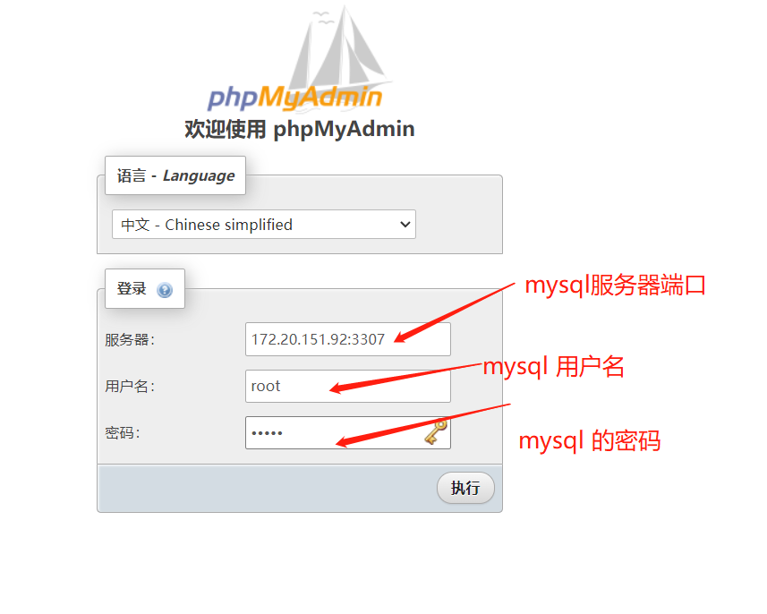

#  phpmyadmin runs in the docker environment

> 快速部署phpmyadmin mysql客户端管理工具，用于开发环境调用，测试用途，开源助免费  
> 如果只是简单查询修改数据，推荐此工具 phpmyadmin mysql web管理工具  
> 安装docker 环境后，直接运行以下命令，高级功能请查询官方文档  

## 命令
```jshelllanguage
#下载容器
docker pull phpmyadmin/phpmyadmin
#运行容器，PMA_ARBITRARY=1表示可以连接任意mysql数据库服务器
docker run --name myadmin -d -e PMA_ARBITRARY=1   -p 8081:80  phpmyadmin/phpmyadmin
```

##运行结果如下
> 如果遇到登录不上的，请检查你的mysql端口和用户名，密码  
> 需要填写mysql username or password   

