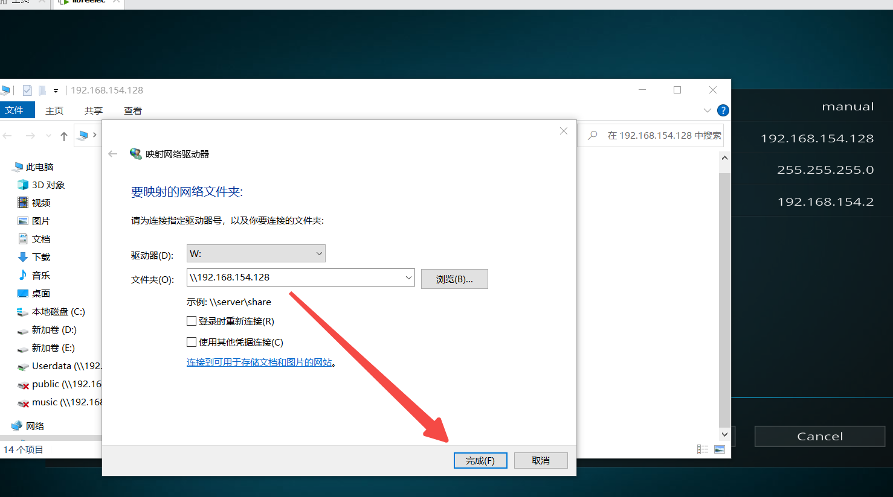

#  how to get started with developing kodi plugins

> 开发kodi插件如何入门，通过学习kodi插件开发，你可以实现自己的想要自动化播放音影服务
> 主要是实现基于kodi实现开机自动播放影片或者音乐或者iptv等，记忆播放等能力
> 学习kodi插件开发除了需要一些编程经验外，还需要了解kodi系统插件运行环境，开发环境等
> 今天特记录一下如何搭建kodi开发环境，
> 搭建开发环境需要准备以下步骤，以windows 10+ python2.7+ vmware 操作环境为例 
  
> 1 利用vmware安装libreELEC 系统，libreELEC 就是一个阉割版本的Linux+kodi整合而成
     安装libreELEC，首先是去官网下载libreELEC OVA文件   
     官网：https://libreelec.tv/downloads/generic/   
        
     
> 2 用vmware打开下载好的libreELEC OVA 文件即可运行   
        
     启动后，启用ssh 设置ssh密码，启用smb服务
     
> 3 设置windows10 与 libreELEC 网络互通，并且还要让libreelec 访问外网，vmware需要设置桥接模式 或者 nat网络模式，让libreelec 可以访问网外网，
    我这边设置NAT模式，需要知道vmware nat 的ip 范围，一般nat模式，vmware会自动分配一个ip给libreelec的，我这里设置静态，不然ip会变动
    影响后面开发   
        
> 4 配置libreELEC 系统文件共享给windows 10访问，ip为libreELEC系统的刚设置的ip   
    只要下图片窗口能正常打开，即网络能访问通   
        
     映射windows盘符,这步很重要，不然会影响后面代码开发   
        
> 5 进入libreELEC系统，安装hellworld模块   
     下载hellworld模块，下载地址如下   
     https://github.com/zag2me/script.hello.world/archive/master.zip   
     选择安装从zip 文件 安装插件，安装前提是需要设置安装来源允许 未知来源`unkown`安装   
         
> 6 用命令行工具登录libreELEC系统并进入到`/storage/.kodi/userdata/` 创建`project`，移动`script.hello.world`插件目录到`/storage/.kodi/userdata/`共享目录下
    并做好script.hello.world软链接，这一步需要把插件目录移动共享目录让windows10可见能访问，原来的libreELEC插件目录做好软链接   
```shell
      cd /storage/.kodi/userdata/   
       
      mkdir project 
        
      mv /storage/.kodi/addons/script.hello.world  /storage/.kodi/userdata/project   
      
      ln -sf /storage/.kodi/addons/script.hello.world  /storage/.kodi/userdata/project/script.hello.world
```
> 7 上一步成功后，应该可以用pycharm 打开`script.hello.world` 项目了   
      windows 10 打开可以看到如下结果   
          
          
> 8 安装pycharm 插件，该插件用于pycharm python 代码自动提示   
          
> 9 修改kodi helloworld插件代码并运行  
       addon.py为主要执行文件，插件入口文件，   
          
           
           
        再次修改代码，再次运行
           
           
        日志查看   
        tail -f  /storage/.kodi/temp/kodi.log    
           
        xbmc打开窗口，并显示音乐播放列表   
        xbmc.executebuiltin("ActivateWindow(Music,special:/storage/ad/bj.m3u)")   
        xbmc打印日志   
        xbmc.log("message",level=xbmc.LOGNOTICE)   
> 参考文档官网  
        https://kodi.wiki/view/HOW-TO:HelloWorld_addon  
        https://kodi.wiki/view/Add-on_development  
         