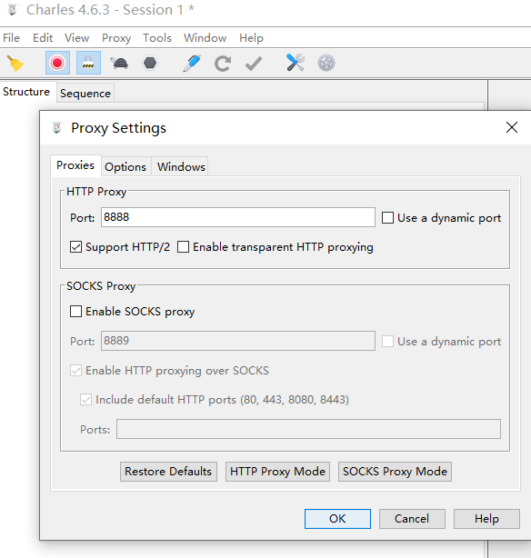
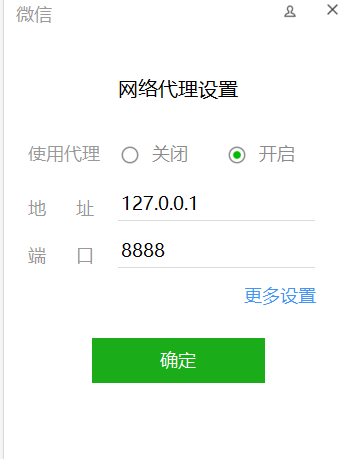
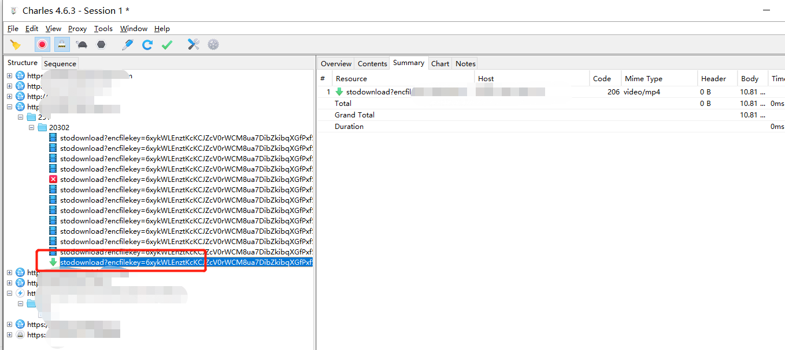
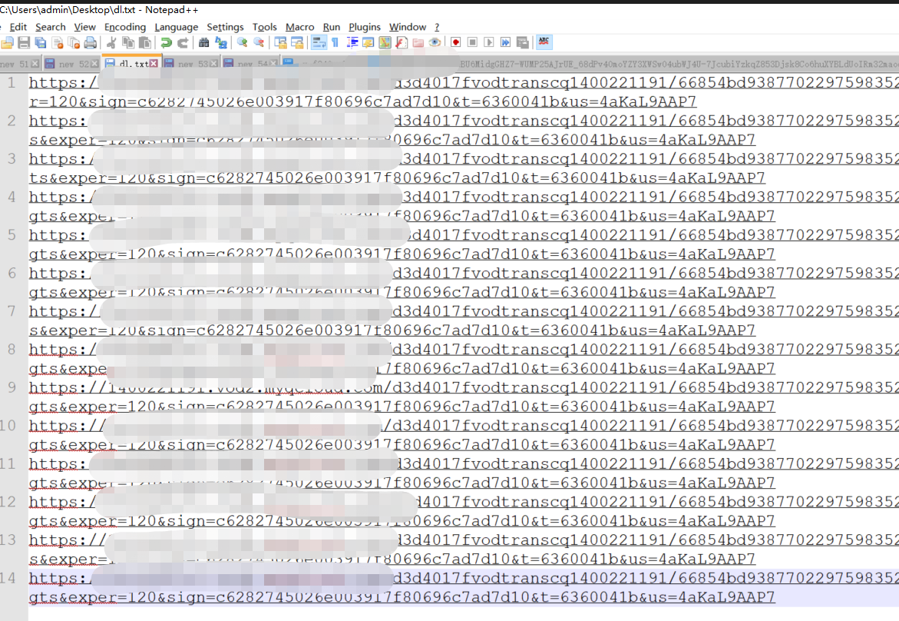
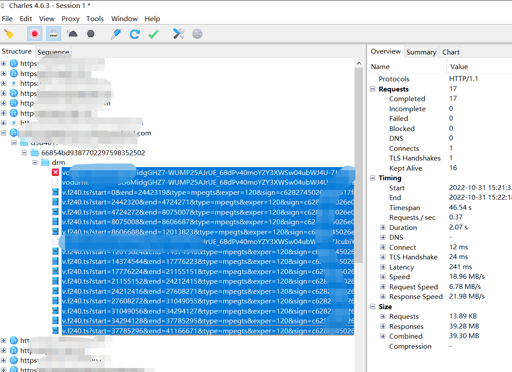
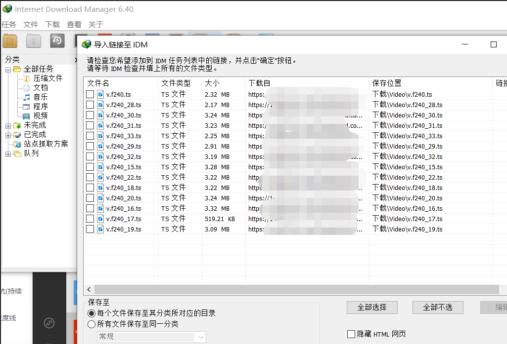
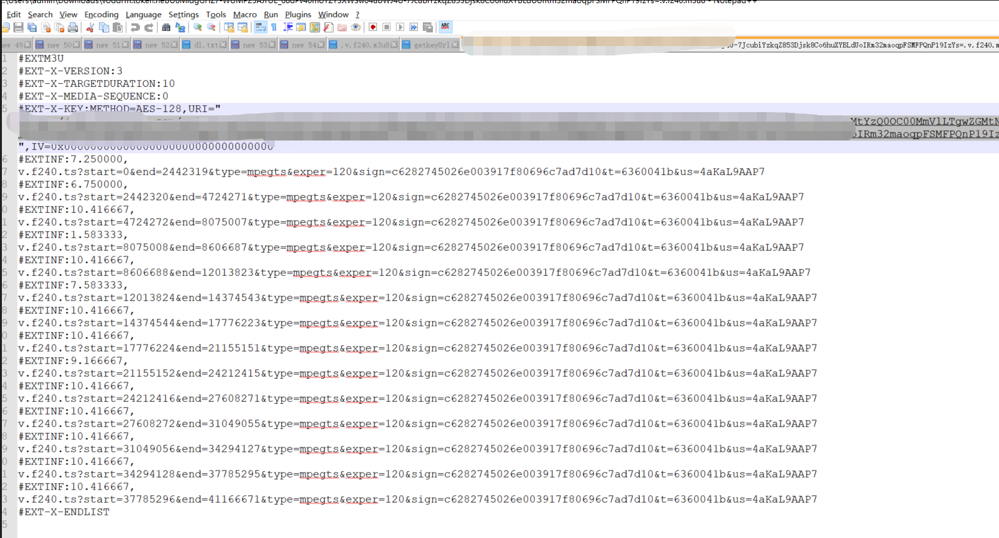
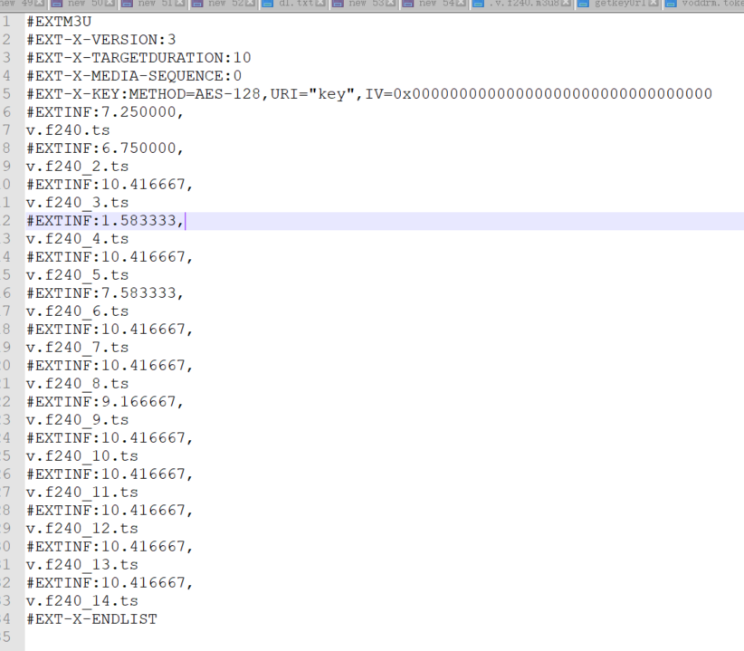
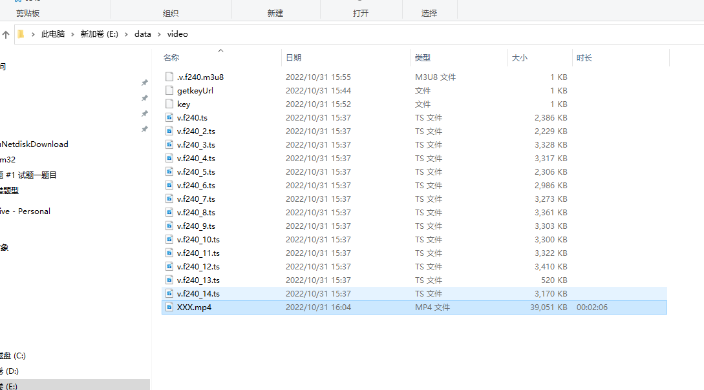

#  how to downlaod videos from wechat

> `(如何下载微信里的视频)`堂姐发来微信消息，需要帮她把过去上传到微信的视频号某视频下载下来急用
> 开始以为可以用浏览器打开`F12`下载抓包，原来还是`too young`，不得不又从网上捣鼓一下 
> 偶然发现`Charles`这个抓包工具，中文名`花瓶`，于是有了以下步骤，特记录一下`step`
> 普通的下载本来可以通过浏览器打开然后我们可以对其右键另存为的
> 总的是来说，下载视频，无非分为`两步`，`第一步`，找真实下载链接，`第二步`用下载工具下载  
> 不过有个终极方法就是手机录屏可以搞定视频复制下载，但是效果极差不推荐

> 第一步，通过 `Charles` 对微信抓包获取所有`http/https`请求链接地址
        安装`charles`最新版,`charles`默认代理端口为`8888` 
                 
        设置微信代理登录，这一步是告诉微信需要需要通过代理端口`8888`才能连接微信服务器   
                  
        打开微信聊天,图片省略，打开微信视频号播放，观察`charles`变化，找到真实视频播放地址    
            
        比较幸运的是微信视频号并没有加密，哈哈

> 第二步，通过浏览器打开播放视频并右键另存为   
          直接找到复现连接地址用浏览器打开播放，然后在浏览端右键另存为视频
             下载视频己完成，如果碰到加密视频请往下看

#  视频解密下载
> 理论上只要是能支持微信传播的视频连接地址，都应该可以下载的，也就是说只要能在微信打开播放的视频都可以下载的
> 除非载了不能解密导致无法播放等，视频加密有好几种，这里我只介绍一种`aes`是对称还是非对称加密算法
> 首先视频被下载到浏览器端需要对其视频流文件解码后进行解析播放等几个步骤，通过aes非对稳加密，哪浏览器端解码需要从服务端获取key
> 知道这个原理后，再来分析抓包链接，以一个付费视频为准，通过都是经过加密解密后进行播放的

> 第一步，还是与上面一样，通过 `Charles` 对微信抓包获取所有`http/https`请求链接地址

> 第二步，找出真实视频链接以及解码序列(token)文件请求，将链接地址导入到idm进行批量下载
             
            
         

> 第三步，准备合并前视频解码配置文件及文件合并解密`key`
         将以下文件
         
          编辑成如下文件，需要和视频文件目录保持一致，否则无法解码
         
        

> 第四步， 合并视频文件
      执行命令如下,如果没有`ffmpeg`需要安装,合并视频很关键

```shell
     ffmpeg -allowed_extensions ALL -i .v.f240.m3u8 -vcodec copy -acodec copy XXX.mp4
```
 执行命令运行结果如下显示
```shell
      E:\data\video>
E:\data\video>ffmpeg -allowed_extensions ALL -i .v.f240.m3u8 -vcodec copy -acodec copy XXX.mp4
ffmpeg version n4.4-79-gde1132a891-20210806 Copyright (c) 2000-2021 the FFmpeg developers
  built with gcc 10-win32 (GCC) 20210408
  configuration: --prefix=/ffbuild/prefix --pkg-config-flags=--static --pkg-config=pkg-config --cross-prefix=x86_64-w64-mingw32- --arch=x86_64 --target-os=mingw32 --enable-gpl --enable-version3 --disable-debug --disable-w32threads --enable-pthreads --enable-iconv --enable-libxml2 --enable-zlib --enable-libfreetype --enable-libfribidi --enable-gmp --enable-lzma --enable-fontconfig --enable-libvorbis --enable-opencl --enable-libvmaf --enable-vulkan --disable-libxcb --disable-xlib --enable-amf --enable-libaom --enable-avisynth --enable-libdav1d --enable-libdavs2 --disable-libfdk-aac --enable-ffnvcodec --enable-cuda-llvm --enable-libglslang --enable-libgme --enable-libass --enable-libbluray --enable-libmp3lame --enable-libopus --enable-libtheora --enable-libvpx --enable-libwebp --enable-lv2 --enable-libmfx --enable-libopencore-amrnb --enable-libopencore-amrwb --enable-libopenjpeg --enable-librav1e --enable-librubberband --enable-schannel --enable-sdl2 --enable-libsoxr --enable-libsrt --enable-libsvtav1 --enable-libtwolame --enable-libuavs3d --disable-libdrm --disable-vaapi --enable-libvidstab --enable-libx264 --enable-libx265 --enable-libxavs2 --enable-libxvid --enable-libzimg --extra-cflags=-DLIBTWOLAME_STATIC --extra-cxxflags= --extra-ldflags=-pthread --extra-ldexeflags= --extra-libs=-lgomp --extra-version=20210806
  libavutil      56. 70.100 / 56. 70.100
  libavcodec     58.134.100 / 58.134.100
  libavformat    58. 76.100 / 58. 76.100
  libavdevice    58. 13.100 / 58. 13.100
  libavfilter     7.110.100 /  7.110.100
  libswscale      5.  9.100 /  5.  9.100
  libswresample   3.  9.100 /  3.  9.100
  libpostproc    55.  9.100 / 55.  9.100
[hls @ 00000253d89e5e00] Skip ('#EXT-X-VERSION:3')
[hls @ 00000253d89e5e00] Opening 'https://app.keepyoga.com/api/v1/auth/getkeyUrl?edk=CiCI5QNgqqiMSqVR5r%2BVFkWoIxj7JoWMXbHpfCbrwZkDehCO08TAChiaoOvUBCokNTcxYTU2Y2MtYzQ0OC00MmVlLTgwZGMtNDI4MTFjOGQ2ODE3&fileId=387702297598352502&keySource=VodBuildInKMS&token=heBU6MidgGHZ7-WUMP25AJrUE_68dPv40moYZY3XWSw04ubWJ4U-7JcubiYzkqZ853Djsk8Co6huXYBLdUoIRm32maoqpFSMFPQnP19IzYs%3D' for reading
[https @ 00000253d8a01940] Protocol 'https' not on whitelist 'file,crypto,data'!
[hls @ 00000253d89e5e00] Unable to open key file https://app.keepyoga.com/api/v1/auth/getkeyUrl?edk=CiCI5QNgqqiMSqVR5r%2BVFkWoIxj7JoWMXbHpfCbrwZkDehCO08TAChiaoOvUBCokNTcxYTU2Y2MtYzQ0OC00MmVlLTgwZGMtNDI4MTFjOGQ2ODE3&fileId=387702297598352502&keySource=VodBuildInKMS&token=heBU6MidgGHZ7-WUMP25AJrUE_68dPv40moYZY3XWSw04ubWJ4U-7JcubiYzkqZ853Djsk8Co6huXYBLdUoIRm32maoqpFSMFPQnP19IzYs%3D
[hls @ 00000253d89e5e00] Opening 'crypto:v.f240.ts' for reading
[hls @ 00000253d89e5e00] Error when loading first segment 'v.f240.ts'
.v.f240.m3u8: Invalid data found when processing input

E:\data\video>ffmpeg -allowed_extensions ALL -i .v.f240.m3u8 -vcodec copy -acodec copy XXX.mp4
ffmpeg version n4.4-79-gde1132a891-20210806 Copyright (c) 2000-2021 the FFmpeg developers
  built with gcc 10-win32 (GCC) 20210408
  configuration: --prefix=/ffbuild/prefix --pkg-config-flags=--static --pkg-config=pkg-config --cross-prefix=x86_64-w64-mingw32- --arch=x86_64 --target-os=mingw32 --enable-gpl --enable-version3 --disable-debug --disable-w32threads --enable-pthreads --enable-iconv --enable-libxml2 --enable-zlib --enable-libfreetype --enable-libfribidi --enable-gmp --enable-lzma --enable-fontconfig --enable-libvorbis --enable-opencl --enable-libvmaf --enable-vulkan --disable-libxcb --disable-xlib --enable-amf --enable-libaom --enable-avisynth --enable-libdav1d --enable-libdavs2 --disable-libfdk-aac --enable-ffnvcodec --enable-cuda-llvm --enable-libglslang --enable-libgme --enable-libass --enable-libbluray --enable-libmp3lame --enable-libopus --enable-libtheora --enable-libvpx --enable-libwebp --enable-lv2 --enable-libmfx --enable-libopencore-amrnb --enable-libopencore-amrwb --enable-libopenjpeg --enable-librav1e --enable-librubberband --enable-schannel --enable-sdl2 --enable-libsoxr --enable-libsrt --enable-libsvtav1 --enable-libtwolame --enable-libuavs3d --disable-libdrm --disable-vaapi --enable-libvidstab --enable-libx264 --enable-libx265 --enable-libxavs2 --enable-libxvid --enable-libzimg --extra-cflags=-DLIBTWOLAME_STATIC --extra-cxxflags= --extra-ldflags=-pthread --extra-ldexeflags= --extra-libs=-lgomp --extra-version=20210806
  libavutil      56. 70.100 / 56. 70.100
  libavcodec     58.134.100 / 58.134.100
  libavformat    58. 76.100 / 58. 76.100
  libavdevice    58. 13.100 / 58. 13.100
  libavfilter     7.110.100 /  7.110.100
  libswscale      5.  9.100 /  5.  9.100
  libswresample   3.  9.100 /  3.  9.100
  libpostproc    55.  9.100 / 55.  9.100
[hls @ 00000186a0885e00] Skip ('#EXT-X-VERSION:3')
[hls @ 00000186a0885e00] Opening 'key' for reading
[hls @ 00000186a0885e00] Opening 'crypto:v.f240.ts' for reading
Input #0, hls, from '.v.f240.m3u8':
  Duration: 00:02:06.08, start: 1.436889, bitrate: 0 kb/s
  Program 0
    Metadata:
      variant_bitrate : 0
  Stream #0:0: Video: h264 (High) ([27][0][0][0] / 0x001B), yuv420p(tv), 1920x1080 [SAR 1:1 DAR 16:9], 24 fps, 24 tbr, 90k tbn, 48 tbc
    Metadata:
      variant_bitrate : 0
  Stream #0:1: Audio: aac (LC) ([15][0][0][0] / 0x000F), 44100 Hz, stereo, fltp
    Metadata:
      variant_bitrate : 0
Output #0, mp4, to 'XXX.mp4':
  Metadata:
    encoder         : Lavf58.76.100
  Stream #0:0: Video: h264 (High) (avc1 / 0x31637661), yuv420p(tv), 1920x1080 [SAR 1:1 DAR 16:9], q=2-31, 24 fps, 24 tbr, 90k tbn, 90k tbc
    Metadata:
      variant_bitrate : 0
  Stream #0:1: Audio: aac (LC) (mp4a / 0x6134706D), 44100 Hz, stereo, fltp
    Metadata:
      variant_bitrate : 0
Stream mapping:
  Stream #0:0 -> #0:0 (copy)
  Stream #0:1 -> #0:1 (copy)
Press [q] to stop, [?] for help
[hls @ 00000186a0885e00] Opening 'crypto:v.f240_2.ts' for readingte=N/A speed=   0x
[hls @ 00000186a0885e00] Opening 'crypto:v.f240_3.ts' for reading
[mpegts @ 00000186a0889180] Packet corrupt (stream = 0, dts = 1382250).
[mp4 @ 00000186a08a0e80] Non-monotonous DTS in output stream 0:1; previous: 632968, current: 631736; changing to 632969. This may result in incorrect timestamps in the output file.
[mp4 @ 00000186a08a0e80] Non-monotonous DTS in output stream 0:1; previous: 632969, current: 632760; changing to 632970. This may result in incorrect timestamps in the output file.
[hls @ 00000186a0885e00] Opening 'crypto:v.f240_4.ts' for reading
[mpegts @ 00000186a0889180] Packet corrupt (stream = 0, dts = 3399750).
[mp4 @ 00000186a08a0e80] Non-monotonous DTS in output stream 0:1; previous: 1093167, current: 1092135; changing to 1093168. This may result in incorrect timestamps in the output file.
[mp4 @ 00000186a08a0e80] Non-monotonous DTS in output stream 0:1; previous: 1093168, current: 1093159; changing to 1093169. This may result in incorrect timestamps in the output file.
[hls @ 00000186a0885e00] Opening 'crypto:v.f240_5.ts' for reading
[mpegts @ 00000186a0889180] Packet corrupt (stream = 0, dts = 7719750).
[hls @ 00000186a0885e00] Opening 'crypto:v.f240_6.ts' for reading
[hls @ 00000186a0885e00] Opening 'crypto:v.f240_7.ts' for reading
[mp4 @ 00000186a08a0e80] Non-monotonous DTS in output stream 0:1; previous: 2290257, current: 2289161; changing to 2290258. This may result in incorrect timestamps in the output file.
[mp4 @ 00000186a08a0e80] Non-monotonous DTS in output stream 0:1; previous: 2290258, current: 2290185; changing to 2290259. This may result in incorrect timestamps in the output file.
[hls @ 00000186a0885e00] Opening 'crypto:v.f240_8.ts' for reading
[hls @ 00000186a0885e00] Opening 'crypto:v.f240_9.ts' for reading
[mpegts @ 00000186a0889180] Packet corrupt (stream = 0, dts = 8657250).
[hls @ 00000186a0885e00] Opening 'crypto:v.f240_10.ts' for reading
[mpegts @ 00000186a0889180] Packet corrupt (stream = 0, dts = 11469750).
[hls @ 00000186a0885e00] Opening 'crypto:v.f240_11.ts' for reading
[mp4 @ 00000186a08a0e80] Non-monotonous DTS in output stream 0:1; previous: 4128509, current: 4126661; changing to 4128510. This may result in incorrect timestamps in the output file.
[mp4 @ 00000186a08a0e80] Non-monotonous DTS in output stream 0:1; previous: 4128510, current: 4127685; changing to 4128511. This may result in incorrect timestamps in the output file.
[hls @ 00000186a0885e00] Opening 'crypto:v.f240_12.ts' for reading
[mpegts @ 00000186a0889180] Packet corrupt (stream = 0, dts = 5019750).
[hls @ 00000186a0885e00] Opening 'crypto:v.f240_13.ts' for reading
[mpegts @ 00000186a0889180] Packet corrupt (stream = 0, dts = 10532250).
[hls @ 00000186a0885e00] Opening 'crypto:v.f240_14.ts' for reading
[mpegts @ 00000186a0889180] Packet corrupt (stream = 0, dts = 2462250).
frame= 3026 fps=0.0 q=-1.0 Lsize=   39051kB time=00:02:06.04 bitrate=2538.1kbits/s speed= 320x
video:38238kB audio:743kB subtitle:0kB other streams:0kB global headers:0kB muxing overhead: 0.178609%

E:\data\video>

```
  上述运行命令后不报错，就表示将`ts`文件合并视频成功，到此下载视频解密成功