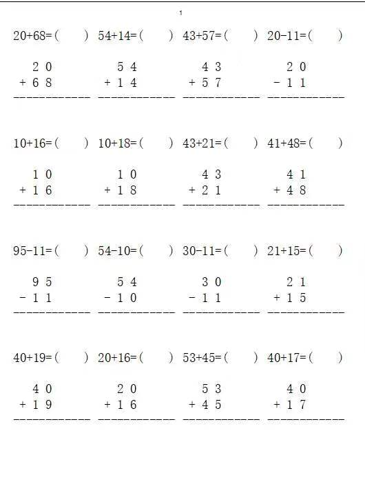

# 自动生成小学生算式题代码

>  自动生成100以内的2个操作数的加减运算算式，要求运算结果也在100以内 
>  规避结果为负数，题目数量可定制，生成到excel，可以直接打印，样式如下图
>  感谢xkm提供代码
> 


>  代码如下，运行环境python3.x
```py
#author:xkm
#createdate:2023/2/3
#encoding=utf-8

import random
import datetime
import math
import xlwt
style = xlwt.XFStyle()#格式信息
font = xlwt.Font()#字体基本设置
font.name = u'宋体'
font.color = 'black'
font.height= 400 #字体大小，220就是11号字体，大概就是11*20得来的吧
style.font = font
wb = xlwt.Workbook()
ws = wb.add_sheet("习题集",cell_overwrite_ok=True)

data = []
cell = 4  #生成excel 列数
total = 100 #生成题数
def subbb():
    a=random.randint(1,9)
    b=random.randint(0,a - 1)
    ab=a*10+b
    a1=random.randint(1,a)
    b1 = random.randint(0, a1)
    ab1=a1 * 10 + b1
    if ab-ab1>=0:
        res=str(ab)+'-'+str(ab1)+'=(    )'+"\r\n"+"\r\n"
        res=res+'   '+str(a)+' '+str(b)+' '+"\r\n"
        res=res+' - '+str(a1)+' '+str(b1)+' '+"\r\n"
        res=res+ '------------'+"\r\n"+"\r\n"
        data.append(res)
        print(res)

def addbb():
    a = random.randint(1, 8)
    b = random.randint(0, a - 1)
    ab = a * 10 + b
    a1 = random.randint(1, 9 - a)
    b1 = random.randint(0, 10 - b)
    ab1 = a1 * 10 + b1
    res = str(ab) + '+' + str(ab1) + '=(    )' + "\r\n" + "\r\n"
    res = res + '   ' + str(a) + ' ' + str(b) + ' ' + "\r\n"
    res = res + ' + ' + str(a1) + ' ' + str(b1) + ' ' + "\r\n"
    res = res + '------------' + "\r\n" + "\r\n"
    data.append(res)
    print(res)


for m in range(500):
    if random.randint(0,1)==1:
        addbb()
    else:
        subbb()

index=0
for j in range(int(total / cell)):
    ws.row(j).height_mismatch = True
    ws.row(j).height =256 * 14
    for k in range(cell):
        ws.col(k).width = 256 * 24
        if total==index:
           break
        else:
           ws.write(j, k, data[index],style)
           index=index+1

version = datetime.datetime.now().strftime('%Y%m%d%H%M%S')


wb.save("竖式题目生成-%d-%d-%s.xlsx" % (cell,len(data),version))

```
