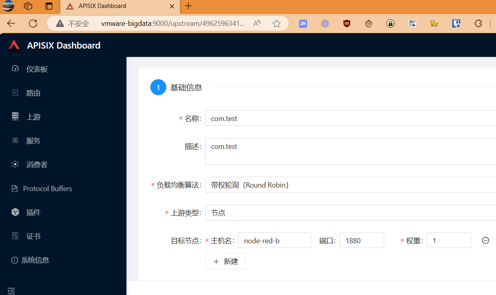

# Resolving Docker Compose and ApiSix Port 502 Error

在工作中，我尝试部署Saas应用程序，使用了Docker Compose、ApiSix和Node-RED。
然而，在这个过程中，我遇到了一个502端口访问错误。
我花了一整天的时间来解决这个问题，最终找到了问题的原因。

问题出在我创建Node-RED实例并在ApiSix中添加upstream时。
我注意到，当我运行以下命令来创建Node-RED实例时，我不小心将端口号设置为1881来进行暴露：

```bash
docker run -d --network apisix_apisix --name node-red-a -p 1880:1880 nodered/node-red:3.1.0-18
docker run -d --network apisix_apisix --name node-red-b -p 1881:1880 nodered/node-red:3.1.0-18
docker run -d --network apisix_apisix --name node-red-c -p 1882:1880 nodered/node-red:3.1.0-18
```
但实际上，Docker网络apisix_apisix并没有使用这个暴露端口，  
而是使用了内部网络的端口。这个错误导致了我一整天的时间浪费。  

为了解决问题，我将Node-RED实例的端口号设置为1880，     
与Docker网络中的端口一致，这样ApiSix能够正确地与Node-RED实例通信。   
以下端口必须要填写内部的程序实际端口  


