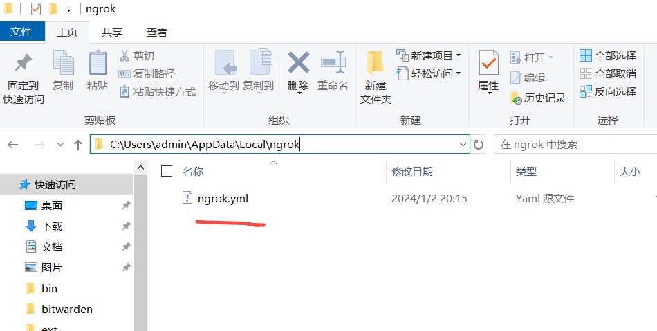

## 介绍
在这篇文章中，我们将探讨如何使用ngrok在Windows环境下解决与公司SSO系统对接时的HTTPS调试问题。我们将逐步介绍如何配置ngrok以实现内网穿透，从而允许远程服务器访问您的本地开发环境。

## 步骤1: 安装ngrok
首先，需要在Windows系统上安装ngrok。请按照以下步骤操作：

1. 访问[ngrok官网](https://ngrok.com/download)。
2. 下载适用于Windows的ngrok安装包。
3. 解压下载的文件到一个您方便访问的位置。
4. 打开命令提示符并切换到包含ngrok的文件夹。
5. 在命令提示符中运行以下命令以验证安装：

    ```
    ngrok --version
    ```

   这应该会显示安装的ngrok版本。

## 步骤2: 配置ngrok
接下来，配置ngrok以实现内网穿透。您需要创建一个ngrok帐户并获取授权令牌。在ngrok官网注册后，复制您的授权令牌，并在命令提示符中运行以下命令：

    ```
    ngrok config add-authtoken  [您的授权令牌]
    ```

配置文件保存如下  



## 步骤3: 启动ngrok隧道
现在，启动ngrok隧道以连接到您的本地开发服务器。假设您的本地服务器运行在端口1880上，您可以使用以下命令启动ngrok隧道：

    ```
    ngrok http 1880
    ```


## 步骤4: 配置SSO系统
最后一步是在您的SSO系统中配置ngrok提供的公共URL。这将允许SSO系统通过ngrok隧道访问您的本地服务器。

## 结论
使用ngrok在Windows环境下解决SSO系统的HTTPS调试问题是一个简单而有效的方法。通过以上步骤，您可以轻松地实现内网穿透，从而使远程服务器能够访问您的本地开发环境。
