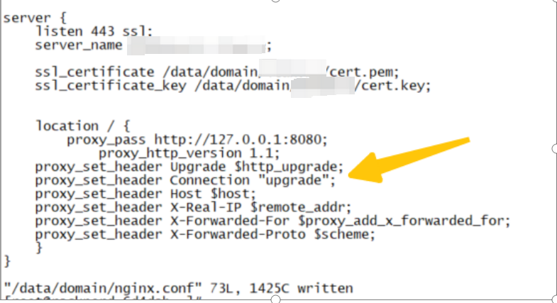
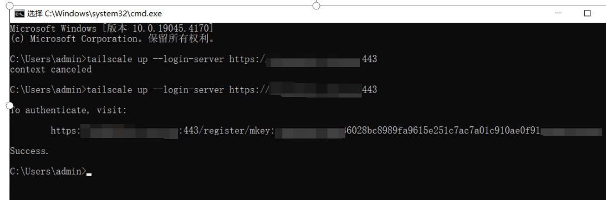
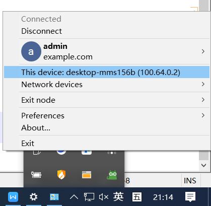
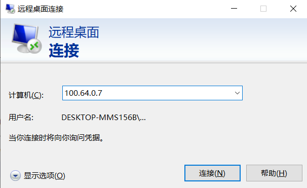
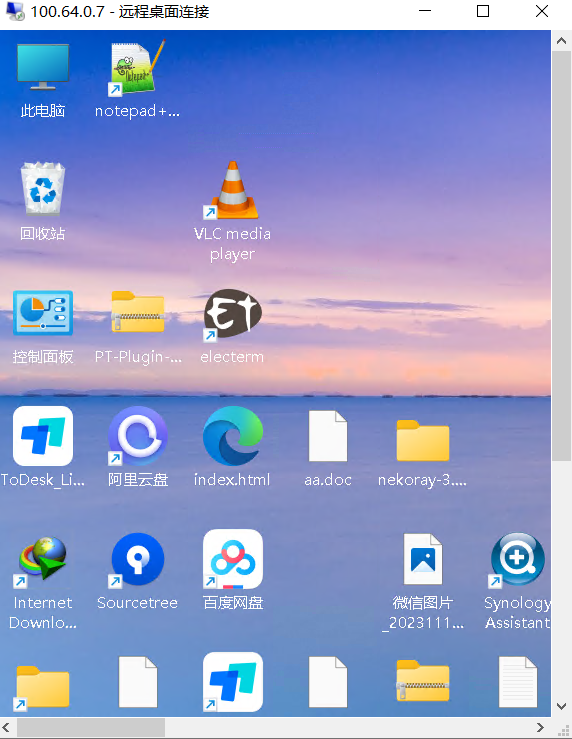
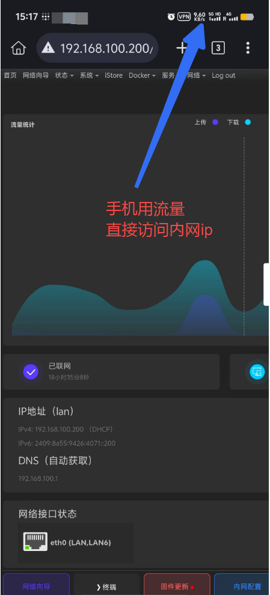

# Server setup process using Headscale with Docker.

## 记录采用headscale & docker 异地组网过程

## 需求背景
> 曾经我尝试使用`ZeroTier`，最初的体验非常不错。然而，随着时间的推移，我发现连接速度变得缓慢和卡顿，
> 有时甚至需要借助特殊的网络加速技术来提高性能。后来，在`X`社区中，我看到有人分享了`Tailscale`的好评，
> 这促使我安装了`Tailscale`的官方客户端。相较于`ZeroTier`，`Tailscale`在速度上有显著的提升，
> 尽管偶尔也会遇到一些延迟。`Tailscale`依赖于其官方服务器，但它支持用户自建服务器，
> 这一点非常吸引我。通过结合使用`Tailscale`客户端和官网，我们可以实现异地组网。
> 为了达到更理想的连接速度，我决定自建异地组网系统。这样不仅能控制家中的`群晖`设备，还能优化`PT`下载等功能。

##  搭建`headscale`服务端
> 1,准备环境`linux(centos7/ubuntu)`   
> 2,安装`docker`,   
> 3,申请好域名,准备`https`证书 推荐`cf`,并解析到自己的服务器   
    `ssl_certificate` 和 `ssl_certificate_key` 为自己申请的域名证书从cf导出来的文件   
> 4,安装好`nginx`,`nginx`配置如下,打码地方为自己的域名，箭头处需要开启`websocket`   
>   

### 准备`headscale` 配置文件
> 创建目录
```shell
mkdir -p /root/mydocker/config
chmod -R a+x /root/mydocker/config
```
> 从以下链接地址下载配置文件
```shell
wget -O /root/mydocker/conf/config.yaml https://raw.githubusercontent.com/juanfont/headscale/main/config-example.yaml
```

> 修改配置文件`config.yaml` 文件
```shell
 server_url: https://你的域名:443
 listen_addr: 0.0.0.0:8080
 metrics_listen_addr: 0.0.0.0:9090
 noise:
    private_key_path: /etc/headscale/noise_private.key
 database:
  type: sqlite3
  sqlite:
    path: /etc/headscale/db.sqlite
```
## 部署headscale
> 启动docker, 我是在/root/mydocker/ 目录启动的
```shell
  docker run --name headscale --detach --volume $(pwd)/config:/etc/headscale/ --publish 0.0.0.0:8080:8080 --publish 0.0.0.0:9090:9090 headscale/headscale:0.23.0-alpha5 serve
```
## 在windows或客户端安装tailscale(官网下载并安装好)
> 以win10 为例 直接采用命令行登录   
  
> 会得到以下地址:  
> https://你的域名:443/register/mkey:23234kflasdjf.....
> mkey 后面请复制一下
> 进入到headscale 服务器命令行，执行以下命令，将`23234kflasdjf.....` 注册即可

## 进入服务器,执行命令注册登录的设备
> 执行以下命令，因为是docker安装的  
> mywin10 就表示对应需要组网的机器  
```shell
docker exec headscale headscale users create mywin10
docker exec headscale headscale nodes register --user admin --key mkey:23234kflasdjf.....
```
> 以下是我执行的上面两条docker命令的示例   
 ```shell
[root@racknerd-6d4dab3 ~]# docker exec headscale headscale users create admin
2024-04-08T12:28:08Z TRC DNS configuration loaded dns_config={"Nameservers":["1.1.1.1"],"Proxied":true,"Resolvers":[{"Addr":"1.1.1.1"}]}
User created
[root@racknerd-6d4dab3 ~]# docker exec headscale headscale nodes register --user admin --key mkey:2342342344444444444444fb3ce635336028bc8989fa9615e233343434
2024-04-08T12:28:14Z TRC DNS configuration loaded dns_config={"Nameservers":["1.1.1.1"],"Proxied":true,"Resolvers":[{"Addr":"1.1.1.1"}]}
Node desktop-mms156b registered
```
> 接下来就看到以下成功信息   


> tailscale 客户端自动显示当前状态   
  

> 接下来就可以远程登录我的win10了，我要从100.64.0.2 的机器远程登录100.64.0.7的机器     
    

> 远程登录win10 速度很赞，几乎和本地一样操作流畅，而且无需科学   
   
> 
> 解决以上需要在每一台电脑上都要安装tailscale 客户端的问题
> 利用群晖做数据转发，只需要在群晖上安装tailscale客户端即可

## 群晖子网路由（Subnet Router）设置

### 问题解决方案
> 使用群晖NAS作为子网路由（Subnet Router）可以让所有家庭网络中的设备无需安装Tailscale客户端即可访问Tailscale网络。
> 只需在群晖上安装一次Tailscale客户端，并进行适当配置，就可以实现整个内网的访问。

### 详细步骤

#### 1. 在群晖上启用IPv4转发功能
> 通过SSH登录到群晖，执行以下命令启用IPv4转发：
```shell
# 检查当前IPv4转发状态
sysctl net.ipv4.ip_forward

# 临时启用IPv4转发
sudo sysctl -w net.ipv4.ip_forward=1

# 永久启用IPv4转发（在重启后仍然生效）
sudo echo "net.ipv4.ip_forward = 1" >> /etc/sysctl.conf
sudo sysctl -p
```

#### 2. 在Headscale服务器上允许子网路由广播
> 在Headscale服务器上执行以下命令，允许用户advertise routes（广播路由）：
```shell
# 格式：headscale routes enable-route [子网CIDR] [节点ID]
# 例如：允许群晖广播192.168.1.0/24子网
docker exec headscale headscale routes list
# 查看当前节点ID和广播的路由

# 启用子网路由（使用实际的子网CIDR和节点ID）
docker exec headscale headscale routes enable --route 192.168.1.0/24 --node-id 1
```

> 以下是我实际执行的命令和结果：
```shell
[root@racknerd-6d4dab ~]# docker exec headscale headscale routes enable \
>   --route 1 \
>   --force
2025-04-05T06:53:57Z WRN An updated version of Headscale has been found (0.25.1 vs. your current v0.23.0-beta1). Check it out https://github.com/juanfont/headscale/releases

[root@racknerd-6d4dab ~]# docker exec headscale headscale routes list
2025-04-05T06:54:14Z WRN An updated version of Headscale has been found (0.25.1 vs. your current v0.23.0-beta1). Check it out https://github.com/juanfont/headscale/releases

ID | Node        | Prefix           | Advertised | Enabled | Primary
1  | diskstation | 192.168.100.0/24 | true       | true    | true
```
> 从上面的结果可以看到，我的群晖设备名为`diskstation`，它已经成功广播了`192.168.100.0/24`子网，并且该路由已启用。

#### 3. 在群晖NAS上配置Tailscale
> 在群晖上配置Tailscale客户端以广播子网路由：
```shell
# 在群晖上执行此命令来重新配置Tailscale客户端
# 注意：--advertise-routes参数指定要广播的子网
sudo tailscale up --accept-routes --advertise-routes=192.168.1.0/24 --login-server=https://你的域名

# 查看Tailscale状态确认子网路由是否生效
tailscale status
```
> 注意：不需要重新登录，只需执行上述命令即可启用子网路由。

### 验证子网路由是否成功

#### 在Android手机上验证
> 1. 在Android手机上安装Tailscale客户端
> 2. 使用你的域名作为登录服务器（https://你的域名）登录
> 3. 成功登录后，你应该能够访问家里内网的IP地址（如192.168.1.x）

#### 检查路由状态
```shell
# 在Headscale服务器上检查路由状态
docker exec headscale headscale routes list

# 在群晖上检查Tailscale状态
tailscale status
```

  

> 成功配置后，任何连接到你的Tailscale网络的设备都可以直接访问家庭内网的所有设备，而无需在每台设备上安装Tailscale客户端。
> 这大大简化了网络管理，并允许访问那些无法安装Tailscale的设备（如智能家居设备、打印机等）。
