#　Records of Problems Encountered During the Installation and Initialization of Thingsboard 3.6.4
> 记录`thingsboard3.6.4`在导入 `IntelliJ IDEA 2022.2.3` 编译报错的一些问题  
> 记录 如何从`thingsboard3.6.4`弃坑到`thingsboard3.6.3`最后又回到了`thingsboard3.6.4`  

> 导入步骤简单说一下，先从github下载thingsboard3.6.4 源码 
> 导入代码前提准备是环境，我的环境如下
> windows 10   
> maven version 3.8.1 给 IntelliJ IDEA 2022.2.3 配置好settings.xml 采用从maven官方仓库拉取依赖   
> IntelliJ IDEA 2022.2.3     
IntelliJ IDEA 只需要安装 protocol buffers 和 lombook 就可以了   
> JDK17,不是jdk11   
> 在本地安装postgreSQL,创建好数据库名`thingsboard364`   
> 然后导入到IntelliJ IDEA 2022.2.3。   
>  从复制sql脚本到application的`src/main/data/`目录下   
  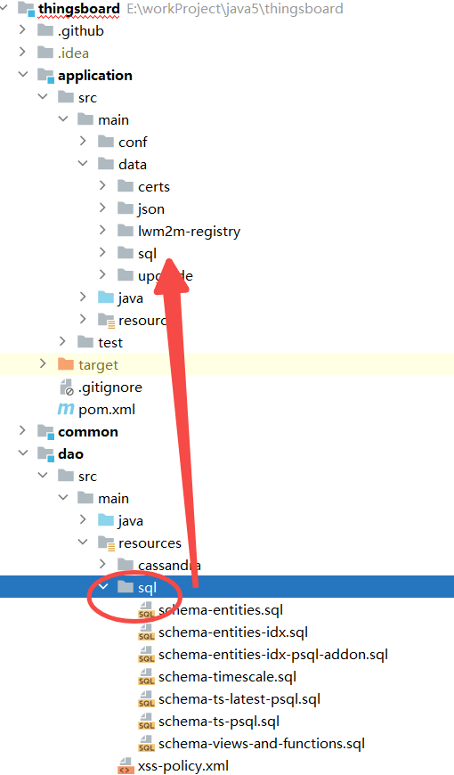
> 把 **IntelliJ IDEA** maven 设置跳过skip test,避免测试过程中遇到地域性测试，语言文本测试 导致通测试不过   
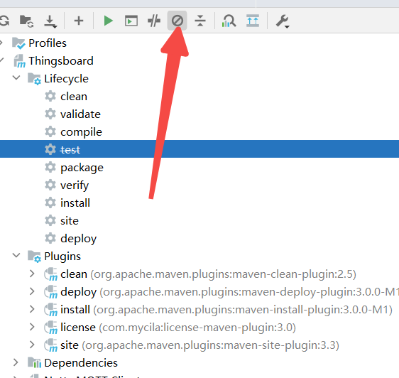
> 最后点击 **IntelliJ IDEA** maven package 进行编译项目    
> 我遇到的问题如下：  
> 
> *问题1 lombok 在jdk17下版本太低不兼容*  
```shell
class lombok.javac.apt.LombokProcessor (in unnamed module @0x719f35fe) 
cannot access class com.sun.tools.javac.processing.JavacProcessingEnvironment
 (in module jdk.compiler) 
 because module jdk.compiler does not export com.sun.tools.javac.processing to
  unnamed module @0x719f35fe
```
> 解决lombok 报错
> The issue you are facing with the error "java.lang.IllegalAccessError: class lombok.javac.apt.LombokProcessor" is related to compatibility problems between Lombok and JDK versions. To resolve this issue, you need to ensure that you are using a compatible version of Lombok with your JDK. Upgrading Lombok to version 1.18.22 or higher should address this problem. Additionally, make sure that Lombok is set up correctly in your project configuration.
The error occurs because Java 17 enforces strong encapsulation, and using an older version of Lombok can lead to this issue. By upgrading to Lombok version 1.18.22 or newer, you should be able to resolve the problem. It's crucial to verify that you are indeed using the correct version of Lombok for your build to avoid compatibility issues   
> 解决方方如下：
这个错误是因为Java 17 强制执行强封装，使用较旧版本的Lombok可能会导致此问题。通过升级到Lombok 1.18.22或更新版本，您应该能够解决这个问题。务必验证您确实正在使用正确的Lombok版本来构建，以避免兼容性问题。

在`thingsboard` 根项目目录下`pom.xml` 修改 第85行
<lombok.version>1.18.18</lombok.version>
```xml
<lombok.version>1.18.26</lombok.version>
```

> *问题2 gradle问题*
> 解决方法更换版本 jdk 11,maven 版本为3.8.2
```shell
[INFO] --- gradle-maven-plugin:1.0.11:invoke (default) @ http ---
[INFO] jvmArgs: [Ljava.lang.String;@519c5122
[INFO] gradleProjectDirectory: E:\workProject\java5\thingsboard\transport\http\..\..\packaging\java
[INFO] Build
Downloading https://services.gradle.org/distributions/gradle-7.1.1-bin.zip
[INFO] Download https://services.gradle.org/distributions/gradle-7.1.1-bin.zip
...........................................................................................................
[INFO] Build
[INFO] Starting Gradle Daemon
[INFO] Connecting to Gradle Daemon
[INFO] Starting Gradle Daemon
[INFO] Build
[INFO] Run build
[INFO] Evaluate settings
[INFO] Run build
[INFO] Configure build
[INFO] Load projects
[INFO] Configure build
[INFO] Configure project :
[INFO] Compiling build file 'build.gradle'
[INFO] Configure project :
[INFO] Configure build
[INFO] Run build
FAILURE: Build failed with an exception.
* Where:
Build file 'E:\workProject\java5\thingsboard\packaging\java\build.gradle'
* What went wrong:
Could not compile build file 'E:\workProject\java5\thingsboard\packaging\java\build.gradle'.
> startup failed:
  General error during conversion: Unsupported class file major version 61
  java.lang.IllegalArgumentException: Unsupported class file major version 61
  1 error
* Try:
Run with --stacktrace option to get the stack trace. Run with --info or --debug option to get more log output. Run with --scan to get full insights.
* Get more help at https://help.gradle.org
BUILD FAILED in 18m 29s
[INFO] Build
[INFO] Deleting unused version-specific caches in E:\workProject\java5\thingsboard\packaging\java\.gradle
[INFO] Build
[INFO] 
```

> *问题3 angular js的问题*
> 解决方法：换3.6.3版本   
> 试了梯子没有问题，全局下载tun模式。依然无效
> 最后解决了主要是问题，yarn cache问题，清理干净重新下载即可
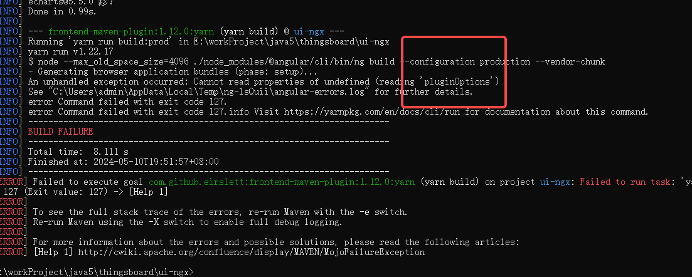
报错如下   
```shell
[error] TypeError: Cannot read properties of undefined (reading 'pluginOptions')
at module.exports (E:\workProject\java5\thingsboard\ui-ngx\extra-webpack.config.js:71:57)
at CustomWebpackBuilder.<anonymous> (E:\workProject\java5\thingsboard\ui-ngx\node_modules\@angular-builders\custom-webpack\dist\custom-webpack-builder.js:32:50)
at Generator.next (<anonymous>)
at fulfilled (E:\workProject\java5\thingsboard\ui-ngx\node_modules\@angular-builders\custom-webpack\dist\custom-webpack-builder.js:5:58)

```
* 提示maven在编译打包ui-ngx时注意几个目录  
* maven 编译  
> mvn clean package  -DskipTests -s settings.xml  
# pgsql数据库初始化
* 登录到pgsql
>psql -h localhost -p 5432 -U thingsboard -d thingsboard   
* 增加pg数据库用户root 密码为root  
> CREATE ROLE root WITH LOGIN PASSWORD "root";
* 增加角色给root  
> GRANT thingsboard TO root;   

* 设置远程访问 pg_hba.conf,不管是docker安装thingsboard这里也适用
* docker thingsboard的`postgresql` 配置位置位于`/data/db/`
* 在pg_hba.conf增加一行在文件末行
```shell
host    all             all             0.0.0.0/0               md5  
```
在postgresql.conf中修改以下
```shell
listen_addresses='*'  
```
* WINDOWS 10 解决node.exe占用     
> tasklist /V |findstr node.exe  找到进程ID   
> taskkill /F /PID 7132  删除该进程ID  

* maven编译ui-ngx几个缓存 `E:\maven_repository\.m2\` 这个是我下载的组件 
* 如果你之前在你的windows电脑上尝试过多个版本进打包编译，小心缓存
> E:\maven_repository\.m2\repository\com\github\eirslett\node\   
> E:\maven_repository\.m2\repository\com\github\eirslett\yarn\1.22.17\   
> E:\maven_repository\.m2\repository\com\github\eirslett  
> C:\Users\admin\AppData\Local\Yarn  #这个缓存目录很坑，动不动几个G的文件

在ui-ngx目录下执行
> target\node\yarn\dist\bin\yarn.cmd cache clean    
也可以手动执行安装，还可以看到进度条，通过maven的插件运行不太友好    
> target\node\yarn\dist\bin\yarn.cmd  install   
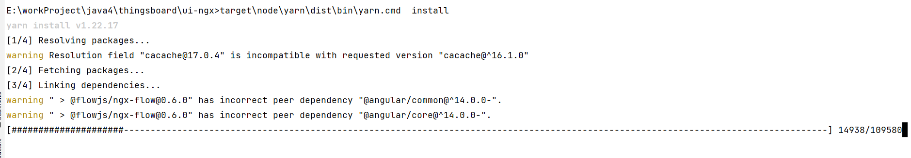
> yarn 清理缓存如下
清除yarn cache成功
```shell
yarn cache v1.22.17
success Cleared cache.
Done in 57.70s.
```
> 删除target 目录用 `del /P target`  
> 删除js `del /P node_modules`    
> 总之清理缓存需要清理yarn的缓存，yarn,node程序自身的程序，maven下载所产生的包  

# 关于thingsboard docker启动，及修改docker里的pgsql 配置的工具调式
> apt-get update # 更新   
> docker exec -it -u root [container_name_or_id] /bin/bash  # 进入容器   
> apt-get install -y net-tools  # 安装netstart  
> apt-get install -y vim # 安装vim 修改配置   
最简单的docker compose 配置 快速启动  
```xml
version: '3.0'
services:
  mytb:
    restart: always
    image: "thingsboard/tb-postgres:3.6.3"
    ports:
      - "8080:9090"
      - "1883:1883"
      - "7070:7070"
      - "15432:5432"
      - "5683-5688:5683-5688/udp"
    environment:
      TB_QUEUE_TYPE: in-memory
    volumes:
      - /data/program/thingsboard/tb-data-363:/data
      - /data/program/thingsboard/logs:/var/log/thingsboard
```

# 关于thingsboard protoc 文件显示问题   
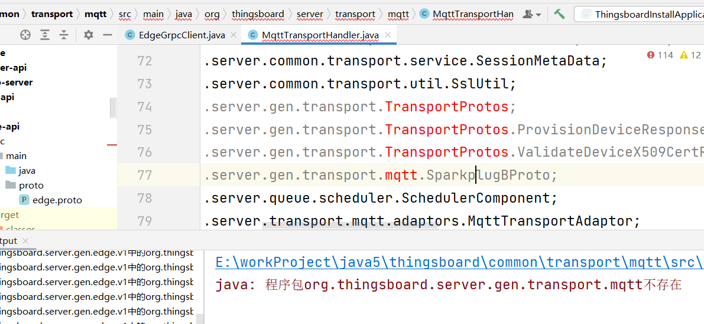   
插件只安装一个，否则与第一个冲突，这是我遇到的问题   
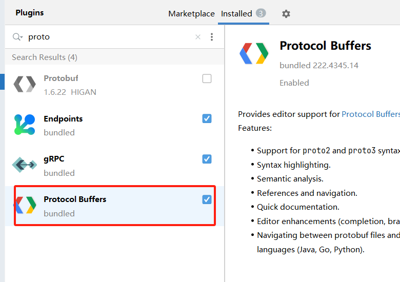  
将生成的proto java 类必须让maven知道这是源文件，右键目录选择`Mark Directory as`  设置为`Generated Sources root`   
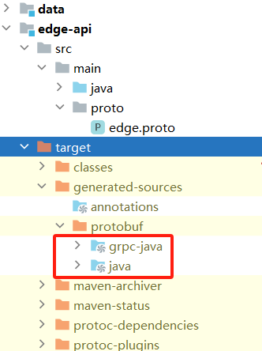  
TransportProts 飘红问题
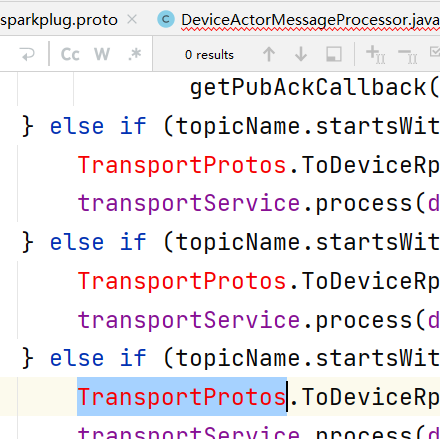
如果完全安装后错误仍然存在，则这是 IDE 的问题。打开"Edit Custom Properties..."（或者可能以不同的方式调用）并添加以下行：    
idea.max.intellisense.filesize=20000    
通过`ctrl+shift+A`打开后输入上述配置    
这个文件其实idea目录下的bin下     
 custom IntelliJ IDEA properties (expand/override 'bin\idea.properties')      
idea.max.intellisense.filesize=20000    
保存后 重新运行：mvn clean install -DskipTests    
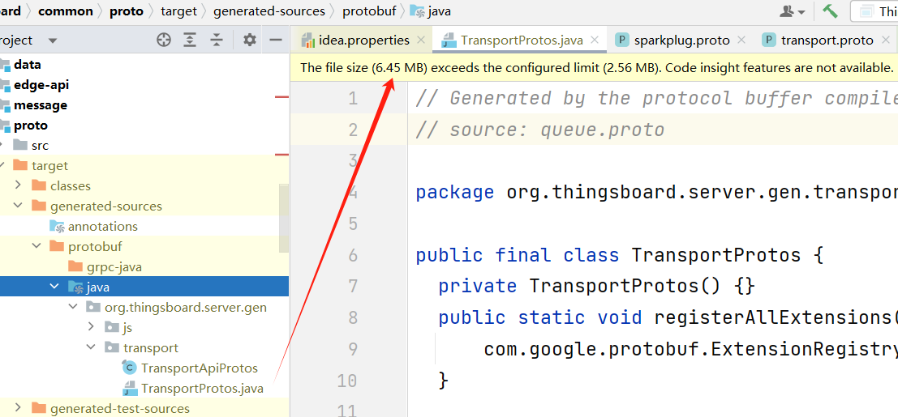

# 说在最后
在maven 编译时，一定要使用windows 管理员权限执行
```shell
mvn clean package  -DskipTests -s settings.xml
mvn clean install -U  -s settings.xml
```
如果ui-ngx打包遇到以下问题 Module not found 字样，则是网络的问题，需要挂梯子
./node_modules/@angular/material/fesm2020/badge.mjs:7:0-77 - Error: Module not found: Error: Can't resolve '@angular/platform-browser/animations' in 'E:\workProject\java5\thingsboard\ui-ngx\node_modules\@angular\material\fesm2020'   
主要是因为网络问题在下载以下两个包需要很长时间 
> 出现以下两行特别坑，非常慢，从windowsm网络监控看，明显示下载速度降低了，可以挂梯子试试更换节点地区试试
```shell
[INFO] warning " > @flowjs/ngx-flow@0.6.0" has incorrect peer dependency "@angular/common@^14.0.0-".
[INFO] warning " > @flowjs/ngx-flow@0.6.0" has incorrect peer dependency "@angular/core@^14.0.0-".
```
这些包更不要单独安装  
npm install @angular/common@^14.0.0 @angular/core@^14.0.0
也不排除一些情况在网络载中，某个js包下载不全导致编译报错，这种情况也会发生的。   
随时查看网络情况以及电脑使用内存情况，由其是内存的问题，如果同时多个yarn install 然后又开了 IntelliJ IDEA 2022.2.3  
多个任务，会导致内存接近极限，我电脑32G，被干到了31G，这样的话非常慢，重启电脑大法再来吧   
 
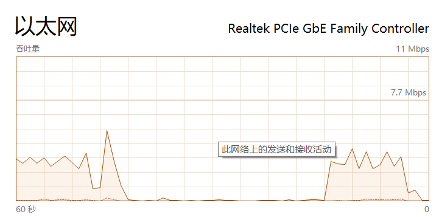
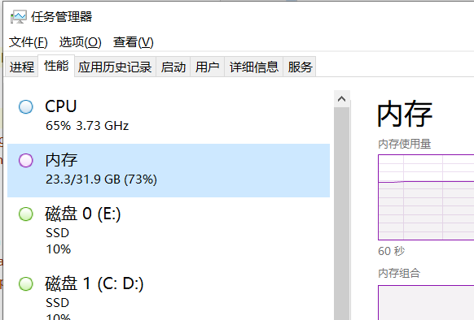

最后展示编译thingsboard ui-ngx 3.6.3和3.6.4都编译通过了
> 以下是3.6.4 ui-ngx 编译成功
```shell
C:\Users\admin\Downloads\thingsboard-3.6.3\ui-ngx>target\node\yarn\dist\bin\yarn.cmd install
yarn install v1.22.17
[1/4] Resolving packages...
warning Resolution field "cacache@17.0.4" is incompatible with requested version "cacache@^16.1.0"
[2/4] Fetching packages...
[3/4] Linking dependencies...
warning " > @flowjs/ngx-flow@0.6.0" has incorrect peer dependency "@angular/common@^14.0.0-".
warning " > @flowjs/ngx-flow@0.6.0" has incorrect peer dependency "@angular/core@^14.0.0-".
[4/4] Building fresh packages...
$ patch-package
patch-package 6.5.1
Applying patches...
@angular/core@15.2.10 ✔
@mat-datetimepicker/core@11.0.3 ✔
canvas-gauges@2.1.7 ✔
echarts@5.5.0 ✔
Done in 19.36s.

C:\Users\admin\Downloads\thingsboard-3.6.3\ui-ngx>npm run start

> thingsboard@3.6.3 start
> node --max_old_space_size=8048 ./node_modules/@angular/cli/bin/ng serve --configuration development --host 0.0.0.0 --open

Warning: This is a simple server for use in testing or debugging Angular applications
locally. It hasn't been reviewed for security issues.

Binding this server to an open connection can result in compromising your application or
computer. Using a different host than the one passed to the "--host" flag might result in
websocket connection issues. You might need to use "--disable-host-check" if that's the
case.
✔ Browser application bundle generation complete.

Initial Chunk Files                                                                                     | Names                                            |  Raw Size
```

> 以下是3.6.4 ui-ngx 编译成功
```shell
C:\Users\admin\Downloads\thingsboard-3.6.4_a.tar\364\thingsboard-3.6.4\ui-ngx>target\node\yarn\dist\bin\yarn.cmd install
yarn install v1.22.17
[1/4] Resolving packages...
warning Resolution field "cacache@17.0.4" is incompatible with requested version "cacache@^16.1.0"
[2/4] Fetching packages...
[3/4] Linking dependencies...
warning " > @flowjs/ngx-flow@0.6.0" has incorrect peer dependency "@angular/common@^14.0.0-".
warning " > @flowjs/ngx-flow@0.6.0" has incorrect peer dependency "@angular/core@^14.0.0-".
[4/4] Building fresh packages...
$ patch-package
patch-package 6.5.1
Applying patches...
@angular/core@15.2.10 ✔
@mat-datetimepicker/core@11.0.3 ✔
canvas-gauges@2.1.7 ✔
echarts@5.5.0 ✔
Done in 18.75s.

C:\Users\admin\Downloads\thingsboard-3.6.4_a.tar\364\thingsboard-3.6.4\ui-ngx>
C:\Users\admin\Downloads\thingsboard-3.6.4_a.tar\364\thingsboard-3.6.4\ui-ngx>
C:\Users\admin\Downloads\thingsboard-3.6.4_a.tar\364\thingsboard-3.6.4\ui-ngx>npm run start

> thingsboard@3.6.4 start
> node --max_old_space_size=8048 ./node_modules/@angular/cli/bin/ng serve --configuration development --host 0.0.0.0 --open

Warning: This is a simple server for use in testing or debugging Angular applications
locally. It hasn't been reviewed for security issues.

Binding this server to an open connection can result in compromising your application or
computer. Using a different host than the one passed to the "--host" flag might result in
websocket connection issues. You might need to use "--disable-host-check" if that's the
case.

```
我还没有执行mvn 打包所有的java 光前端ui-ngx 2个G了  
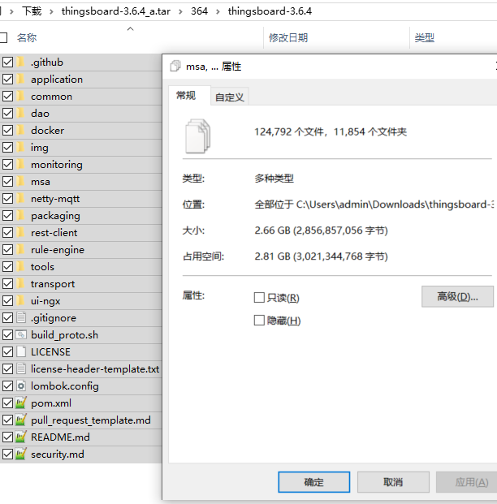
最终我运行的环境   
C:\Users\admin>mvn -version   
Apache Maven 3.8.2 (ea98e05a04480131370aa0c110b8c54cf726c06f)   
Maven home: D:\apache-maven-3.8.2   
Java version: 11.0.11, vendor: AdoptOpenJDK, runtime: D:\Java_jdk\Java\jdk1.11.0-11   
Default locale: zh_CN, platform encoding: GBK   
OS name: "windows 10", version: "10.0", arch: "amd64", family: "windows"   
