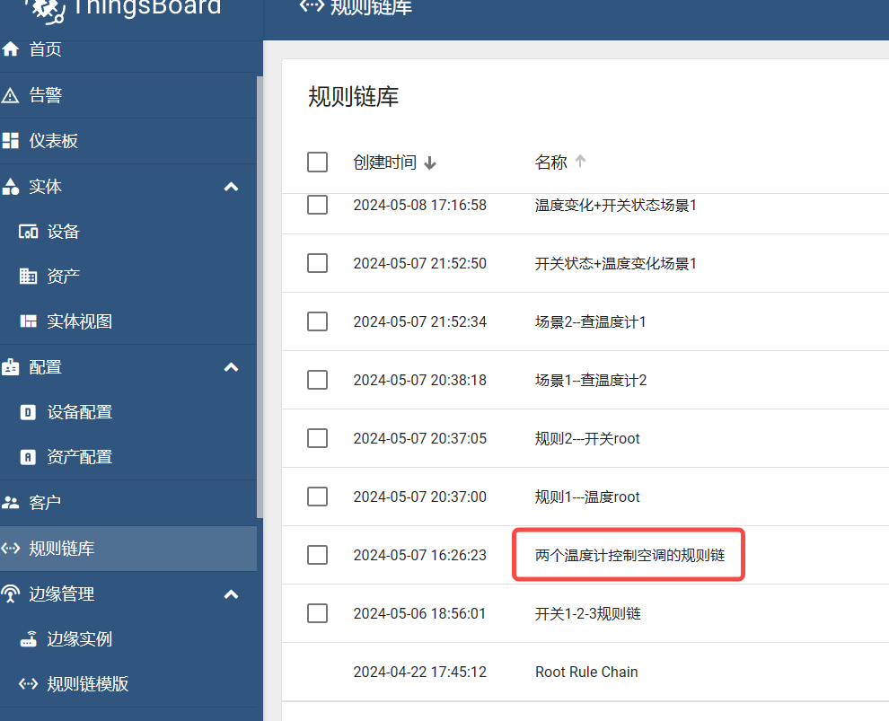
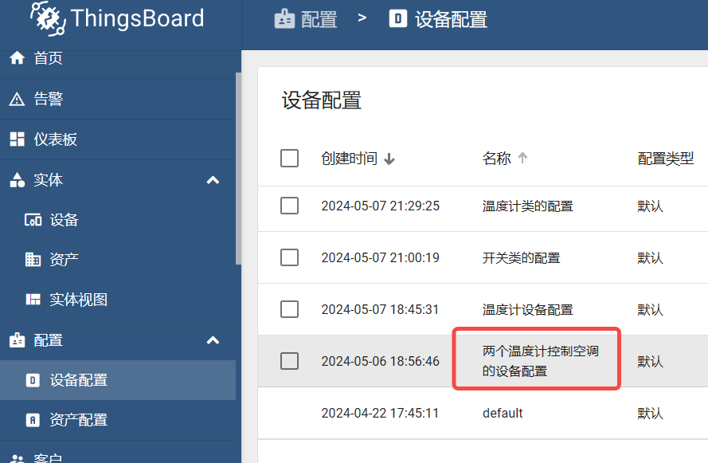
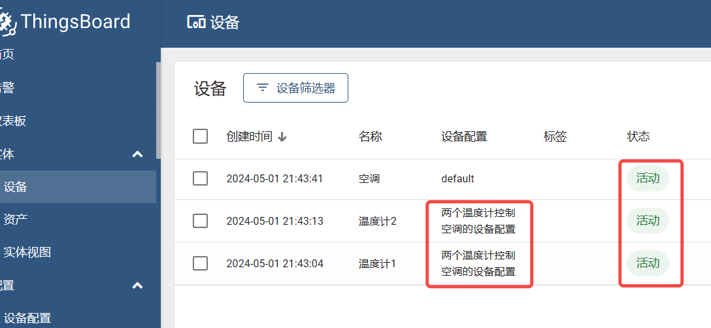
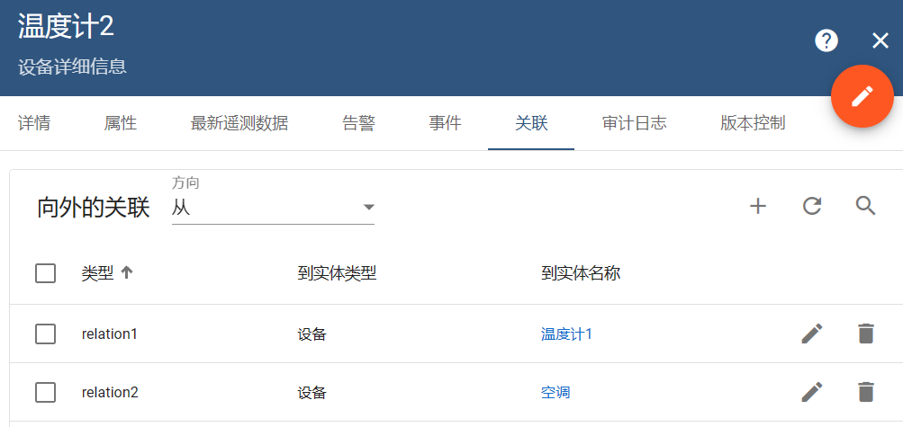
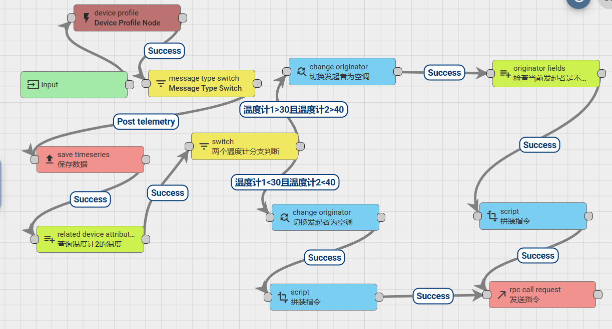
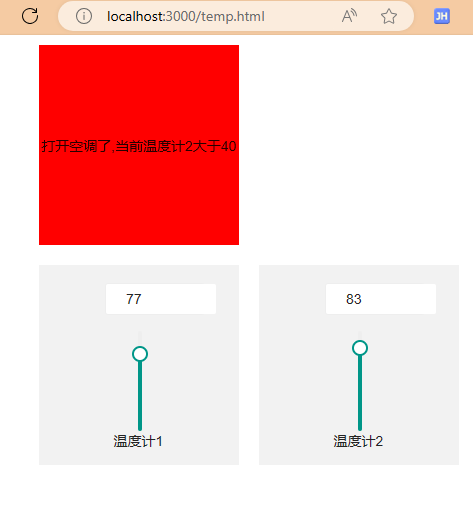
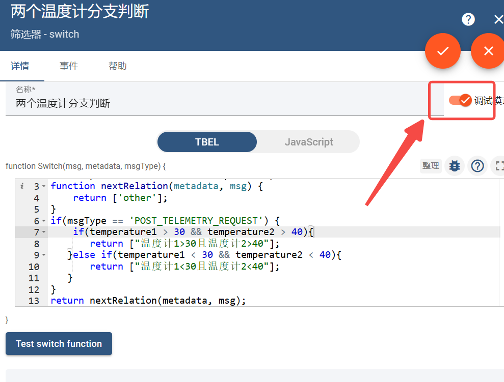
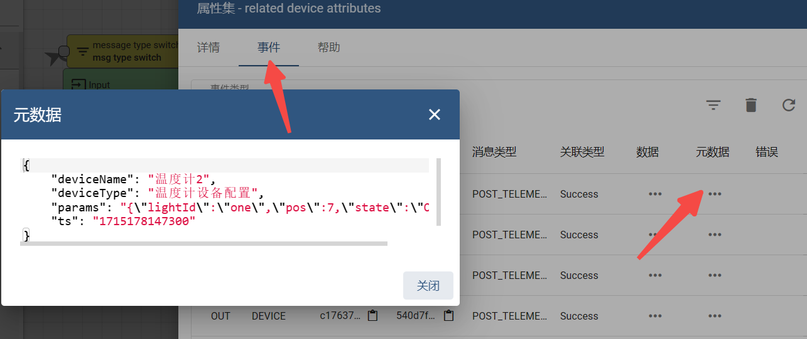

# Automating Climate Control: Leveraging Dual Thermometers for Smart Air Conditioning via ThingsBoard

> 记录一次在thingsboard中通过同时满足两个温度计的温度条件来控制空调开关机
> 当然这并不是真实过程对接调式，只是通过模拟的方法来熟练一下thingsboard的ruleChain
###  第一步，创建一个空的规则链，名称就叫`两个温度计控制空调的规则链`

   
###  第二步，创建一个设备配置，名称就叫`两个温度计控制空调的设备配置`


###  第三步，分别添加三个设备`温度计1`、`温度计2`、`空调`

###  第四步，给`温度计1`,`温度计2` 设备添加关联关系
添加关系的原因是，因为`温度计1`,`温度计2` 的温度都满足了条件需要给`空调`发送rpc控制消息
才需创建关联空调的，这里可以理解是`温度计`控制`空调`，所以创建温度计`向外的关联`（`from`）的关系
同理也可以理解，空调需要接受温度计的控制消息`向内的关联`（`to`）的关系，这两个关系方向都可以
这里以from关系为例创建，但请注意，这里的`关系类型`一定要唯一，不能一样我这里建立了两条关系分别是`relation1`,
`relation2`


###  第五步，给`两个温度计控制空调的规则链`这个空白的规则链编写规则链，这是最核心的部分
梳理自己的流程需求，我这里的流程是前提条件，`温度计1`、`温度计2`、`空调` 这三个设备已经连上了`thingsboard` `1883` `mqqt` 端口
且处理活动状态，在实体设备可以看到设备状态。 
我的主要流程是，`温度计1`和`温度计2`都在同时发送遥测消息数据格式为：
`{temperature:25}` 并由`save timeseries` 这个节点保存数据
当接受到`温度计1`的遥测数据时，再查询`温度计2`的遥测温度数据，并把`温度计2`的数据保存在元数据中`metadata`
这是由`related device attrbuite` 查询得到`温度计2`的数据
如果` success` 然后接下来由` switch` 判断两个温度数据是否满足，代码如下
```javascript
var temperature1 = msg.temperature;
var temperature2 = metadata.temperature; //从元数据获取temperature数据
function nextRelation(metadata, msg) {
  return ['other'];
}
if(msgType == 'POST_TELEMETRY_REQUEST') {
    if(temperature1 > 30 && temperature2 > 40){
       return ["温度计1>30且温度计2>40"];
    }else if(temperature1 < 30 && temperature2 < 40){
       return ["温度计1<30且温度计2<40"];
    }
}
return nextRelation(metadata, msg); 
```
以下`switch`节点产生了两个分支，接下来到了`change originator`
这一步是关键，因为我们上述所说到是由温度计把消息发送给空调这是错误的理解，
因为需要空调`（self）`自已给自己发送消息才能控制空调，所以这一步目的是将发送消息者切换为空调本身
当切换`success`成后，接下来是`script` 转换节点 主要是组装空调能解析的数据结构
我这里定义的是数据如下, 消息体为`newMsg`
```javascript
var newMsg = {
   "method": "setKongTiao",
   "params": {
       "state": "OFF"
    }
}
return {msg: newMsg, metadata: metadata, msgType: msgType};
```



###  第六步，debug调试
用网页模拟成功，红色区域为打开空调

打开调式

点击事件，查看数据，看数据是否符合预期


> 通过以上步骤，我们可以构建一个高效且自动化的空调控制系统，使室内环境保持在舒适的温度范围内。这不仅提高了居住或工作环境的舒适度，同时也有助于节约能源。
>希望这次介绍能够帮助你更好地理解在ThingsBoard平台上如何实现复杂的设备互动和自动化控制。如果需要进一步的信息或有其他疑问，请继续关注我的博客或提出咨询。
> 
> 不得不说thingsboard非常强大，你无需编写查询sql语句去获取数据，相反如果用了nodered做流处理，需要编写sql语句来获取设备数据的
> 
