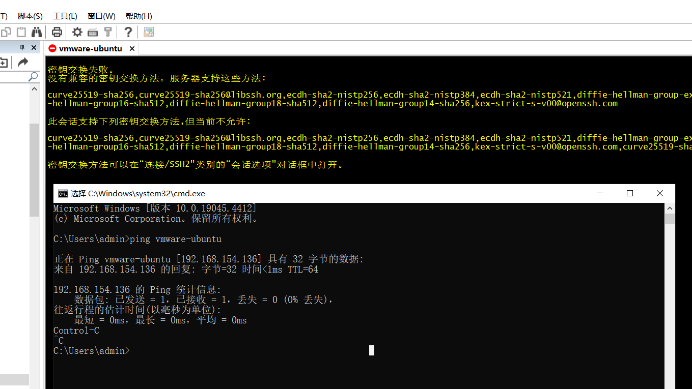

## 解决 SecureCRT 报错的问题


在windows 10 环境下通过cmd登录ssh，能成功，但是通过SecureCRT报一些错误解决的方法
```shell
ssh twl-admin@192.168.154.136 
```
能通过 Windows CMD 使用 SSH 成功登录到你的 Ubuntu 虚拟机，这说明你的 SSH 服务器配置是正确的。SecureCRT 报错很可能是因为它使用的密钥交换算法或加密算法与 SSH 服务器不兼容。


### 解决 SecureCRT 报错的问题

以下是调整 SecureCRT 设置以解决密钥交换失败问题的详细步骤：

1. **打开 SecureCRT 会话设置**：
    - 打开 SecureCRT。
    - 右键点击你的会话并选择 `属性`（或 `Edit Session`）。

2. **调整密钥交换算法**：
    - 在左侧导航栏中，选择 `连接` > `SSH2`。
    - 在 `首选密钥交换` 列表中，添加或启用兼容的算法。例如，添加 `diffie-hellman-group14-sha1` 或 `diffie-hellman-group1-sha1`。
    - 确保这些算法被选中。

3. **调整加密算法**：
    - 在同一个 `SSH2` 选项卡中，找到 `首选加密` 列表。
    - 添加或启用兼容的加密算法。例如，添加 `aes256-cbc`、`aes128-cbc` 等常见的加密算法。
    - 确保这些算法被选中。

4. **保存设置**：
    - 保存会话设置，并尝试重新连接。

### 检查 SSH 配置文件中的支持算法

确认你的 SSH 服务器配置文件 `/etc/ssh/sshd_config` 中包含以下内容：

1. **编辑 SSH 配置文件**：
    - 打开终端并编辑文件：
      ```sh
      sudo nano /etc/ssh/sshd_config
      ```

2. **确保包含以下行**：
   ```sh
   KexAlgorithms diffie-hellman-group14-sha1,diffie-hellman-group1-sha1
   Ciphers aes256-cbc,aes128-cbc
   ```

3. **保存文件并重启 SSH 服务**：
    - 保存文件并退出编辑器，然后重启 SSH 服务：
      ```sh
      sudo systemctl restart ssh
      ```

### 重试 SecureCRT 连接

1. **打开 SecureCRT**：
    - 重新尝试连接。
    - 如果仍然遇到问题，可以尝试禁用一些较新的密钥交换和加密算法，只保留兼容的算法。

### SecureCRT 的详细设置步骤

1. **打开 SecureCRT 并选择会话**。
2. **右键点击会话并选择 `属性`**。
3. **导航到 `连接` > `SSH2` 选项卡**。
4. **在 `首选密钥交换` 列表中，确保 `diffie-hellman-group14-sha1` 和 `diffie-hellman-group1-sha1` 被选中**。
5. **在 `首选加密` 列表中，确保 `aes256-cbc` 和 `aes128-cbc` 被选中**。
6. **保存设置并重试连接**。

