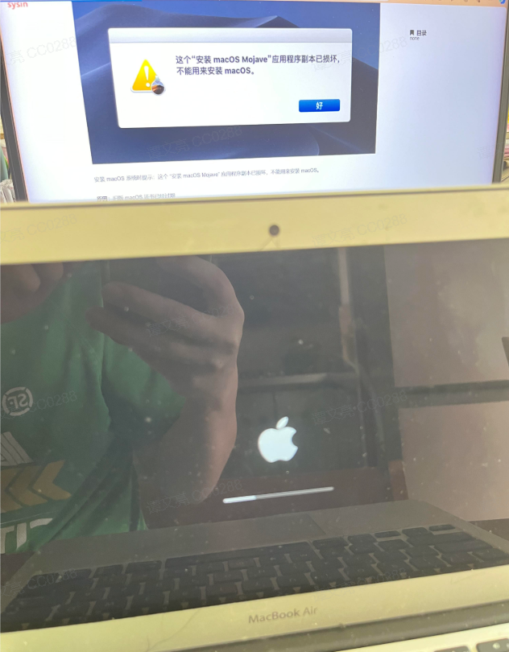
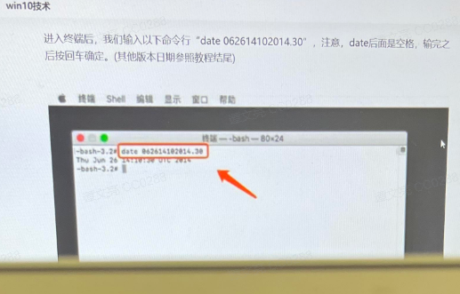

# Upgrading a 2013 MacBook Air to a Specific macOS Version for Microsoft RDP Client Installation
> 由于2013年的MacBook Air配置相对较低，直接升级到最新的macOS版本会导致系统卡顿。因此，我选择将系统升级到可以支持安装Microsoft RDP Client的指定版本。这样既能利用macOS的轻量特性，又能通过RDP客户端远程登录到Windows 10进行办公。macOS自带的功能有限，而通过RDP客户端，可以充分利用Windows的办公环境。 
## 升级过程中的问题与解决方案
### 1. 下载DMG文件的问题
> 首先，我从Apple官方网站下载了所需版本的macOS DMG文件。在下载过程中，遇到了以下问题：
> 官网实在找不到旧版本的dmg下载，就用google 找到一个baidu网盘下载
> 但是百度网盘没有svip, 立马打开黄鱼解决

## 2. 烧录U盘的问题
> 成功下载DMG文件后，我需要将其制作成可启动的U盘。选择了闪迪（SanDisk）的U盘，使用createinstallmedia命令进行制作。遇到的主要问题包括：
> U盘无法识别：确保U盘已经正确插入，并且在“磁盘工具”中被识别。如果仍然无法识别，可以尝试更换USB端口或使用其他品牌的U盘。
> 制作过程中断：使用命令行工具时，如果遇到中断问题，确保U盘没有任何物理问题，并且在制作过程中不要中途拔出U盘。
> 烧录必须用mac,要将下载的DMG文件烧录到U盘以制作启动盘，可以使用以下命令。假设你的DMG文件名为macOS.dmg，U盘挂载点为/Volumes/MyUSB：
> 请注意以下几点： 
> 将/Volumes/MyUSB替换为你实际的U盘挂载点名称。
> 将/path/to/macos.dmg替换为你实际的DMG文件路径。
```shell
sudo /Applications/Install\ macOS\ Mojave.app/Contents/Resources/createinstallmedia --volume /Volumes/MyUSB --applicationpath /path/to/macos.dmg

```
## 3. 时间问题和Date命令
> 在安装过程中，出现了“macOS Mojave 副本已经损坏”的提示，这是由于系统时间不正确导致的。解决方法如下：
> 进入“实用工具”中的“终端”。
> 使用以下命令调整系统时间：
> 例如，将时间设置为2013年12月15日12:00：
```shell
date 121512002013
```

> 调整时间后，重新启动安装程序，问题得以解决。
> 通过上述步骤，我成功将2013年MacBook Air升级到了指定的macOS版本，顺利安装了Microsoft RDP Client，实现了通过RDP远程登录Windows 10进行办公的需求。在升级过程中，遇到了下载DMG文件、烧录U盘以及系统时间问题，通过逐一排查和解决，最终完成了升级。
