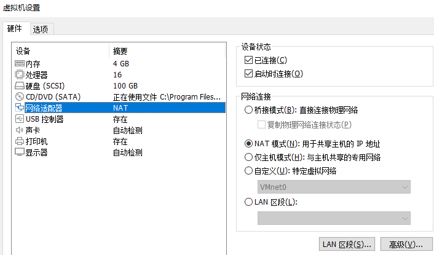
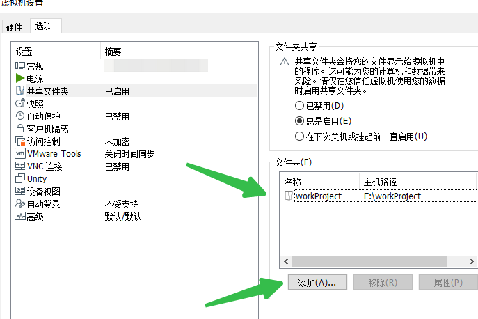

## 在Vmware安装Ubuntu 20.04 LTS 版本与windows 10 共享文件，环境搭建
我的虚拟机设置情况   


要在 VMware 上安装 Ubuntu 20.04.6 LTS (64-bit) 版本以便编译 ThingsBoard 源码，以下是详细的步骤指南：

### 下载 Ubuntu 20.04.6 LTS ISO 文件

1. **访问 Ubuntu 官方下载页面**:
    - 打开浏览器，访问 [Ubuntu 20.04.6 LTS 下载页面](https://releases.ubuntu.com/20.04/).

2. **选择下载合适的 ISO 文件**:
    - 找到 `ubuntu-20.04.6-live-server-amd64.iso`，这是没有桌面环境的服务器版本。

### 创建新的虚拟机

1. **打开 VMware Workstation 或 VMware Player**:
    - 启动你的 VMware 软件。

2. **创建新的虚拟机**:
    - 点击 `Create a New Virtual Machine` 或者 `New Virtual Machine`.

3. **选择安装源**:
    - 选择 `Installer disc image file (iso)`，然后浏览并选择刚刚下载的 `ubuntu-20.04.6-live-server-amd64.iso` 文件。

4. **虚拟机配置**:
    - **操作系统版本**: VMware 通常会自动识别 ISO 文件。如果没有，请手动选择 `Linux` 作为操作系统和 `Ubuntu 64-bit` 作为版本。
    - **虚拟机名称**: 给你的虚拟机起个名字，例如 `Ubuntu 20.04.6 Server`.
    - **存储位置**: 选择一个适合的存储位置。

5. **分配磁盘空间**:
    - 建议至少分配 20 GB 的磁盘空间。选择 `Store virtual disk as a single file`.

6. **配置硬件**:
    - **内存**: 分配至少 2 GB 的内存，建议 4 GB 或更多以便更好地编译源码。
    - **处理器**: 分配至少 2 个 CPU 核心，建议更多以提高编译性能。
    - **网络适配器**: 选择 `Bridged` 或 `NAT` 网络连接。

7. **完成配置**:
    - 点击 `Finish`，虚拟机将会创建并启动。

### 安装 Ubuntu 20.04.6 LTS

1. **启动虚拟机**:
    - 虚拟机启动后，会从 ISO 文件引导进入 Ubuntu 安装程序。

2. **选择安装语言**:
    - 选择 `English` 或你偏好的语言，然后按 `Enter`.

3. **安装 Ubuntu Server**:
    - 选择 `Install Ubuntu Server`.

4. **网络配置**:
    - 通常默认的网络配置是 `自动配置`。按 `Enter` 继续。

5. **配置代理**:
    - 如果需要代理，填写代理信息。否则，直接按 `Enter` 继续。

6. **配置 Ubuntu 存储库镜像**:
    - 默认选项即可。按 `Enter` 继续。

7. **磁盘分区**:
    - 选择 `Use an entire disk`，然后选择你的虚拟磁盘。确认后继续。

8. **配置用户和主机名**:
    - 设置系统管理员用户名和密码。你也需要设置主机名。

9. **安装过程**:
    - 确认所有配置，开始安装 Ubuntu。这个过程可能需要几分钟。

10. **完成安装**:
    - 安装完成后，选择 `Reboot Now` 重启虚拟机。

### 更新系统并安装编译工具

1. **登录系统**:
    - 使用你在安装过程中设置的用户名和密码登录系统。

2. **更新系统**:
    - 打开终端，运行以下命令更新系统：
      ```sh
      sudo apt update
      sudo apt upgrade -y
      ```

3. **安装编译工具**:
    - 运行以下命令安装编译 ThingsBoard 源码所需的工具：
      ```sh
      sudo apt install -y openjdk-11-jdk maven git
      ```

### 克隆并编译 ThingsBoard 源码

1. **克隆 ThingsBoard 仓库**:
    - 运行以下命令克隆 ThingsBoard 源码：
      ```sh
      git clone https://github.com/thingsboard/thingsboard.git
      cd thingsboard
      ```

2. **编译源码**:
    - 使用 Maven 编译 ThingsBoard 源码：
      ```sh
      mvn clean install -DskipTests
      ```

这将会下载所有依赖项并编译 ThingsBoard 源码，整个过程可能需要一些时间，取决于你的硬件配置和网络速度。

通过以上步骤，你将在 VMware 上安装 Ubuntu 20.04.6 LTS 并配置好环境以编译 ThingsBoard 源码。

## 为了提升ubuntu 下载依赖速度，修改列新源
为了加速下载 Ubuntu 20.04.6 LTS 服务器版本的 ISO 文件，你可以使用中国的镜像站点。以下是一些常用的中国镜像站点以及如何使用它们下载 Ubuntu ISO 文件：

### 中国镜像站点

1. **清华大学开源软件镜像站**：
    - 网址：[https://mirrors.tuna.tsinghua.edu.cn/ubuntu-releases/20.04/](https://mirrors.tuna.tsinghua.edu.cn/ubuntu-releases/20.04/)

2. **阿里云开源镜像站**：
    - 网址：[https://mirrors.aliyun.com/ubuntu-releases/20.04/](https://mirrors.aliyun.com/ubuntu-releases/20.04/)

3. **北京外国语大学开源镜像站**：
    - 网址：[https://mirrors.bfsu.edu.cn/ubuntu-releases/20.04/](https://mirrors.bfsu.edu.cn/ubuntu-releases/20.04/)

4. **中国科学技术大学开源镜像站**：
    - 网址：[http://mirrors.ustc.edu.cn/ubuntu-releases/20.04/](http://mirrors.ustc.edu.cn/ubuntu-releases/20.04/)

### 下载 Ubuntu 20.04.6 LTS ISO 文件

你可以直接访问以上镜像站点的 URL，然后下载 `ubuntu-20.04.6-live-server-amd64.iso` 文件。例如：

1. **从清华大学开源软件镜像站下载**：

   访问 [清华大学 Ubuntu 20.04.6 LTS 服务器版本下载页面](https://mirrors.tuna.tsinghua.edu.cn/ubuntu-releases/20.04/) 然后点击 `ubuntu-20.04.6-live-server-amd64.iso` 链接下载。

2. **从阿里云开源镜像站下载**：

   访问 [阿里云 Ubuntu 20.04.6 LTS 服务器版本下载页面](https://mirrors.aliyun.com/ubuntu-releases/20.04/) 然后点击 `ubuntu-20.04.6-live-server-amd64.iso` 链接下载。


## 安装ssh server
在这个屏幕上，你需要配置 SSH 设置。这一步将允许你通过 SSH 远程访问你的 Ubuntu 服务器。以下是详细的配置步骤：

### 配置 SSH 设置

1. **安装 OpenSSH 服务器**:
    - 确保选中 `Install OpenSSH server` 选项（默认已选中）。
    - 这将安装并启用 OpenSSH 服务器，以便你可以通过 SSH 连接到服务器。

2. **导入 SSH 身份（可选）**:
    - 如果你有 GitHub 或 Launchpad 上的 SSH 密钥，可以选择导入。
    - 如果不需要导入 SSH 密钥，将 `Import SSH identity` 保持为 `No`。

3. **允许密码认证**:
    - 默认情况下，`Allow password authentication over SSH` 选项已选中。
    - 这将允许你通过密码进行 SSH 认证。如果你只想使用 SSH 密钥认证，可以取消选中此选项。

### 操作步骤

1. **确保选中 `Install OpenSSH server`**:
    - 确保 `Install OpenSSH server` 选项已选中。
    - 使用箭头键导航，确认该选项已选中（`[X]`）。

2. **设置导入 SSH 身份**:
    - 如果你不需要导入 SSH 密钥，将 `Import SSH identity` 保持为 `No`。
    - 使用箭头键或 Tab 键导航到 `Import SSH identity`，确认其设置为 `No`。

3. **允许密码认证**:
    - 如果你希望通过密码进行 SSH 认证，确保 `Allow password authentication over SSH` 选项已选中（`[X]`）。
    - 默认情况下，该选项已选中。如果你不想使用密码认证，可以取消选中。

4. **完成设置**:
    - 使用箭头键导航到屏幕底部的 `Done` 按钮，并按 `Enter` 键继续。

### 图示操作

确保选项如下：

```plaintext
[X] Install OpenSSH server

Import SSH identity: [ No  ▼]
You can import your SSH keys from GitHub or Launchpad.

[X] Allow password authentication over SSH

[ Done ]
[ Back ]
```

完成这些步骤后，安装程序将继续进行剩余的安装过程。安装完成后，你将能够通过 SSH 远程连接到你的 Ubuntu 服务器。

### 总结

1. 确保 `Install OpenSSH server` 选项已选中。
2. 确保 `Import SSH identity` 设置为 `No`，除非你需要导入 SSH 密钥。
3. 确保 `Allow password authentication over SSH` 选项已选中。
4. 导航到 `Done` 按钮并按 `Enter` 键继续。

 
## 安装thingsboard 环境
在这个界面中，你可以选择安装一些常用的服务器应用程序。你提到需要 Docker，同时还需要 Python 3.10、Java JDK 11、SSH 登录以及 ThingsBoard 所有的依赖项，包括 Google Protobuf。以下是详细的操作步骤：

### 选择安装 Docker

1. **选择 Docker**：
    - 使用箭头键移动到 `docker` 选项。
    - 按空格键选择 `docker`（选择后会显示 [X]）。

### 其他软件的安装

对于 Python 3.10、Java JDK 11、Google Protobuf 及其他依赖项，你需要在完成安装后通过命令行来安装，因为这些软件在这个界面中不提供直接选择。

### 完成选择

1. **完成选择**：
    - 确认已选择 `docker` 选项。
    - 使用箭头键移动到 `Done` 按钮，然后按 `Enter` 键继续。

### 安装完成后，通过命令行安装其他依赖项

安装完成并首次登录到系统后，你可以通过命令行安装其他所需的软件和依赖项。

### 更新系统并安装 SSH

1. **更新系统**：
   ```sh
   sudo apt update
   sudo apt upgrade -y
   ```

2. **确保 SSH 服务已安装并启动**：
   ```sh
   sudo apt install -y openssh-server
   sudo systemctl enable ssh
   sudo systemctl start ssh
   ```

### 安装 Python 3.10

1. **添加 deadsnakes PPA 并安装 Python 3.10**：
   ```sh
   sudo apt install -y software-properties-common
   sudo add-apt-repository ppa:deadsnakes/ppa
   sudo apt update
   sudo apt install -y python3.10 python3.10-venv python3.10-dev
   ```

### 安装 Java JDK 11

1. **安装 OpenJDK 11**：
   ```sh
   sudo apt install -y openjdk-11-jdk
   ```

### 安装 Google Protobuf

1. **安装 Protobuf**：
   ```sh
   sudo apt install -y protobuf-compiler
   ```

### 安装 ThingsBoard 依赖项

1. **安装 Maven 和 Git**：
   ```sh
   sudo apt install -y maven git
   ```

### 克隆并编译 ThingsBoard 源码

1. **克隆 ThingsBoard 仓库**：
   ```sh
   git clone https://github.com/thingsboard/thingsboard.git
   cd thingsboard
   ```

2. **编译 ThingsBoard 源码**：
   ```sh
   mvn clean install -DskipTests
   ```

### 示例命令汇总

以下是你可以复制粘贴到终端中执行的一系列命令，以确保安装所需的所有依赖项：

```sh
# 更新系统
sudo apt update
sudo apt upgrade -y

# 安装 SSH 服务
sudo apt install -y openssh-server
sudo systemctl enable ssh
sudo systemctl start ssh

# 安装 Docker
sudo apt install -y docker.io
sudo systemctl enable docker
sudo systemctl start docker

# 安装 Python 3.10
sudo apt install -y software-properties-common
sudo add-apt-repository ppa:deadsnakes/ppa
sudo apt update
sudo apt install -y python3.10 python3.10-venv python3.10-dev

# 安装 OpenJDK 11
sudo apt install -y openjdk-11-jdk

# 安装 Google Protobuf
sudo apt install -y protobuf-compiler

# 安装 Maven 和 Git
sudo apt install -y maven git

# 克隆并编译 ThingsBoard 源码
git clone https://github.com/thingsboard/thingsboard.git
cd thingsboard
mvn clean install -DskipTests
```

执行上述命令后，你将会安装并配置好所有所需的软件和依赖项，以便在 Ubuntu 20.04.6 LTS 上编译和运行 ThingsBoard。

## 安装vmware tools 工具，
*** 找到vmware pro 17 安装目录下的linux.iso 文件将添加到vmware cdrom中
要在 VMware 虚拟机中挂载 Windows 10 宿主机上的文件，可以使用 VMware 提供的共享文件夹功能。以下是详细的步骤指南：

### 1. 安装 VMware Tools

首先，需要在 Ubuntu 虚拟机中安装 VMware Tools。这是一个必需的步骤，因为共享文件夹功能依赖于 VMware Tools。

#### 安装 VMware Tools

1. **打开 VMware Workstation**：
    - 启动你的 VMware Workstation，并运行你的 Ubuntu 虚拟机。

2. **挂载 VMware Tools ISO**：
    - 在 VMware 菜单中，选择 `VM` -> `Install VMware Tools`。
    - 这将挂载 VMware Tools ISO 到虚拟机中的光驱。

3. **挂载光驱**：
    - 在 Ubuntu 虚拟机中，打开终端。
    - 输入以下命令将光驱内容挂载到 `/mnt` 目录：
      ```sh
      sudo mount /dev/cdrom /mnt
      ```

4. **解压并安装 VMware Tools**：
    - 解压 VMware Tools 安装包：
      ```sh
      tar -zxvf /mnt/VMwareTools-*.tar.gz -C /tmp/
      ```
    - 进入解压后的目录并运行安装脚本：
      ```sh
      cd /tmp/vmware-tools-distrib
      sudo ./vmware-install.pl
      ```
    - 按照提示完成安装过程。

### 2. 配置共享文件夹

1. **打开共享文件夹设置**：
    - 在 VMware 菜单中，选择 `VM` -> `Settings`。
    - 选择 `Options` 标签，点击 `Shared Folders`。
    - 选择 `Always enabled` 或 `Enabled until next power off or suspend`。

2. **添加共享文件夹**：
    - 点击 `Add` 按钮，浏览并选择你希望共享的宿主机文件夹。
    - 设置共享文件夹名称，并选择 `Enable this share` 选项。

### 3. 挂载共享文件夹

1. **重启 Ubuntu 虚拟机**：
    - 完成以上步骤后，重启 Ubuntu 虚拟机。

2. **挂载共享文件夹**：
    - 在 Ubuntu 虚拟机中，打开终端。
    - 创建挂载点目录：
      ```sh
      mkdir ~/shared
      ```
    - 挂载共享文件夹（假设共享文件夹名称为 `share`）：
      ```sh
      sudo mount -t vmhgfs .host:/share ~/shared
      ```

### 4. 自动挂载共享文件夹（可选）

要在每次启动时自动挂载共享文件夹，可以编辑 `/etc/fstab` 文件：

1. **编辑 `/etc/fstab` 文件**：
    - 打开终端并编辑 `/etc/fstab` 文件：
      ```sh
      sudo nano /etc/fstab
      ```

2. **添加挂载条目**：
    - 在文件末尾添加以下条目：
      ```plaintext
      .host:/share /home/your-username/shared vmhgfs defaults 0 0
      ```

3. **保存并退出**：
    - 保存文件并退出编辑器。


## 将windows共享目录添加到vmware

使用 `vmware-hgfsclient` 命令，并且显示了共享文件夹 `workProject`。接下来我们可以尝试挂载这个共享文件夹到你的 Ubuntu 文件系统中。

### 挂载 `vmware-hgfsclient` 显示的共享文件夹

首先，确保 `open-vm-tools` 已经正确安装并运行。

1. **确认 `open-vm-tools` 已经安装并运行**

```sh
sudo systemctl status open-vm-tools
```

2. **创建挂载点目录**

```sh
sudo mkdir -p /mnt/hgfs/workProject
```

3. **挂载共享文件夹**

```sh
sudo vmhgfs-fuse .host:/workProject /mnt/hgfs/workProject -o allow_other
```

### 验证挂载

1. **检查挂载结果**

```sh
df -h
```

2. **查看共享文件夹内容**

```sh
ls /mnt/hgfs/workProject
```

### 总结

通过这些步骤，你应该能够成功挂载 `vmware-hgfsclient` 显示的共享文件夹。如果在过程中遇到任何问题，请提供详细的错误信息或输出内容，以便进一步排查。

```shell
admin@ubuntu-server:~$ ls /mnt/hgfs/workProject/
apache-tomcat-7.0.103  c_node_modules  docker-emqx      easy-rules  holiday-cn-2022.01.01  java2  java5  node          php     rust
apisix                 deploy          docker-node-red  go          html                   java3  js     node-red_bak  python
artemis-rest           docker          drama-engine     hawtio      java                   java4  lua    openresty     remote
admin@ubuntu-server:~$ 
admin@ubuntu-server:~$ 
```

