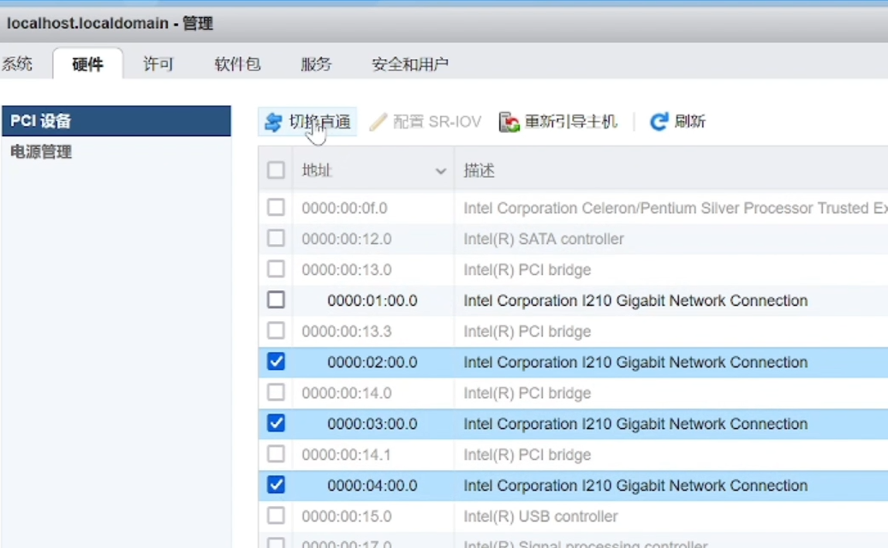

以下图片vmnic0对应eth0,打x 的表示用于管理该exsi虚拟机器使用

图片ip地址设置

选择需要直通的网卡，需要排除管理网卡，点击`切换直通`

配置istore 硬件

# 添加交换机后，再添加端口组

# 问题.
任务
Power On VM
键
haTask-5-vim.VirtualMachine.powerOn-267

描述
打开该虚拟机电源

虚拟机
win10
状况
失败 - 父资源池中的可用内存资源不足，无法执行该操作。

错误
模块“MonitorLoop”打开电源失败。
组 vmm.135766: 无法对 VMM 组 vmm0:win10 应用内存配置。(最小值: 1048576，最大值: -1，最小限制: -1，份额: -3，单位: pages)
无法打开虚拟机电源: 内存资源的准入检查失败。有关资源管理设置的信息，请参见《VMware ESX 资源管理指南》。
无法打开虚拟机电源。
无法启动虚拟机。

实际显示

win10 的配置

istore的配置

