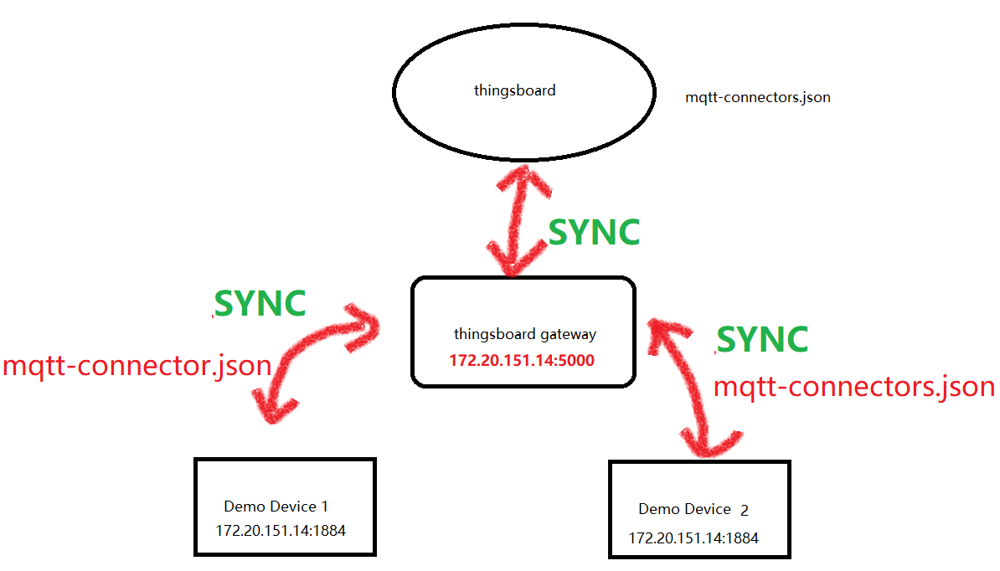
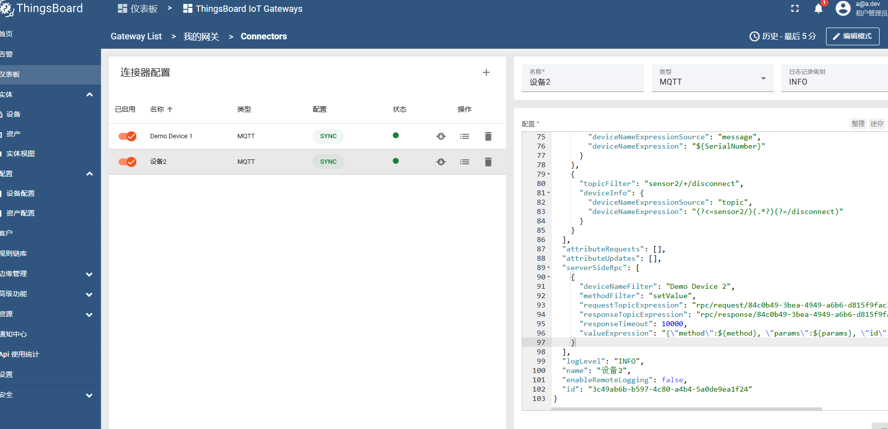
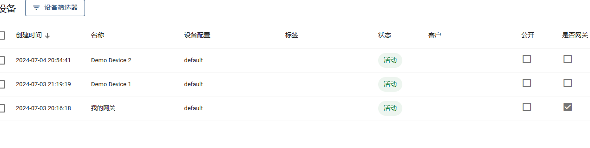
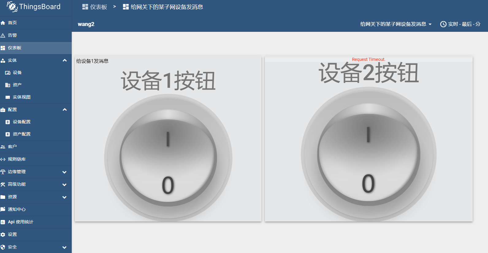
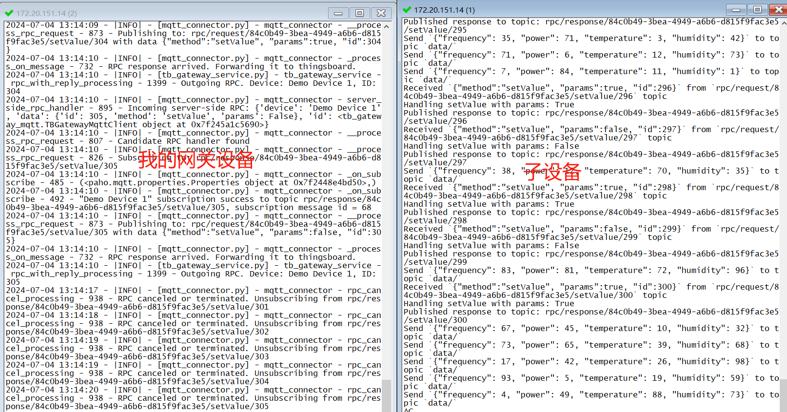
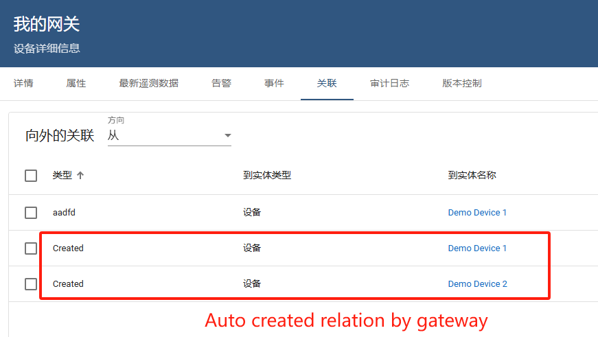

# 记一次thingsboard gateway 调试总结

### 背景

在使用 `ThingsBoard 3.6.4` 网关`thingsboard gateway 3.5.1`的过程中，我们需要配置和调试 `MQTT` 连接器，以便子设备能够正确处理来自网关的 `RPC` 请求。此次调试过程中，遇到了一些问题，包括 `JSON` 格式错误、消息未正确替换变量、以及消息处理超时等。
但凡遇到网关问题，官方文档少知又少。github issue 有人遇到同样的问题无人回复,本人折腾了2天终于让子设备通网了 

我模拟网关的网络结构如下：
其中 `Demo Device 1` 和 `Demo Device 2` 作为 `thingsboard gateway` 的子设备  


### 问题总结

#### 1. JSON 格式错误

在配置 `valueExpression` 时，生成的 `JSON` 字符串格式不正确，导致子设备在解析时出错。具体表现为双引号重复或逗号缺失。

**解决方法：**
确保 `valueExpression` 格式正确，避免重复的双引号。最终的 `valueExpression` 如下：
```json
"valueExpression": "{\"method\":${method}, \"params\":${params}, \"id\":${id}}"
```

#### 2. 变量未正确替换

在最初的调试过程中，发现 `methodName` 和 `requestId` 变量未能正确替换，导致子设备接收到的消息中包含未解析的变量字符串。
原因是因为变量名写错了

**解决方法：**
确保 `mqtt-connector.json` 中的变量能够正确替换。最终的配置如下：
```json
{
  "serverSideRpc": [
    {
      "deviceNameFilter": "Demo Device 1",
      "methodFilter": "setValue",
      "requestTopicExpression": "rpc/request/84c0b49-3bea-4949-a6b6-d815f9fac3e5/${method}/${id}",
      "responseTopicExpression": "rpc/response/84c0b49-3bea-4949-a6b6-d815f9fac3e5/${method}/${id}",
      "responseTimeout": 10000,
      "valueExpression": "{\"method\":${method}, \"params\":${params}, \"id\":${id}}"
    }
  ]
}
```

#### 3. RPC 请求超时

网关日志显示 RPC 请求被取消或超时，导致未能正确处理子设备的响应。

**解决方法：**
在网关下的子设备上面 增加调试信息，确保子设备在处理消息时能够正确响应。更新后的 `publisher.py` 如下：
```python
import random
import time
import json
from paho.mqtt import client as mqtt_client

broker = '127.0.0.1'
port = 1884
topic = 'data/'
device_id = '84c0b49-3bea-4949-a6b6-d815f9fac3e5' 
rpc_request_topic = f'rpc/request/{device_id}/#'
client_id = f'publish-{random.randint(0, 1000)}'

def connect_mqtt():
    def on_connect(client, userdata, flags, rc):
        if rc == 0:
            print("Connected to MQTT Broker!")
            client.subscribe(rpc_request_topic)  
            print(f"Subscribed to topic: {rpc_request_topic}")
        else:
            print(f"Failed to connect, return code {rc}")

    client = mqtt_client.Client(client_id)
    client.on_connect = on_connect
    client.on_message = on_message 
    client.connect(broker, port)
    return client

def on_message(client, userdata, msg):
    print(f"Received `{msg.payload.decode()}` from `{msg.topic}` topic")
    try:
        rpc_request = json.loads(msg.payload.decode())
        if isinstance(rpc_request, dict):
            handle_rpc_request(client, rpc_request)
        else:
            print(f"Received non-JSON message: {rpc_request}")
    except json.JSONDecodeError as e:
        print(f"Error processing message: {e}")

def handle_rpc_request(client, rpc_request):
    method = rpc_request.get('method')
    params = rpc_request.get('params')
    request_id = rpc_request.get('id')
    print(f"Handling RPC request: method={method}, params={params}, id={request_id}")

    if method == 'setValue':
        response = handle_set_value(params)
        response_topic = f'rpc/response/{device_id}/{method}/{request_id}'
        client.publish(response_topic, json.dumps(response))
        print(f"Published response to topic: {response_topic}, response: {response}")
    else:
        print(f"Unknown RPC method: {method}")

def handle_set_value(params):
    print(f"Handling setValue with params: {params}")
    return {"status": "success"}

def make_msg():
    return json.dumps({
        'frequency': random.randint(0, 100),
        'power': random.randint(0, 100),
        'temperature': random.randint(0, 100),
        'humidity': random.randint(0, 100)
    })

def publish(client):
    while True:
        msg = make_msg()
        result = client.publish(topic, msg)
        status = result[0]
        if status == 0:
            print(f"Send `{msg}` to topic `{topic}`")
        else:
            print(f"Failed to send message to topic {topic}")

        time.sleep(1)

def run():
    client = connect_mqtt()
    client.loop_start()
    publish(client)
    client.loop_stop()

if __name__ == '__main__':
    print("STARTED")
    run()
```

### 验证与测试

1. **重新启动 ThingsBoard 网关**，确保新的配置生效。
2. **确保 MQTT Broker 正常运行**。
3. **重新启动 `publisher.py` 脚本**。
4. **发布 RPC 请求**：
    ```bash
    mosquitto_pub -h 127.0.0.1 -p 1884 -t "rpc/request/84c0b49-3bea-4949-a6b6-d815f9fac3e5/setValue/req1" -m '{"method":"setValue","params":true,"id":"req1"}'
    ```
5. **观察网关和子设备日志**，确保请求和响应正确处理。

通过以上步骤，我们成功解决了 JSON 格式错误、变量未正确替换以及 RPC 请求超时等问题，确保了 ThingsBoard 网关和子设备能够正确通信。

thingsboard与gate&子设备最关键的部分，链接器配置json

我的设备列表如下

分别配置了两个按钮给设备1和设备2发送消息


子设备收到消息
Received `{"method":"setValue", "params":false, "id":299}` from `rpc/request/84c0b49-3bea-4949-a6b6-d815f9fac3e5/setValue/299` topic


网关与子设备的关联关系


网关打印的日志
```shell

2024-07-04 13:13:20 - |INFO| - [mqtt_connector.py] - mqtt_connector - _process_on_message - 732 - RPC response arrived. Forwarding it to thingsboard.
2024-07-04 13:13:20 - |INFO| - [tb_gateway_service.py] - tb_gateway_service - rpc_with_reply_processing - 1399 - Outgoing RPC. Device: Demo Device 1, ID: 291
2024-07-04 13:13:26 - |INFO| - [mqtt_connector.py] - mqtt_connector - rpc_cancel_processing - 938 - RPC canceled or terminated. Unsubscribing from rpc/response/84c0b49-3bea-4949-a6b6-d815f9fac3e5/setValue/286
2024-07-04 13:13:28 - |INFO| - [mqtt_connector.py] - mqtt_connector - rpc_cancel_processing - 938 - RPC canceled or terminated. Unsubscribing from rpc/response/84c0b49-3bea-4949-a6b6-d815f9fac3e5/setValue/287
2024-07-04 13:13:29 - |INFO| - [mqtt_connector.py] - mqtt_connector - rpc_cancel_processing - 938 - RPC canceled or terminated. Unsubscribing from rpc/response/84c0b49-3bea-4949-a6b6-d815f9fac3e5/setValue/288
2024-07-04 13:13:29 - |INFO| - [mqtt_connector.py] - mqtt_connector - rpc_cancel_processing - 938 - RPC canceled or terminated. Unsubscribing from rpc/response/84c0b49-3bea-4949-a6b6-d815f9fac3e5/setValue/289
2024-07-04 13:13:29 - |INFO| - [mqtt_connector.py] - mqtt_connector - rpc_cancel_processing - 938 - RPC canceled or terminated. Unsubscribing from rpc/response/84c0b49-3bea-4949-a6b6-d815f9fac3e5/setValue/290
2024-07-04 13:13:30 - |INFO| - [mqtt_connector.py] - mqtt_connector - rpc_cancel_processing - 938 - RPC canceled or terminated. Unsubscribing from rpc/response/84c0b49-3bea-4949-a6b6-d815f9fac3e5/setValue/291
2024-07-04 13:13:47 - |INFO| - [mqtt_connector.py] - mqtt_connector - server_side_rpc_handler - 895 - Incoming server-side RPC: {'device': 'Demo Device 1', 'data': {'id': 292, 'method': 'setValue', 'params': True}, 'id': <tb_gateway_mqtt.TBGatewayMqttClient object at 0x7f245a1c5690>}
2024-07-04 13:13:47 - |INFO| - [mqtt_connector.py] - mqtt_connector - __process_rpc_request - 807 - Candidate RPC handler found
2024-07-04 13:13:47 - |INFO| - [mqtt_connector.py] - mqtt_connector - __process_rpc_request - 826 - Subscribing to: rpc/response/84c0b49-3bea-4949-a6b6-d815f9fac3e5/setValue/292
2024-07-04 13:13:47 - |INFO| - [mqtt_connector.py] - mqtt_connector - _on_subscribe - 485 - (<paho.mqtt.properties.Properties object at 0x7f2448fcda10>,)
2024-07-04 13:13:47 - |INFO| - [mqtt_connector.py] - mqtt_connector - _on_subscr
```
If you have any questions about ThingsBoard, please add my WeChat at any time. Welcome!
My WeChat ID: 83975256
