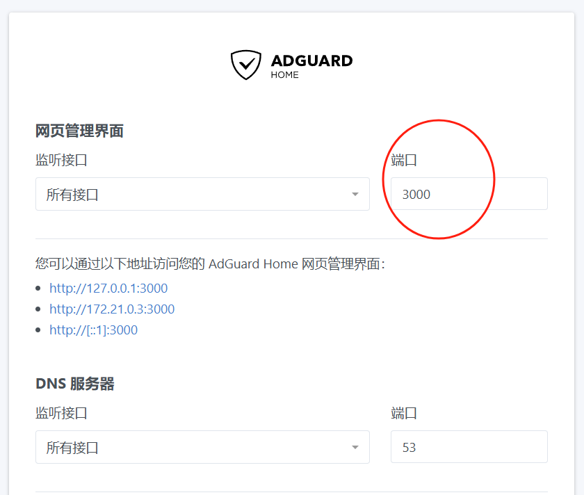

文档参考记录
https://disc8888.com/10775.html
https://cloud.tencent.com/developer/article/2296129
smartdns
https://www.nodeseek.com/post-53938-1

docker run --name adguardhome2 --restart unless-stopped -v /overlay/upper/opt/docker/volumes/adguard2/work:/opt/adguardhome/work -v /overlay/upper/opt/docker/volumes/adguard2/conf:/opt/adguardhome/conf -p 15332:53/udp -p 15332:53/tcp -p 3002:3000/tcp -d adguard/adguardhome:latest

docker run --name adguardhome1 \
--restart unless-stopped \
-v /overlay/upper/opt/docker/volumes/adguard1/work:/opt/adguardhome/work \
-v /overlay/upper/opt/docker/volumes/adguard1/conf:/opt/adguardhome/conf \
-p 15331:53/udp \
-p 15331:53/tcp \
-p 3001:3000/tcp \
-d adguard/adguardhome:latest

docker run --name adguardhome1 \
--restart unless-stopped \
-v /overlay/upper/opt/docker/volumes/adguard2/work:/opt/adguardhome/work \
-v /overlay/upper/opt/docker/volumes/adguard2/conf:/opt/adguardhome/conf \
--network host \
-d adguard/adguardhome:latest
