# 记一次开启给家庭网络开通公网ip访问，方便远程访问nas同步照片，资料等
> 我的设备为广东移动+openwrt(r5s)， 我上网模式是光猫拨号，路由器nat
> 1.找到登录光猫后台用户名和密码   
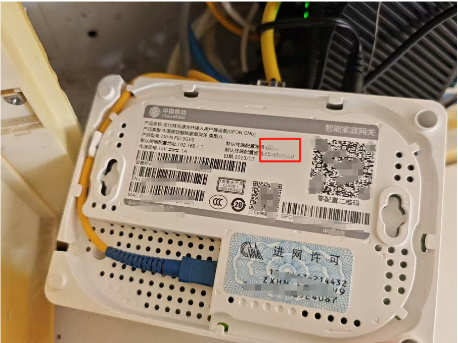   
> 2.设置如下状态如下->如图所示   

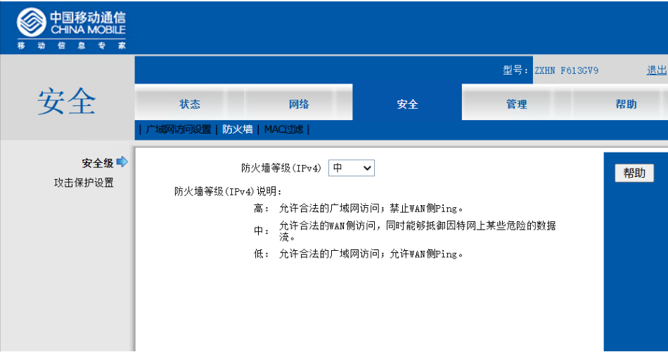 
先把这里的沟去掉吧，后续再优化，看能否通网   
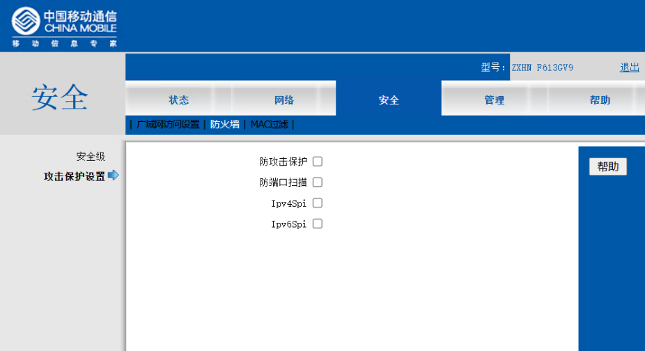
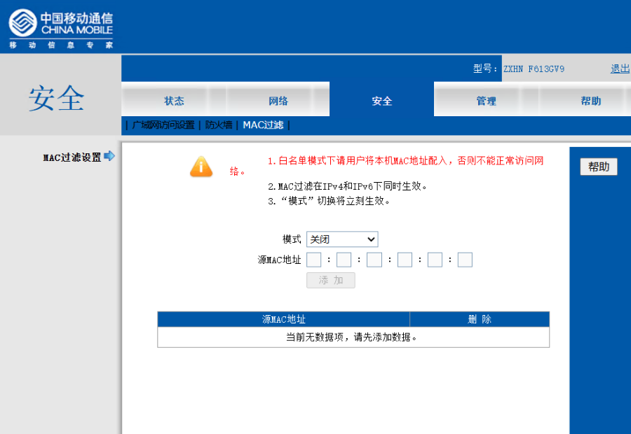  
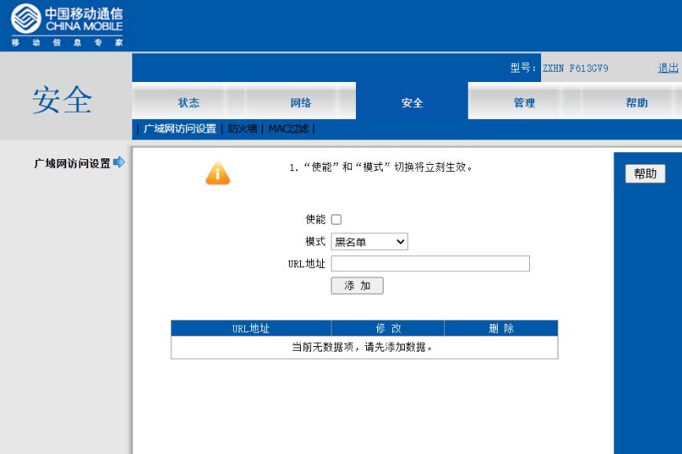   
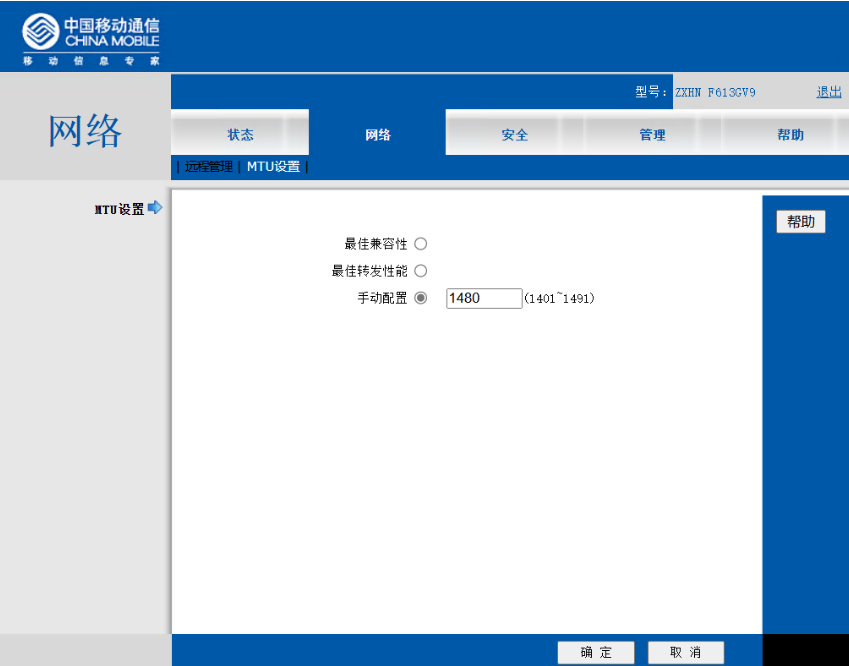  

> 3.openwrt设置-> 如图所示  
  以下也是全部选择接受，从wan口到lan口接受
   先看是否能通，后续慢慢做安全优化
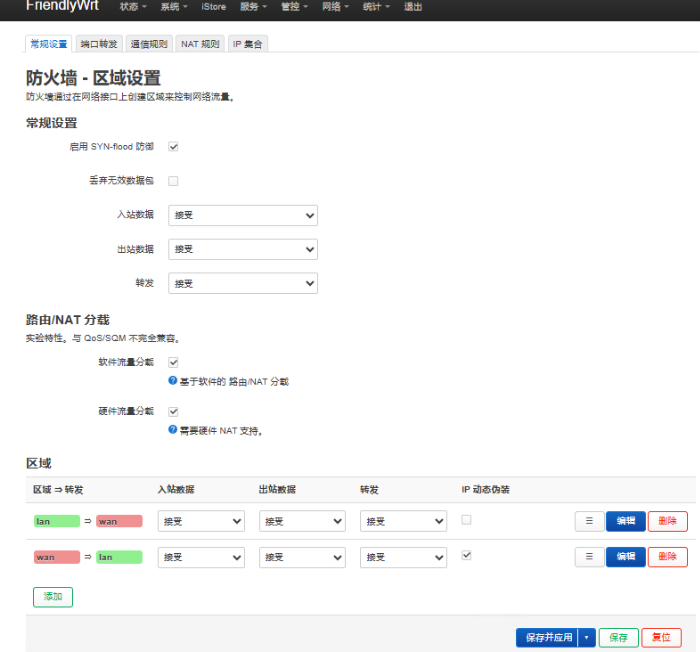  
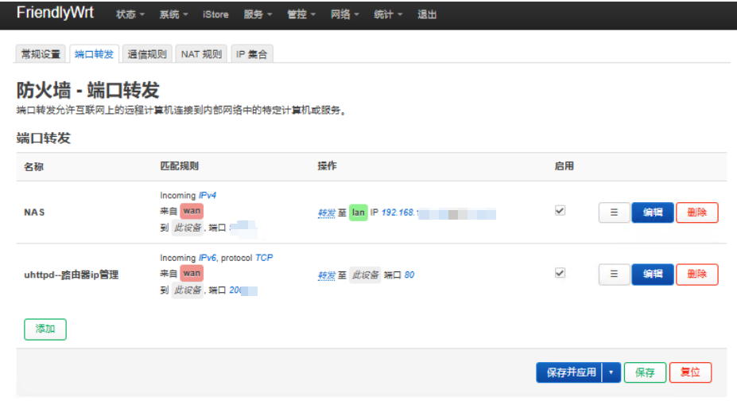  
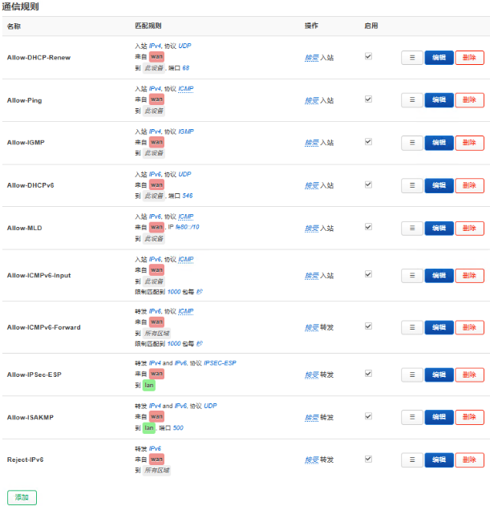  
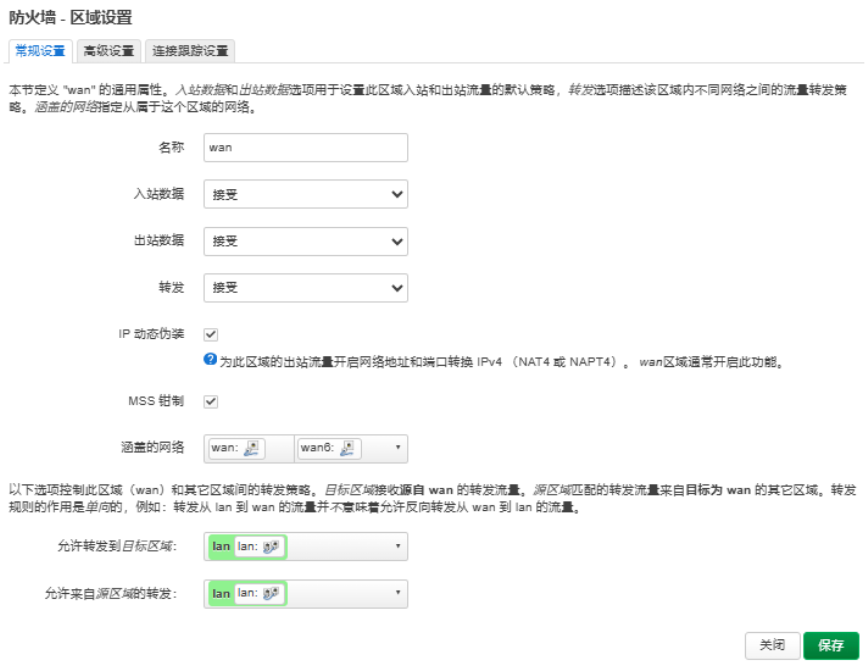  
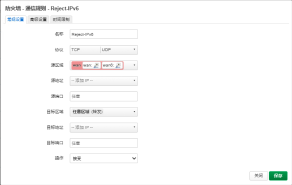  

> 测试 用手机5g流量,浏览器打开访问    

ipv6 通网成功,不过后续ipv6 地址经常变动，但可以在pt站点查看做种的ip地址
