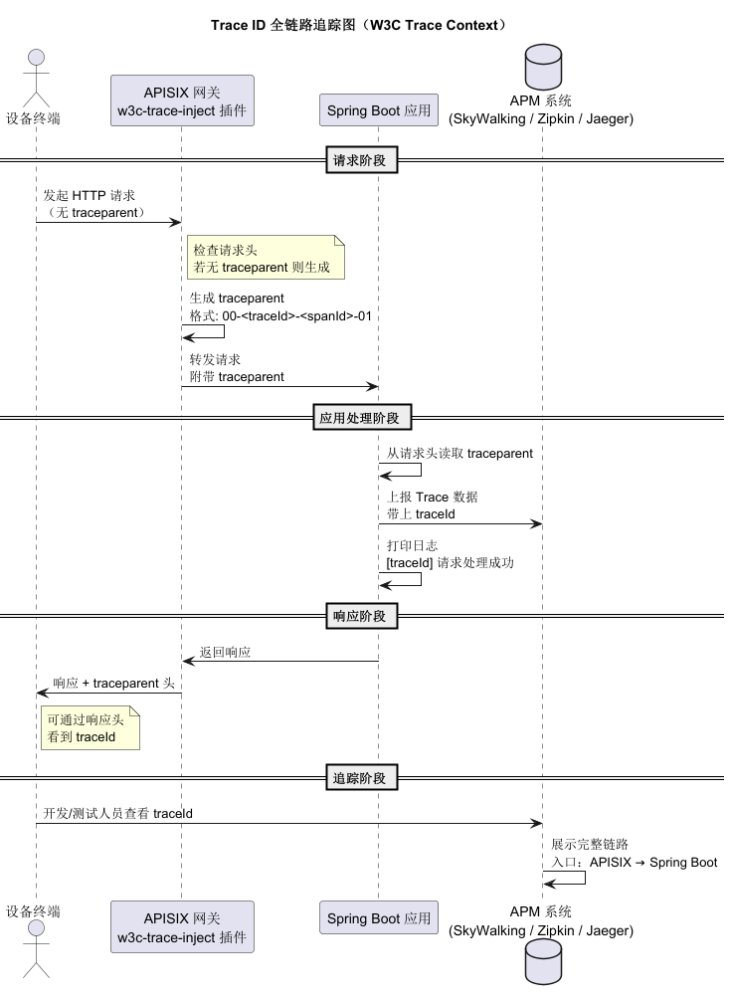
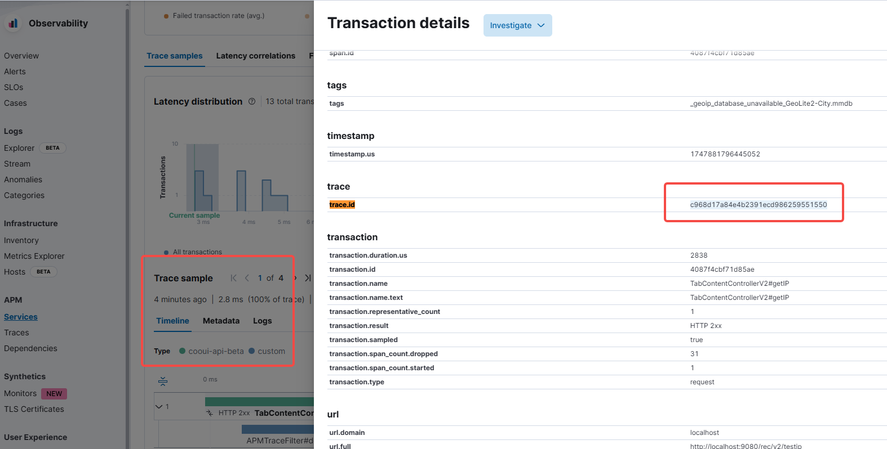
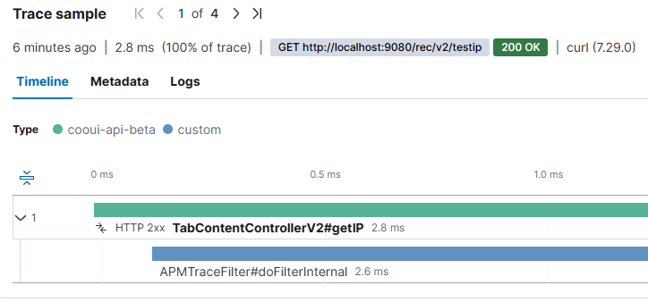

## 目录
1. [背景与目标](#背景与目标)
2. [环境准备](#环境准备)
3. [Docker Compose 最小可运行栈](#docker-compose-最小可运行栈)
4. [自定义 `w3c-trace-inject` 插件](#自定义-w3c-trace-inject-插件)
5. [常见报错与排障笔记](#常见报错与排障笔记)
6. [路由 / 上游配置与测试](#路由--上游配置与测试)

---

## 背景与目标
* **业务痛点**：跨服务排障时难以用一个 trace ID 串起整条调用链。
* **目标**：
    1. 网关层为所有流量注入符合 W3C TraceContext 的 `traceparent / tracestate`。
    2. 后端 Java 应用读到同一 trace ID，并将其写入日志 / 上报 APM。
    3. 在 APM 里能通过 trace ID 搜到整条链路。

---
## 整体追踪逻辑图



## 环境准备
| 组件 | 版本 | 镜像 |
|------|------|------|
| APISIX | `3.9.0-debian` | `apache/apisix` |
| Dashboard | `3.0.0-alpine` | `apache/apisix-dashboard` |
| etcd | `3.5.11` | `bitnami/etcd` |
| 自定义插件 | Lua 5.1 (OpenResty) | ― |

> 宿主机：CentOS 7；Docker 24.0+；Docker-Compose v2 CLI。

---

## Docker Compose 最小可运行栈
```yaml
version: "3.8"
services:
  etcd:
    image: bitnami/etcd:3.5.11
    environment:
      - ALLOW_NONE_AUTHENTICATION=yes
      - ETCD_ADVERTISE_CLIENT_URLS=http://0.0.0.0:2379
      - ETCD_LISTEN_CLIENT_URLS=http://0.0.0.0:2379
    volumes: [etcd_data:/etcd-data]
    ports: ["2379:2379"]

  apisix:
    image: apache/apisix:3.9.0-debian
    environment:
      APISIX_DEPLOYMENT_ETCD_HOST: '["http://etcd:2379"]'
    volumes:
      - ./apisix_conf/config.yaml:/usr/local/apisix/conf/config.yaml:ro
      - ./plugins/w3c-trace-inject.lua:/usr/local/apisix/apisix/plugins/w3c-trace-inject.lua:ro
      - logs:/usr/local/apisix/logs
    command: ["sh","-c","rm -f /usr/local/apisix/logs/worker_events.sock && apisix start"]
    ports: ["9080:9080","9443:9443","9180:9180"]
    depends_on: [etcd]

  dashboard:
    image: apache/apisix-dashboard:3.0.0-alpine
    environment:
      APISIX_LISTEN_ADDRESS=apisix:9180
      ETCD_HOST=etcd:2379        # ⚠ 不要带 http://
      DEFAULT_ADMIN_PASSWORD=admin
    ports: ["9000:9000"]
    depends_on: [apisix]

volumes:
  etcd_data:
  logs:
```
## config.yaml 关键片段：
```yaml
deployment:
  admin:
    allow_admin:
      - 0.0.0.0/0
    admin_key:
      - name: admin
        key: edd1c9f034335f136f87ad84b625c8f1
        role: admin

plugins:
  - w3c-trace-inject
  - prometheus

```
## 自定义 w3c-trace-inject 插件
```lua
 --
--  插件名称 : w3c-trace-inject
--  APISIX 3.9
--  功能     : 为所有请求注入 / 校验 traceparent 与 tracestate，并把 traceparent 回写到响应头
--
local core   = require("apisix.core")
local random = require("resty.random")
local str    = require("resty.string")

local plugin_name = "w3c-trace-inject"

------------------------------------------------------------------------
-- 插件元信息
------------------------------------------------------------------------
local _M = {
    version  = 0.3,        -- ↑ 0.3：新增 header_filter
    priority = 10000,
    name     = plugin_name,
    schema   = { type = "object" },   -- 无需额外配置
}

------------------------------------------------------------------------
-- 工具函数
------------------------------------------------------------------------
local function gen_hex(bytes)           -- 将随机字节转 16 进制
    return str.to_hex(random.bytes(bytes, true))
end

-- traceparent 必须形如 00-32hex-16hex-2hex
local function valid_traceparent(tp)
    return tp
       and tp:match("^00%-%x%x%x%x%x%x%x%x%x%x%x%x%x%x%x%x%x%x%x%x%x%x%x%x%x%x%x%x%x%x%x%x%x%x%-%x%x%x%x%x%x%x%x%x%x%x%x%x%x%x%x%-%x%x$")
end

-- tracestate 基础校验：≤512 字节，逗号分隔的 key=value，key 只能小写字母数字和 `_ - * /`
local function valid_tracestate(ts)
    if not ts or #ts > 512 then return false end
    for entry in ts:gmatch("[^,]+") do
        local key, val = entry:match("^([%l%d%-%_%*/]+)=([%g]+)$")
        if not key or not val then
            return false
        end
    end
    return true
end

------------------------------------------------------------------------
-- access 阶段：注入 / 校验请求头
------------------------------------------------------------------------
function _M.access(conf, ctx)
    local headers = core.request.headers(ctx)

    -- 1️⃣ traceparent --------------------------------------------------
    local tp = headers["traceparent"]
    if not valid_traceparent(tp) then
        local trace_id = gen_hex(16)             -- 128-bit
        local span_id  = gen_hex(8)              -- 64-bit
        tp = string.format("00-%s-%s-01", trace_id, span_id)
        core.request.set_header(ctx, "traceparent", tp)
        ctx.trace_id = trace_id                  -- 写入 ctx 供日志等使用
    else
        ctx.trace_id = tp:sub(4, 35)             -- 提取已存在的 trace-id
    end
    ctx.response_traceparent = tp                -- 留给 header_filter

    -- 2️⃣ tracestate ---------------------------------------------------
    local ts = headers["tracestate"]
    if not ts then
        ts = "as=1"
        core.request.set_header(ctx, "tracestate", ts)
    elseif not valid_tracestate(ts) then
        core.request.clear_header(ctx, "tracestate")
        ts = nil
    end
    ctx.response_tracestate = ts                 -- 留给 header_filter
end

------------------------------------------------------------------------
-- header_filter 阶段：把 trace 信息写回响应头
------------------------------------------------------------------------
function _M.header_filter(conf, ctx)
    if ctx.response_traceparent then
        ngx.header["traceparent"] = ctx.response_traceparent
    end
    if ctx.response_tracestate then
        ngx.header["tracestate"] = ctx.response_tracestate
    end
end

return _M

```
## 常见报错与排障笔记
| Error / Log Message                                           | Root Cause / Explanation                                  | Quick Fix                                                         |
|---------------------------------------------------------------|-----------------------------------------------------------|-------------------------------------------------------------------|
| `malformed number near '10_000'`                              | Lua 5.1 数字常量不支持下划线分隔符                        | 把 `priority = 10000`（或其他纯整数），重新 `apisix reload`。      |
| `Admin API connection reset by peer`                          | `allow_admin` 未放通外部 IP；或 `admin_listen.ip`=127.0.0.1 | 在 `deployment.admin.allow_admin` 加 `0.0.0.0/0`，或改监听地址。   |
| `failed to fetch upstream info … id [N], response code: 404`  | Route 指向的 `upstream_id` 不存在                         | 先创建对应 Upstream，或把 `upstream_id` 改成已存在的 ID。         |
| Dashboard log → `dial tcp 0.0.0.0:2379: connect: connection refused` | 环境变量 `ETCD_HOST` 带了 `http://`，解析失败            | 改为 `ETCD_HOST=etcd:2379`，或用 conf.yaml 写 `"http://etcd:2379"` |
| `traceparent` 注入但响应头没有                                | 仅在请求头 set，没有回写响应                              | 在插件 `header_filter` 加 `ngx.header["traceparent"]=…`，或用 `response-rewrite`。 |
| `503 Service Temporarily Unavailable`                         | Upstream 不可达 / DNS 解析失败 / 健康检查判 unhealthy     | 在 APISIX 容器里 `curl` 目标地址；必要时关闭健康检查 or 修网络。   |
| Dashboard 无限重启 `etcd get failed`                          | Dashboard 没加载到自定义 `conf.yaml`                     | 确认 volume 路径正确；若用 env 则删掉冲突的 `conf.yaml` 挂载。    |
| `failed to check token` (401)                                | 缺少或使用错误的 `X-API-KEY`                              | 用与 `admin_key` 对应的 key；或在 dev 环境把 `admin_key` 设空数组。|
| `worker_events.sock Address already in use`                   | 上次启动失败残留 Unix Socket                              | 启动脚本前 `rm -f /usr/local/apisix/logs/worker_events.sock`。    |
| Route 404 但插件未执行                                       | URI 不匹配或 Route 未启用插件                             | 确认 `uri` 与请求一致；或在 Global Rule 里开启插件测试。          |

## 路由 / 上游配置与测试
```shell
bash-4.2# curl -X PUT http://localhost:9180/apisix/admin/upstreams/1 \        # 添加上游
>   -H 'X-API-KEY: edd1c9f034335f136f87ad84b625c8f1' \
>   -d '{
>         "scheme":"http",
>         "type":"roundrobin",
>         "pass_host":"rewrite",
>         "upstream_host":"10.244.191.219",
>         "nodes":{"10.244.191.219:8080":1}
>       }'
{"key":"/apisix/upstreams/1","value":{"id":"1","scheme":"http","hash_on":"vars","pass_host":"rewrite","upstream_host":"10.244.191.219","type":"roundrobin","create_time":1747881772,"nodes":{"10.244.191.219:8080":1},"update_time":1747881772}}
-bash-4.2# curl -X PUT http://localhost:9180/apisix/admin/routes/1 \        # 添加路由
>   -H 'X-API-KEY: edd1c9f034335f136f87ad84b625c8f1' \
>   -d '{
>         "uri":"/rec/v2/testip",
>         "methods":["GET","POST"],
>         "upstream_id":1,
>         "plugins":{"w3c-trace-inject":{}}
>       }'
{"key":"/apisix/routes/1","value":{"upstream_id":1,"id":"1","status":1,"priority":0,"plugins":{"w3c-trace-inject":{}},"create_time":1747881778,"update_time":1747881778,"methods":["GET","POST"],"uri":"/rec/v2/testip"}}
-bash-4.2#
-bash-4.2# curl -i http://localhost:9080/rec/v2/testip     #测试接口
HTTP/1.1 200
Content-Type: application/json;charset=UTF-8
Content-Length: 332
Connection: keep-alive
Date: Thu, 22 May 2025 02:43:12 GMT
Server: APISIX/3.9.0
traceparent: 00-76be9240e9f1b09cd5f8575b998cf82b-ea282e6c58efb57e-01      # 这里是响应头 
tracestate: as=1
 
{"code":0,"data":{"x-real-ip":"192.168.240.1","tracestate":"as=1","x-forwarded-proto":"http","x-forwarded-host":"localhost","traceparent":"00-76be9240e9f1b09cd5f8575b998cf82b-ea282e6c58efb57e-01","clientIP":"192.168.240.1","host":"10.244.191.219","x-forwarded-port":"9080","user-agent":"curl/7.29.0","accept":"*/*"},"msg":"success"}-bash-4.2#
-bash-4.2#
-bash-4.2# curl -i http://localhost:9080/rec/v2/testip
HTTP/1.1 200
Content-Type: application/json;charset=UTF-8
Content-Length: 332
Connection: keep-alive
Date: Thu, 22 May 2025 02:43:16 GMT
Server: APISIX/3.9.0
traceparent: 00-c968d17a84e4b2391ecd986259551550-44b21d2b9dcc18e5-01    # 这里是响应头
tracestate: as=1
 
{"code":0,"data":{"x-real-ip":"192.168.240.1","tracestate":"as=1","x-forwarded-proto":"http","x-forwarded-host":"localhost","traceparent":"00-c968d17a84e4b2391ecd986259551550-44b21d2b9dcc18e5-01","clientIP":"192.168.240.1","host":"10.244.191.219","x-forwarded-port":"9080","user-agent":"curl/7.29.0","accept":"*/*"},"msg":"success"}
```

## 通过trace.id查看 apm dashbard 效果

> 

