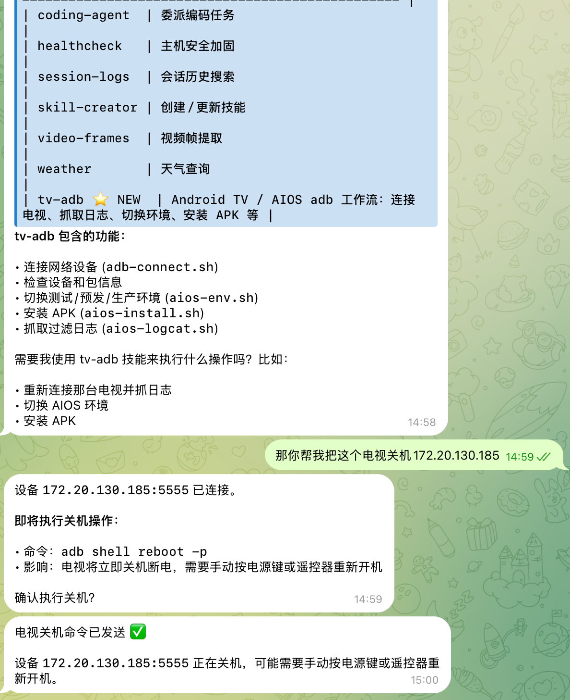

最近把 OpenClaw 跑顺之后，手就开始痒了。光让它聊天没什么意思，真正有用的是把自己天天会敲的命令收进去，变成一套能复用的技能。

我第一个下手的对象，就是电视调试。

平时这类 Android TV 设备，最常用的操作其实都差不多：`adb connect`、切测试环境、装 APK、看 `logcat`、查包版本、强杀进程。命令不复杂，但特别碎，久了就会散在聊天记录、备忘录、终端历史里。每次要用的时候，还得重新翻。

所以这次我给 OpenClaw 做了一个自己的 skill，名字就叫 `tv-adb`。

## 为什么要单独做一个 skill

一开始我也想过，直接把这些命令塞进 prompt 里是不是就够了。

后来发现不行。

原因很简单：

- 命令太碎，临时贴进去不方便维护
- 有些操作是有副作用的，比如 `pm clear`、`pm uninstall`、`setprop`
- 有些流程是重复动作，适合写成脚本，不适合每次现场拼
- 以后不只是我要用，OpenClaw 自己也应该知道“遇到电视调试任务时该先做什么，再做什么”

按 OpenClaw 现在的机制，最稳的做法还是做成一个正式 skill。

## 最开始的判断：不要装在运行中的容器里

这一步其实挺关键。

我原本是想直接进 sandbox 容器里装 `adb`，后来翻了 OpenClaw 的代码和文档，结论很明确：这种装法没意义。

运行中装进去的东西，容器一重建就没了。

所以正确路线只有一条：

1. `adb` 装进 sandbox 镜像
2. skill 放进 OpenClaw 的 skill 目录
3. 重建容器
4. 再让 OpenClaw 去使用

也就是说，二进制和 skill 是两回事：

- `adb` 是运行依赖，应该进镜像
- `tv-adb` 是使用说明和操作流程，应该进 skill

## 镜像该改哪一层

我现在用的是自己定制过的 sandbox 镜像，不是官方默认那套。

运行中的容器是这两个：

```bash
docker ps
```

里面能看到：

- `openclaw-sandbox-custom:bookworm-slim`
- `openclaw-sandbox-browser-custom:bookworm-slim`

这两个名字一看就知道，浏览器容器是基于我自己的基础镜像继续做的。所以 `adb` 最适合加在基础镜像里，也就是：

```dockerfile
Dockerfile.sandbox-custom
```

我最后就是在这个 Dockerfile 的 apt 包列表里加了：

```dockerfile
adb
```

然后重建两张镜像，再把当前的 sandbox 容器 recreate 一次。

验证结果没问题：

```bash
adb version
```

容器里已经能直接跑：

```text
Android Debug Bridge version 1.0.41
Version 29.0.6-debian
```

这一步做完，后面 skill 才有意义。否则 skill 写得再漂亮，底层没 `adb` 也只是纸上谈兵。

## skill 放哪比较对

这也是这次踩到的一个点。

OpenClaw 的 skill 不是随便丢个 Markdown 文件就行，它有自己的发现机制。按现在这套结构，最适合我的不是放到某个单独项目里，而是放到共享 skill 目录：

```bash
~/.openclaw/skills/tv-adb/
```

因为电视调试不是某个 repo 私有能力，而是我长期都要用的通用能力。放共享目录，以后不管在哪个 workspace 里，都能调出来。

最后我把它拆成了这个结构：

```text
tv-adb/
├── SKILL.md
├── references/
│   ├── commands.md
│   ├── environments.md
│   ├── packages.md
│   └── troubleshooting.md
├── scripts/
│   ├── adb-connect.sh
│   ├── tv-env.sh
│   ├── tv-install.sh
│   └── tv-logcat.sh
└── agents/
    └── openai.yaml
```

这样拆有个好处：主 skill 文件不用写得太肿。

`SKILL.md` 里只放规则和流程，比如：

- 先 `adb devices`
- 多设备必须指定 `-s`
- 有副作用的命令先提示风险
- 装包前先看当前版本

具体命令表放到 `references/`，高频操作则直接固化进 `scripts/`。

## 真正开始写的时候，碰到的第一个坑是 frontmatter

我第一次把 `SKILL.md` 写完后，OpenClaw 没认出来。

原因不是目录不对，也不是文件名不对，而是 frontmatter 写得太随意了。

我在 `description` 里用了带冒号的长句，YAML 直接炸了，生成 `openai.yaml` 时就报 frontmatter 解析错误。

最后还是老老实实把 description 用引号包起来，才正常。

这种问题不大，但特别耽误时间，因为表面上看像是“skill 没生效”，实际上只是元数据没过解析。

## 第二个坑：skill 明明装好了，Telegram 里却说没有

这个坑最迷惑。

我把 `tv-adb` 建好以后，本地命令行已经能看到它了：

```bash
node openclaw.mjs skills check
node openclaw.mjs skills info tv-adb
```

输出里都能确认它是 `Ready`。

结果我转头去 Telegram 问 OpenClaw：“你现在有哪些 skill？”

它回答我只有 6 个可用技能，里面没有 `tv-adb`。

第一反应当然是怀疑模型犯傻。

后来去翻会话文件和 OpenClaw 的代码，才发现锅不在模型本身，而在会话快照。

OpenClaw 不会每一轮都重新全量扫描 skill。它会把当前会话可用的 skill 列表做成一个 `skillsSnapshot`，后续优先复用这个快照。

问题就出在这里：

- `tv-adb` 是我后加进去的
- Telegram 那条会话已经存在了
- 这条旧会话里缓存的 skill 快照还是旧的

所以模型看到的，真的是旧列表，不是它瞎编。

最后最简单的处理办法反而很土：

```text
/new
```

新开一个会话之后，再问 skill 列表，`tv-adb` 就出来了。

这类问题以后我估计还会碰到。表面上像是“模型没学会”，实际往往是上下文没刷新。

## 脚本化之后，顺手多了

这次我没有只做文档，也顺手把几个最常用的动作做成了脚本：

- `adb-connect.sh`
- `tv-env.sh`
- `tv-install.sh`
- `tv-logcat.sh`

这样以后就不用每次临时拼命令了。

比如连电视：

```bash
~/.openclaw/skills/tv-adb/scripts/adb-connect.sh 172.20.130.245:5555
```

切预发布环境：

```bash
~/.openclaw/skills/tv-adb/scripts/tv-env.sh --serial 172.20.130.245:5555 --profile pre-release
```

装 APK：

```bash
~/.openclaw/skills/tv-adb/scripts/tv-install.sh \
  --serial 172.20.130.245:5555 \
  --apk sample-tv-app-release.apk \
  --package com.vendor.tv.launcher
```

看日志：

```bash
~/.openclaw/skills/tv-adb/scripts/tv-logcat.sh \
  --serial 172.20.130.245:5555 \
  --preset image-definition
```

真正开始用起来后，感觉这才像一个“能干活的 skill”，而不是一个大号备忘录。

## 这次做完之后，我对 OpenClaw 的感觉也变了

之前我把 OpenClaw 当成一个能聊天、能跑命令的 agent。

这次自己做完第一个 skill，感觉它更像一个能不断长工具的壳。

你把常用命令、规矩、脚本、依赖都塞进去之后，它就不只是“会调用模型”，而是真的开始长出自己的工作习惯。

`tv-adb` 只是第一步，后面我大概率还会继续往里塞别的东西，比如设备别名、批量信息采集、电视环境一键切换之类的。

至少现在，Android TV 这套常用操作终于不用再到处翻聊天记录了。
