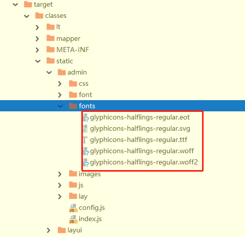

# 解决maven生成jar包时字体不能正常显示

由于前端人手不够，今天做了一个小项目，这个项目是用spring boot  + layui 构建的后台管理系统。就没有用到前后端分离的方式去开发

项目做完后在打包时运行时发现浏览器显示字体损坏，导致网站icon图标不能正常显示

##  解决方法：

在pom.xml 里找到build 区块用下面代码替换它

```
    <build>
        <finalName>ivy-admin</finalName>
        <resources>
            <resource>
                <directory>src/main/resources</directory>
                <filtering>true</filtering>
                <excludes>
                    <exclude>static/layui/font/**</exclude>
                    <exclude>static/admin/font/**</exclude>
                    <exclude>static/admin/fonts/**</exclude>
                </excludes>
            </resource>
            <resource>
                <directory>src/main/resources</directory>
                <filtering>false</filtering>
                <includes>
                    <include>static/layui/font/**</include>
                    <include>static/admin/font/**</include>
                    <include>static/admin/fonts/**</include>
                </includes>
            </resource>
        </resources>
        <plugins>
            <plugin>
                <groupId>org.springframework.boot</groupId>
                <artifactId>spring-boot-maven-plugin</artifactId>
                <configuration>
                    <executable>true</executable>
                </configuration>
            </plugin>
        </plugins>
    </build>

```

## 问题原因:

经过发现在不加上面打包代码时，不排除font 字体目录时，发现maven在打包复制时，对其font字体文件编译，导致文件被改写，编码和原来的字体文件不一样，导致打包前，打包前文件md5不一样，font 字体损坏，最终浏览器显示字体损坏

打包后可以对比一下字体md5文件，就知道mvn在编译打包时，损坏了font

